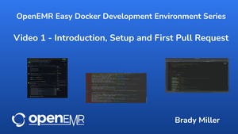
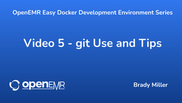
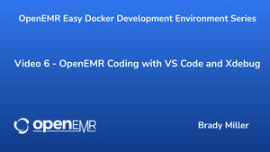
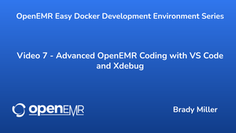
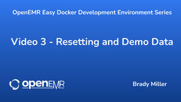
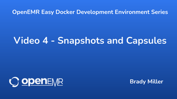
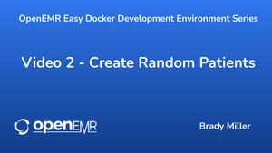

Thank you for your contribution. OpenEMR (and global healthcare) continues to get better because of people like you!

The maintainers of OpenEMR want to get your pull request in as seamlessly as possible, so please ensure your code is consistent with our [development policies](https://open-emr.org/wiki/index.php/Development_Policies).

## Proposing Changes

For most contributions, you can submit a PR directly — no issue required. The PR description should explain the motivation and approach clearly enough for reviewers to understand the change without additional context.

For larger changes — new features, architectural changes, or anything that would benefit from community input — consider getting feedback first through one of these channels:

- **Forum** — Post on the [community forum](https://community.open-emr.org/) to get early feedback on an idea.
- **Issues** — Create a well-scoped issue describing the problem and proposed approach.
- **Conference call** — Join the [twice-weekly conference call](https://www.open-emr.org/wiki/index.php/OpenEMR_Twice_Weekly_Conference_Call_Details) (Tuesdays at 11 AM PT are much better attended than Saturdays) to discuss with maintainers. Look for the current admin meeting notes thread on the forum to post agenda items ahead of time.

## Which Repository?

OpenEMR is split across multiple repositories. Make sure your contribution targets the right one:

- **[openemr/openemr](https://github.com/openemr/openemr)** — The application itself: PHP code, frontend, APIs, clinical features, tests.
- **[openemr/openemr-devops](https://github.com/openemr/openemr-devops)** — Infrastructure and deployment: Docker, Kubernetes, cloud provisioning (CloudFormation, Terraform), and operational tooling.

When in doubt, ask on the forum or open an issue to discuss where the work belongs.

## Commit Messages

OpenEMR uses [Conventional Commits](https://www.conventionalcommits.org/) for all commits merged to `master` and `rel-*` branches. Your PR title must follow this format:

```
<type>(<scope>): <description>
```

### Types

| Type | Description |
|------|-------------|
| `feat` | New feature |
| `fix` | Bug fix |
| `docs` | Documentation only |
| `style` | Code style (formatting, whitespace) |
| `refactor` | Code refactoring (no feature/fix) |
| `perf` | Performance improvement |
| `test` | Adding/updating tests |
| `build` | Build system or dependencies |
| `ci` | CI configuration |
| `chore` | Maintenance tasks |
| `revert` | Revert a previous commit |

### Examples

- `feat(api): add PATCH support for patient resource`
- `fix(calendar): correct date parsing for recurring events`
- `docs(readme): update installation instructions`
- `chore(deps): bump monolog/monolog from 3.9.0 to 3.10.0`

### Scopes

Scopes are optional but encouraged. Use them to indicate the area of the codebase affected (e.g., `api`, `calendar`, `patient`, `billing`, `deps`).

### Breaking Changes

For breaking changes, add `!` after the type/scope or include a `BREAKING CHANGE:` footer:

```
feat(api)!: change patient endpoint response format

BREAKING CHANGE: The patient endpoint now returns a different JSON structure.
```

### AI-Assisted Contributions

If you used AI tooling (Claude, Copilot, ChatGPT, etc.) to create or modify code, indicate this with a commit trailer:

```sh
git commit --trailer "Assisted-By: Claude" -m "fix(billing): correct tax calculation"
```

Use `Generated-By` when AI produced the code directly, or `Assisted-By` when AI helped with tweaks, refactors, or fixes to human-written code:

- `Generated-By: Claude` — Code fully generated by Claude Code, claude.ai, etc.
- `Assisted-By: Copilot` — Human-written code with GitHub Copilot suggestions
- `Assisted-By: Cursor` — Refactoring or fixes assisted by Cursor

If the AI made the commit directly (e.g., Claude Code), the trailer is typically added automatically. This records AI involvement in git history without cluttering the source code, and works for all change types including deletions and refactors.

## Code Contributions (local development)

You will need a "local" version of OpenEMR to make changes to the source code. Two paths:

- **Recommended:** the [Docker development environment](https://hub.docker.com/r/openemr/openemr/) described below. Single Docker dependency on the host; the openemr container provides PHP, Node, Composer, the test runners, the pre-commit hooks, and all the validation tooling. This is the path most contributors use and the rest of this section walks through.
- **Alternative:** install OpenEMR's full dependency stack directly on your host (PHP 8.2+, Composer, Node, Python 3, MySQL/MariaDB, etc.) and run everything natively without Docker. See [Working without Docker](#working-without-docker) at the bottom of this document for the host-toolchain workflow.

---

### Starting with OpenEMR Development Docker Environment
- For the highly recommended free course "You Can Be a OpenEMR Developer in 5 Easy Steps", click below:

    [You Can Be a OpenEMR Developer in 5 Easy Steps](https://www.open-emr.org/blog/you-can-be-a-openemr-developer-in-5-easy-steps/)

- For the Video Tutorial, click below:

    [](https://youtu.be/D4tXP5G9-sY)

    - (Recommend using Ubuntu Desktop 22.04 for above video and other videos in the [OpenEMR Easy Docker Development Environment Video Series](https://www.youtube.com/playlist?list=PLFiWG_dDadgQT7zjqvEqbXm1OiuubOVO8). Easiest way to do this is setting up a [Ubuntu Desktop 22.04 Virtual Machine on VirtualBox](https://ubuntu.com/tutorials/how-to-run-ubuntu-desktop-on-a-virtual-machine-using-virtualbox), which recommend configuring with 40GB hard drive, assigning 25% of computer memory, and assigning 25% of cpu cores to the virtual machine.)

1. [Create your own fork of OpenEMR](https://github.com/openemr/openemr/fork) (you will need a GitHub account) and `git clone` it to your local machine.

    - For the Video Tutorial, click below:

      [](https://youtu.be/QhTlWMqPV1Q)

      - (Recommend using Ubuntu Desktop 22.04 for above video and other videos in the [OpenEMR Easy Docker Development Environment Video Series](https://www.youtube.com/playlist?list=PLFiWG_dDadgQT7zjqvEqbXm1OiuubOVO8). Easiest way to do this is setting up a [Ubuntu Desktop 22.04 Virtual Machine on VirtualBox](https://ubuntu.com/tutorials/how-to-run-ubuntu-desktop-on-a-virtual-machine-using-virtualbox), which recommend configuring with 40GB hard drive, assigning 25% of computer memory, and assigning 25% of cpu cores to the virtual machine.)

    - If you haven't already, [install git](https://git-scm.com/downloads) for your system
	- (optional) If you want to set up the base services(e.g. git, docker, docker compose, openemr-cmd, minkube and kubectl) easily, please try [openemr-env-installer](https://github.com/openemr/openemr-devops/tree/master/utilities/openemr-env-installer)
    - (optional) It's best to also add an `upstream` origin to keep your local fork up to date. [Check out this guide](https://oneemptymind.wordpress.com/2018/07/11/keeping-a-fork-up-to-date/) for more info.
2. Install the development prerequisites:
    - If you haven't already, [install Docker](https://docs.docker.com/install/) and [install compose](https://docs.docker.com/compose/install/) for your system.
    - [Install `openemr-cmd`](https://github.com/openemr/openemr-devops/tree/master/utilities/openemr-cmd) — the canonical CLI for working with the development docker environment. It runs from any directory, dispatches commands into the running openemr container, manages git worktrees, installs pre-commit hooks, and replaces the longer `docker compose exec openemr /root/devtools <cmd>` form throughout this document.
        - **Windows note:** `openemr-cmd` is a bash script. Install it inside WSL2 (recommended) or Git Bash. Native cmd.exe / PowerShell cannot invoke a bash script directly; if you stay on those, fall back to the underlying `docker compose exec openemr /root/devtools <cmd>` form for each example below.
        - Verify with `openemr-cmd --version` and `openemr-cmd --help` (or `openemr-cmd-h <keyword>` to search). All examples below assume openemr-cmd is on your PATH.
    - (optional) If you want to monitor and easily manage the docker environment, also [install openemr-monitor](https://github.com/openemr/openemr-devops/tree/master/utilities/openemr-monitor) and [install portainer](https://github.com/openemr/openemr-devops/tree/master/utilities/portainer) for your system.
    - (optional) If you want to migrate the running docker environment, try [openemr-env-migrator](https://github.com/openemr/openemr-devops/tree/master/utilities/openemr-env-migrator).
    - (optional) If you want to set up with an orchestration tool, try [OpenEMR Kubernetes Orchestrations](https://github.com/openemr/openemr-devops/tree/master/kubernetes/minikube).
3. From the easy dev environment directory, start the docker stack:
    ```sh
    cd openemr/docker/development-easy
    openemr-cmd up
    ```
    - `openemr-cmd up` starts the stack in detached mode (it runs `docker compose up -d` under the hood). The `cd` is required because docker compose reads `docker-compose.yml` from the current directory.
    - To watch the startup logs and see when OpenEMR is ready, in a separate terminal `cd` to the same directory and run:
      ```sh
      cd openemr/docker/development-easy
      docker compose logs -f openemr
      ```
      When the build is done, you'll see the following messages:
      ```sh
      openemr_1  | Love OpenEMR? You can now support the project via the open collective:
      openemr_1  |  > https://opencollective.com/openemr/donate
      openemr_1  |
      openemr_1  | Starting cron daemon!
      openemr_1  | Starting apache!
      ```
4. Navigate to `http://localhost:8300/` or `https://localhost:9300/` to login as `admin`. Password is `pass`.
5. If you wish to connect to the sql database, this docker environment provides the following 2 options:
    - Navigate to `http://localhost:8310/` where you can login into phpMyAdmin.
    - Or you can directly connect to port 8320 via your favorite sql tool (Mysql Workbench etc.).
    - Use `username/user`: openemr, `password`: openemr .
6. Make changes to any files on your local file system. Most changes will appear after a refresh of the page or iFrame you're working on.

    - For the Video Tutorials, click below:

      [](https://youtu.be/XJl7SQGNhpw)

      [](https://youtu.be/0dEYDHWECMI)

      - (Recommend using Ubuntu Desktop 22.04 for above videos and other videos in the [OpenEMR Easy Docker Development Environment Video Series](https://www.youtube.com/playlist?list=PLFiWG_dDadgQT7zjqvEqbXm1OiuubOVO8). Easiest way to do this is setting up a [Ubuntu Desktop 22.04 Virtual Machine on VirtualBox](https://ubuntu.com/tutorials/how-to-run-ubuntu-desktop-on-a-virtual-machine-using-virtualbox), which recommend configuring with 40GB hard drive, assigning 25% of computer memory, and assigning 25% of cpu cores to the virtual machine.)

    - An exception to this is if making changes to styling scripts in interface/themes/. In that case will need to clear web browser cache and run the following command to rebuild the theme files:
      ```sh
      openemr-cmd build-themes
      ```
7. When you're done, clean up. From the easy dev environment directory:
    ```sh
    cd openemr/docker/development-easy
    openemr-cmd down
    ```
    - `openemr-cmd down` runs `docker compose down -v` under the hood, removing the named volumes so the next `openemr-cmd up` rebuilds from scratch.
    - If you'd rather preserve volumes between sessions (so the next start reuses the cached database/vendor/node_modules and comes up much faster), use the raw form instead:
      ```sh
      docker compose down
      ```
8. [Submit a PR](https://github.com/openemr/openemr/compare) from your fork into `openemr/openemr#master`!

### After You Submit

**For first-time contributors:** A maintainer must approve your PR before CI checks will run. This is a GitHub security measure for external contributors.

**Automated checks** include:
- Conventional commit validation (PR title format)
- PHP syntax, phpcs, phpstan, rector
- Unit, API, E2E, and integration tests across multiple PHP/database versions
- JavaScript tests, Docker linting, and more

See `ci/README.md` for details on the CI system.

**Tip:** During development, you can add `Skip-Slow-Tests: true` as a commit trailer to skip the full test matrix and get faster feedback from linting:
```sh
git commit --trailer "Skip-Slow-Tests: true" -m "fix: work in progress"
```
You must remove any `Skip-Slow-Tests` or `skip-ci` trailers before your PR can be merged.

**Review process:** A maintainer will review your PR. Please respond to feedback and push updates to the same branch—the PR will update automatically.

We look forward to your contribution...

---

### Advanced Use of OpenEMR Development Docker Environment

The OpenEMR development docker environment has a very rich advanced feature set. See below Index for links to all the cool advanced stuff:

**Index for Advanced Use of OpenEMR Development Docker Environment**

---
1. [Worktrees](#worktrees)
2. [Pre-commit hooks for the docker dev environment](#precommit)
3. [Xdebug and profiling](#xdebug)
4. [API development and testing](#api)
5. [Testing other PHP versions](#other_php_versions)
6. [Php syntax checking, psr12 checking, and automated testing](#dev_tools_tests)
7. [Run the entire dev tool suite](#dev_tools_suite)
8. [Run only all the automated tests](#dev_tools_auto)
9. [Resetting OpenEMR and loading demo data](#dev_tools_reset)
10. [Backup and restore OpenEMR data](#dev_tools_backup)
11. [Send/receive snapshots](#dev_tools_send)
12. [Create and add random patient data](#dev_tools_randompatients)
13. [Add multisite bank](#dev_tools_bankmultisite)
14. [Turn on and turn off support for multisite feature in setup.php](#dev_tools_multisite)
15. [List the current multisite](#dev_tools_listmultisite)
16. [Change the database character set and collation](#dev_tools_charset)
17. [Test ssl certificate and force/unforce https](#dev_tools_https)
18. [Place/remove testing sql ssl certificate and testing sql ssl client key/cert](#dev_tools_ssl)
19. [CouchDB integration](#dev_tools_couchdb)
20. [LDAP integration](#dev_tools_ldap)
21. [Test webroot value](#dev_tools_webroot)

---

1. <a name="worktrees"></a>git Worktrees are supported. Developers can work on separate worktrees with docker testing stacks concurrently. This requires use of the `openemr-cmd` command (see above for instructions on installing the `openemr-cmd` command). Recommend running these command in the base directory of the base repo.

    - Following will give an overview of the available commands:
      ```sh
      openemr-cmd worktree
      ```

      ```
      Usage: openemr-cmd worktree <add|remove|up|down|start|stop|exec|list|regen|set-env> [options]

        add <branch> [-b] [--env easy|easy-light|easy-redis] [--start]
                                  Create worktree (-b creates new branch, default env: easy)
        remove <branch> [--keep-volumes] Remove worktree (volumes deleted by default)
        up <branch>               Start Docker stack for worktree
        down <branch> [--keep-volumes]  Stop Docker stack for worktree (volumes deleted by default)
        start <branch>            Start stopped containers for worktree (preserves data)
        stop <branch>             Stop running containers for worktree (preserves data)
        set-env <branch> <env>    Switch a worktree's env (easy|easy-light|easy-redis); stack must be down first
        exec <branch> <cmd> [args...]   Run an openemr-cmd command against the worktree's openemr container
        list                      List all worktrees and status
        regen <branch>            Regenerate override/env files
        wt                        Alias for worktree
      ```

    - Can create a new worktree on a new branch via:
      ```sh
      openemr-cmd worktree add worktree-branch-label -b
      ```

    - Or can create a new worktree on a existing branch:
      ```sh
      openemr-cmd worktree add worktree-branch-label
      ```

    - Can start the docker testing stack on a worktree via:
      ```sh
      openemr-cmd worktree up worktree-branch-label
      ```

    - Can stop the docker testing stack on a worktree via:
      ```sh
      openemr-cmd worktree down worktree-branch-label
      ```

    - Can pause a worktree's running containers without recreating them (preserves data and is faster than `down`/`up`):
      ```sh
      openemr-cmd worktree stop worktree-branch-label
      ```

    - Can resume a worktree's stopped containers (counterpart to `stop`):
      ```sh
      openemr-cmd worktree start worktree-branch-label
      ```

    - Can run any standard `openemr-cmd` command against a specific worktree's `openemr` container without manually looking up the container id. Examples:
      ```sh
      openemr-cmd worktree exec worktree-branch-label drid
      openemr-cmd worktree exec worktree-branch-label shell
      openemr-cmd worktree exec worktree-branch-label pl
      ```

    - Can switch a worktree to a different docker dev environment (`easy`, `easy-light`, or `easy-redis`). The stack must be fully torn down first (use `worktree down` to discard the old volumes, or `worktree down --keep-volumes` to preserve them):
      ```sh
      openemr-cmd worktree set-env worktree-branch-label easy-redis
      ```

    - Can remove the worktree via:
      ```sh
      openemr-cmd worktree remove worktree-branch-label
      ```

    - Can view the list of worktrees via:
      ```sh
      openemr-cmd worktree list
      ```

    - Lots of other cool stuff is listed in the usage description via `openemr-cmd worktree`


2. <a name="precommit"></a>Pre-commit hooks for the docker dev environment can be installed so that `git commit` validates staged changes against the project's full `.pre-commit-config.yaml` suite (phpstan, rector, phpcs, codespell, actionlint, etc.) inside the running openemr container. No host install of PHP, Node, Python, codespell, or actionlint is required — only Docker. Routing is cwd-aware: a commit fired from worktree `foo` dispatches to `foo`'s container.

    - One-time install per clone (run from the base repo on master):
      ```sh
      openemr-cmd prek-install
      ```
      Short form: `openemr-cmd pi`. Linked worktrees share git hooks via gitcommondir, so this single install covers every current and future worktree of the primary repo — no per-worktree re-install needed when you `openemr-cmd worktree add <branch>`.

    - After install, `git commit` from any clone or worktree fires the hooks inside the corresponding openemr container. The stack must be running at commit time (`openemr-cmd up` for the primary, `openemr-cmd worktree up <branch>` for a worktree); if it's down, the hook aborts cleanly with a "no running openemr container found" message.

    - Manual invocations (anytime, no install needed) for ad-hoc validation:
      ```sh
      openemr-cmd prek run --all-files     # whole-codebase check, not just staged
      openemr-cmd prek run phpstan         # run a single hook
      openemr-cmd prek autoupdate          # bump hook versions in .pre-commit-config.yaml
      ```

    - To remove the auto-firing hooks:
      ```sh
      openemr-cmd prek-uninstall
      ```
      Short form: `openemr-cmd pu`. Removes only openemr-cmd-managed shims; any other hooks you've installed manually are left alone. If `pi` would overwrite a non-managed hook, it refuses unless `--force` is passed (which backs up the existing hook to a uniquely-suffixed `*.bak.XXXXXXXX` before installing the shim).

    - Mutually exclusive with host-based `prek install` / `pre-commit install`: both paths write to the same `.git/hooks/` files, so the most recent install wins for auto-firing on commit. Manual invocations from either path remain independent.


3. <a name="xdebug"></a>Xdebug and profiling is supported for PHPStorm, VSCode and VSCodium.

    - For the Video Tutorial, click below:

      [](https://youtu.be/XJl7SQGNhpw)

      - (Recommend using Ubuntu Desktop 22.04 for above video and other videos in the [OpenEMR Easy Docker Development Environment Video Series](https://www.youtube.com/playlist?list=PLFiWG_dDadgQT7zjqvEqbXm1OiuubOVO8). Easiest way to do this is setting up a [Ubuntu Desktop 22.04 Virtual Machine on VirtualBox](https://ubuntu.com/tutorials/how-to-run-ubuntu-desktop-on-a-virtual-machine-using-virtualbox), which recommend configuring with 40GB hard drive, assigning 25% of computer memory, and assigning 25% of cpu cores to the virtual machine.)

     - Firefox/Chrome install xdebug helper add on and enable
    - PHPStorm Settings->Language & Frameworks->PHP->Debug
        - Start listening
        - Untoggle "Break at first line in PHP scripts"
        - Untoggle both settings that start with "Force Break at first line..."
        - See [these images for more detail](https://github.com/openemr/openemr-devops/pull/283#issuecomment-779798156)
    - VSCode and VSCodium
        - Listen for XDebug
        - Use this `launch.json` [template](https://github.com/openemr/openemr-devops/issues/285#issuecomment-782899207)
    - Make sure port 9003 is open on your host operating system
    - Profiling output can be found in /tmp directory in the docker. Following will list the profiling output files:
      ```sh
      openemr-cmd list-xdebug-profiles
      ```
    - To check Xdebug log:
      ```sh
      openemr-cmd xdebug-log
      ```
4. <a name="api"></a>API development and testing.
    - Swagger is including in OpenEMR to ease API documentation, development, and testing.
    - The following command will update the API documentation (derive documentation from [_rest_routes.inc.php](_rest_routes.inc.php) to [swagger/openemr-api.yaml](swagger/openemr-api.yaml)):
      ```sh
      openemr-cmd build-api-docs
      ```
    - Can go to Swagger at [https://localhost:9300/swagger](https://localhost:9300/swagger) where it is super easy to test the API:
        - First, click on 'Authorize' button.
        - Then click 'Select All' scopes.
        - Can then do the following from command line to get a client id and secret, which then can copy/paste into the fields:
          ```sh
          openemr-cmd register-oauth2-client
          ```
        - Then click 'Authorize' button and follow the flow and before you know it, you will be authorized to test the api endpoints!
    - There is also a mechanism to allow use of the above Swagger tool with multisite.
        - Before going to the Swagger gui linked above, run the following command (after running below command, the Swagger gui will then be configured to work with the selected multisite):
          ```sh
          openemr-cmd set-swagger-to-multisite <multisite-name>
          ```
        - To collect a client id and secret for the selected multisite, can then do:
          ```sh
          openemr-cmd register-oauth2-client <multisite-name>
          ```
        - When done testing with Swagger on the selected multisite, recommend setting swagger back to the default multisite to avoid changes to the swagger configuration script showing up in your local git repository:
          ```sh
          openemr-cmd set-swagger-to-multisite
          ```
    - There is also a dev tool to make it easy to test the API on the online OpenEMR demo farm. For example, what if you wanted to test the API at [https://eleven.openemr.io/a/openemr](https://eleven.openemr.io/a/openemr):
        - Go to [https://eleven.openemr.io/a/openemr/swagger](https://eleven.openemr.io/a/openemr/swagger/index.html) and follow the Swagger gui flow above. The following command can be used to get a client id and secret from that online demo:
          ```sh
          openemr-cmd register-oauth2-client-demo https://eleven.openemr.io/a/openemr
          ```
5. <a name="other_php_versions"></a>Testing other PHP versions.
    - The standard `flex` docker used in the easy development environments is PHP 8.5. This can be modified by changing the image (`image: openemr/openemr:flex`) used in the docker-compose.yml script. To use PHP 8.2, then just need to change it to `image: openemr/openemr:flex-3.22-php-8.2`. To use PHP 8.3 then change it to `image: openemr/openemr:flex-3.23-php-8.3`. To use PHP 8.4 then change it to `image: openemr/openemr:flex-3.23-php-8.4`.
6. <a name="dev_tools_tests"></a>Php syntax checking, psr12 checking, and automated testing.
    - To check PHP error logs:
      ```sh
      openemr-cmd php-log
      ```
    - To create a report of PSR12 code styling issues (this takes several minutes):
      ```sh
      openemr-cmd psr12-report
      ```
    - To fix PSR12 code styling issues (this takes several minutes):
      ```sh
      openemr-cmd psr12-fix
      ```
    - To create a report of theme styling issues:
      ```sh
      openemr-cmd lint-themes-report
      ```
    - To fix theme styling issues:
      ```sh
      openemr-cmd lint-themes-fix
      ```
    - To check PHP parsing errors (this takes several minutes):
      ```sh
      openemr-cmd php-parserror
      ```
    - To dry run Rector changes:
      ```sh
      openemr-cmd rector-dry-run
      ```
    - To process Rector changes:
      ```sh
      openemr-cmd rector-process
      ```
    - To run unit testing:
      ```sh
      openemr-cmd unit-test
      ```
    - To run api testing:
      ```sh
      openemr-cmd api-test
      ```
    - To run e2e testing:
      ```sh
      openemr-cmd e2e-test
      ```
      - (You can actually view the e2e tests in real-time by going to [http://localhost:7900](http://localhost:7900) with password 'openemr123'.)
    - To run services testing:
      ```sh
      openemr-cmd services-test
      ```
    - To run fixtures testing:
      ```sh
      openemr-cmd fixtures-test
      ```
    - To run validators testing:
      ```sh
      openemr-cmd validators-test
      ```
    - To run controllers testing:
      ```sh
      openemr-cmd controllers-test
      ```
    - To run common testing:
      ```sh
      openemr-cmd common-test
      ```
    - To run isolated PHPUnit tests (no database required; fast — covers Twig template compilation/render tests and other pure-PHP isolated suites):
      ```sh
      openemr-cmd phpunit-isolated
      ```
    - **Mutating maintenance command** — not a test: regenerates the expected-output fixture files used by Twig render tests when you've intentionally changed a Twig template. Overwrites files under `tests/Tests/Isolated/Common/Twig/fixtures/render/`; review the diff before committing:
      ```sh
      openemr-cmd update-twig-fixtures
      ```
7. <a name="dev_tools_suite"></a>Run the entire dev tool suite (PSR12 fix, lint themes fix, PHP parse error, unit/API/e2e/services/fixtures/validators/controllers/common tests) in one command, run
    ```sh
    openemr-cmd clean-sweep
    ```
8. <a name="dev_tools_auto"></a>Run only all the automated tests (unit/API/e2e/services/fixtures/validators/controllers/common tests) in one command, run
    ```sh
    openemr-cmd clean-sweep-tests
    ```
9. <a name="dev_tools_reset"></a>Resetting OpenEMR and loading demo data.
    - For the Video Tutorial, click below:

      [](https://youtu.be/1ch84Ffmky8)

      - (Recommend using Ubuntu Desktop 22.04 for above video and other videos in the [OpenEMR Easy Docker Development Environment Video Series](https://www.youtube.com/playlist?list=PLFiWG_dDadgQT7zjqvEqbXm1OiuubOVO8). Easiest way to do this is setting up a [Ubuntu Desktop 22.04 Virtual Machine on VirtualBox](https://ubuntu.com/tutorials/how-to-run-ubuntu-desktop-on-a-virtual-machine-using-virtualbox), which recommend configuring with 40GB hard drive, assigning 25% of computer memory, and assigning 25% of cpu cores to the virtual machine.)

    - To reset OpenEMR only (then can reinstall manually via setup.php in web browser):
      ```sh
      openemr-cmd dev-reset
      ```
        - When running setup.php, need to use `mysql` for 'Server Host', `root` for 'Root Password', and `%` for 'User Hostname'.
    - To reset and reinstall OpenEMR:
      ```sh
      openemr-cmd dev-reset-install
      ```
    - To reset and reinstall OpenEMR with demo data (this includes several users with access controls setup in addition to patient portal logins. [See HERE for those credentials](https://www.open-emr.org/wiki/index.php/Development_Demo#Demo_Credentials).):
      ```sh
      openemr-cmd dev-reset-install-demodata
      ```
        - hint: this is also a great way to test any changes a developer has made to the sql upgrade stuff (ie. such as sql/5_0_2-to-6_0_0_upgrade.sql)
10. <a name="dev_tools_backup"></a>Backup and restore OpenEMR data (database and data on drive) via snapshots.
    - For the Video Tutorial, click below:

      [](https://youtu.be/n569Lw5I5us)

      - (Recommend using Ubuntu Desktop 22.04 for above video and other videos in the [OpenEMR Easy Docker Development Environment Video Series](https://www.youtube.com/playlist?list=PLFiWG_dDadgQT7zjqvEqbXm1OiuubOVO8). Easiest way to do this is setting up a [Ubuntu Desktop 22.04 Virtual Machine on VirtualBox](https://ubuntu.com/tutorials/how-to-run-ubuntu-desktop-on-a-virtual-machine-using-virtualbox), which recommend configuring with 40GB hard drive, assigning 25% of computer memory, and assigning 25% of cpu cores to the virtual machine.)

     - Create a backup snapshot (using `example` below, but can use any alphanumeric identifier):
      ```sh
      openemr-cmd backup-snapshot example
      ```
    - Restore from a snapshot (using `example` below, but can use any alphanumeric identifier)
      ```sh
      openemr-cmd restore-snapshot example
      ```
    - To list the snapshots
      ```sh
      openemr-cmd list-snapshots
      ```
11. <a name="dev_tools_send"></a>Send/receive snapshots (capsules are backup files that can be saved to disk or shared with other developers).
    - For the Video Tutorial, click below:

      [](https://youtu.be/n569Lw5I5us)

      - (Recommend using Ubuntu Desktop 22.04 for above video and other videos in the [OpenEMR Easy Docker Development Environment Video Series](https://www.youtube.com/playlist?list=PLFiWG_dDadgQT7zjqvEqbXm1OiuubOVO8). Easiest way to do this is setting up a [Ubuntu Desktop 22.04 Virtual Machine on VirtualBox](https://ubuntu.com/tutorials/how-to-run-ubuntu-desktop-on-a-virtual-machine-using-virtualbox), which recommend configuring with 40GB hard drive, assigning 25% of computer memory, and assigning 25% of cpu cores to the virtual machine.)

    - Here is how to grab a capsule from the docker, which can then store or share with friends.
        - List the capsules:
          ```sh
          openemr-cmd list-capsules
          ```
        - Copy the capsule from the docker to your current directory (using `example.tgz` below):
          ```sh
          openemr-cmd get-capsule example.tgz
          ```
          An optional second argument lets you save to a different directory:
          ```sh
          openemr-cmd get-capsule example.tgz /path/to/save
          ```
    - Here is how to send a capsule into the docker.
        - Copy the capsule from current directory into the docker (using `example.tgz` below):
          ```sh
          openemr-cmd put-capsule example.tgz
          ```
        - Restore from the new shiny snapshot (using `example` below):
          ```sh
          openemr-cmd restore-snapshot example
          ```
        - Ensure run upgrade to ensure will work with current version OpenEMR:
          ```sh
          openemr-cmd ensure-version 5.0.2
          ```
12. <a name="dev_tools_randompatients"></a>Create and add random patient data. This will use synthea to create random patients that are then imported into OpenEMR. You can choose the number of patients. Note that each patient will take several seconds.
    - For the Video Tutorial, click below:

      [](https://youtu.be/cFBFXFm_Psg)

      - (Recommend using Ubuntu Desktop 22.04 for above video and other videos in the [OpenEMR Easy Docker Development Environment Video Series](https://www.youtube.com/playlist?list=PLFiWG_dDadgQT7zjqvEqbXm1OiuubOVO8). Easiest way to do this is setting up a [Ubuntu Desktop 22.04 Virtual Machine on VirtualBox](https://ubuntu.com/tutorials/how-to-run-ubuntu-desktop-on-a-virtual-machine-using-virtualbox), which recommend configuring with 40GB hard drive, assigning 25% of computer memory, and assigning 25% of cpu cores to the virtual machine.)

    - Create and add 100 random patients (defaults to development mode set to true, which is set be default to true; development mode will markedly improve performance by bypassing the import of the ccda document and bypassing the use of the audit_master and audit_details tables and will directly import the new patient data from the ccda. Note this should never be done on sites that already contain real data/use, and it will also turn off the audit log during the import.):
       ```sh
       openemr-cmd import-random-patients 100
       ```
       or
       ```sh
       openemr-cmd import-random-patients 100 true
       ```
    - Create and add 100 random patients (with development mode set to false)
       ```sh
       openemr-cmd import-random-patients 100 false
       ```
13. <a name="dev_tools_bankmultisite"></a>Create a bank of multisites with selected number of multisites that are all labelled from run1..runx. It will clone from the default instance. This can be helpful for testing of multisites and other larger scale testing.
    - Create 5 multisites (will be run1, run2, run3, run4, run5):
      ```sh
      openemr-cmd generate-multisite-bank 5
      ```
14. <a name="dev_tools_multisite"></a>Turn on and turn off support for multisite feature (to allow setting up multisites in setup.php script).
    - Turn on support for multisite:
      ```sh
      openemr-cmd enable-multisite
      ```
    - Turn off support for multisite:
      ```sh
      openemr-cmd disable-multisite
      ```
15. <a name="dev_tools_listmultisite"></a>The available multisites can be listed via following command:
    ```sh
    openemr-cmd list-multisites
    ```
16. <a name="dev_tools_charset"></a>Change the database character set and collation (character set is the encoding that is used to store data in the database; collation are a set of rules that the database uses to sort the stored data).
    - Best to demonstrate this devtool with examples.
        - Set character set to utf8mb4 and collation to utf8mb4_general_ci (this is default for OpenEMR 6 and higher):
          ```sh
          openemr-cmd change-encoding-collation utf8mb4 utf8mb4_general_ci
          ```
        - Set character set to utf8mb4 and collation to utf8mb4_unicode_ci:
          ```sh
          openemr-cmd change-encoding-collation utf8mb4 utf8mb4_unicode_ci
          ```
        - Set character set to utf8mb4 and collation to utf8mb4_vietnamese_ci:
          ```sh
          openemr-cmd change-encoding-collation utf8mb4 utf8mb4_vietnamese_ci
          ```
        - Set character set to utf8 and collation to utf8_general_ci (this is default for OpenEMR 5 and lower):
          ```sh
          openemr-cmd change-encoding-collation utf8 utf8_general_ci
          ```
17. <a name="dev_tools_https"></a>Test ssl certificate (to test client based certificates and revert back to default self signed certificate) and force/unforce https.
    - To test client based certificates, create a zip package of the certificate in OpenEMR at Administration->System->Certificates. Then import this zip package (example `ssl.zip`) into the docker via:
      ```sh
      openemr-cmd put-client-cert ssl.zip
      ```
    - To list the available certificate packages on docker:
      ```sh
      openemr-cmd list-client-certs
      ```
    - To install and configure a certificate package (example `ssl`):
      ```sh
      openemr-cmd setup-client-cert ssl
      ```
    - To revert back to self-signed certificates (ie. revert the changes required for client based certificates):
      ```sh
      openemr-cmd on-self-signed-cert
      ```
    - To force https in apache script via redirect:
      ```sh
      openemr-cmd force-https
      ```
    - To revert the changes that forced https in apache script:
      ```sh
      openemr-cmd un-force-https
      ```
18. <a name="dev_tools_ssl"></a>Place/remove testing sql ssl certificate and testing sql ssl client key/cert.
    - Place the testing sql ssl CA cert:
      ```sh
      openemr-cmd sql-ssl
      ```
    - Remove the testing sql ssl CA cert:
      ```sh
      openemr-cmd sql-ssl-off
      ```
    - Place the testing sql ssl CA cert and testing sql ssl client key/cert:
      ```sh
      openemr-cmd sql-ssl-client
      ```
    - Remove the testing sql ssl CA cert and testing sql ssl client key/cert:
      ```sh
      openemr-cmd sql-ssl-client-off
      ```
19. <a name="dev_tools_couchdb"></a>CouchDB integration.
    - In OpenEMR, CouchDB is an option for the patients document storage. For this reason, a CouchDB docker is included in this OpenEMR docker development environment. You can visit the CouchDB GUI directly via http://localhost:5984/_utils/ or https://localhost:6984/_utils/ with username `admin` and password `password`. You can configure OpenEMR to use this CouchDB docker for patient document storage in OpenEMR at Administration->Globals->Documents:
        - Document Storage Method->CouchDB
    - After running the following devtools, 'dev-reset', 'dev-install', 'dev-reset-install', 'dev-reset-install-demodata', 'restore-snapshot', then need to restart the couchdb docker via the following command:
        ```sh
        docker compose restart couchdb
        ```
    - Developer tools to place/remove testing couchdb ssl certificate and testing couchdb ssl client key/cert.
        - Place the testing couchdb ssl CA cert:
          ```sh
          openemr-cmd couchdb-ssl
          ```
        - Remove the testing couchdb ssl CA cert:
          ```sh
          openemr-cmd couchdb-ssl-off
          ```
        - Place the testing couchdb ssl CA cert and testing couchdb ssl client key/cert:
          ```sh
          openemr-cmd couchdb-ssl-client
          ```
        - Remove the testing couchdb ssl CA cert and testing couchdb ssl client key/cert:
          ```sh
          openemr-cmd couchdb-ssl-client-off
          ```
20. <a name="dev_tools_ldap"></a>LDAP integration.
    - In OpenEMR, LDAP is an option for authentication. If this is turned on, then this will be supported for the `admin` user, which will use the following password: `admin`
    - Turn on LDAP:
      ```sh
      openemr-cmd enable-ldap
      ```
    - Turn off LDAP:
      ```sh
      openemr-cmd disable-ldap
      ```
    - Developer tools to place/remove testing ldap tls/ssl certificate and testing ldap tls/ssl client key/cert.
        - Place the testing ldap tls/ssl CA cert:
          ```sh
          openemr-cmd ldap-ssl
          ```
        - Remove the testing ldap tls/ssl CA cert:
          ```sh
          openemr-cmd ldap-ssl-off
          ```
        - Place the testing ldap tls/ssl CA cert and testing ldap tls/ssl client key/cert:
          ```sh
          openemr-cmd ldap-ssl-client
          ```
        - Remove the testing ldap tls/ssl CA cert and testing ldap tls/ssl client key/cert:
          ```sh
          openemr-cmd ldap-ssl-client-off
          ```
21. <a name="dev_tools_webroot"></a>Test webroot value.
    - The default setup of the docker development environments are with a blank webroot, however, it is a good idea to also test with a webroot setting. There is an option to set the webroot to openemr.
    - Note this dev tool requires the use of the openemr-cmd script, which is discussed above and can find instructions to install and use openemr-cmd script at [install openemr-cmd](https://github.com/openemr/openemr-devops/tree/master/utilities/openemr-cmd).
    - Set webroot to blank:
      ```sh
      openemr-cmd change-webroot-blank
      ```
    - Set webroot to `openemr`:
      ```sh
      openemr-cmd change-webroot-openemr
      ```

## Working without Docker

The sections above describe the recommended Docker-based workflow. If you maintain a full host toolchain (PHP 8.2+, Composer with `composer install` populated `vendor/`, Node, Python 3), you can run validation, code-quality checks, and isolated tests directly on your machine without invoking the openemr container.

### Pre-commit hooks on host

If you already have [pre-commit](https://pre-commit.com/) (or [prek](https://github.com/j178/prek)) installed locally, install hooks that run directly on the host:

```sh
pre-commit install --hook-type commit-msg  # Validates commit message format
pre-commit install                          # Enables all code quality hooks
```

This is mutually exclusive with `openemr-cmd prek-install` (both write to the same `.git/hooks/` files; most recent install wins). Requires PHP 8.2+, Composer, `composer install` populated `vendor/`, Python 3 with `pre-commit` (or `prek`) installed, plus a binary for any hook that uses `language: system` outside the composer scripts (e.g. `actionlint`).

### Code-quality checks on host

The same composer scripts back every PHP code-quality check that CI runs and the pre-commit hooks call:

```sh
# Full PHP code-quality suite
composer code-quality

# Individual checks (these handle memory limits automatically)
composer phpstan          # Static analysis
composer phpcs            # Code style check
composer phpcbf           # Code style auto-fix
composer rector-check     # Code modernization (dry-run)

# JavaScript / CSS
npm run lint:js           # ESLint
npm run lint:js-fix       # ESLint auto-fix
npm run stylelint         # CSS/SCSS linting
```

The host path can give slightly higher memory limits for very large analysis runs and matches what CI executes verbatim.

### Isolated tests on host

Some tests run on the host without a database or Docker:

```sh
composer phpunit-isolated        # Run all isolated tests
```

This includes Twig template tests that verify compilation and rendering. If you modify a Twig template that has render-test coverage, regenerate the expected-output fixtures:

```sh
composer update-twig-fixtures    # Regenerate fixture files
```

Review the diff before committing. See `tests/Tests/Isolated/Common/Twig/fixtures/render/README.md` for details.

### Full host installation

If you'd rather not use Docker at all, you can install OpenEMR directly on your local environment. This requires installing additional dependencies for your operating system. For more info see [OpenEMR Development Versions](https://open-emr.org/wiki/index.php/OpenEMR_Installation_Guides#OpenEMR_Development_Versions) on the wiki.

## Financial contributions

We also welcome financial contributions in full transparency on our [open collective](https://opencollective.com/openemr).
Anyone can file an expense. If the expense makes sense for the development of the community, it will be "merged" in the ledger of our open collective by the core contributors and the person who filed the expense will be reimbursed.

## Credits

### Contributors

Thank you to all the people who have already contributed to openemr!
<a href="https://github.com/openemr/openemr/graphs/contributors"></a>

### Backers

Thank you to all our backers! [[Become a backer](https://opencollective.com/openemr#backer)]

<a href="https://opencollective.com/openemr#backers" target="_blank"></a>

### Sponsors

Thank you to all our sponsors! (please ask your company to also support this open source project by [becoming a sponsor](https://opencollective.com/openemr#sponsor))

<a href="https://opencollective.com/openemr/sponsor/0/website" target="_blank"></a>
<a href="https://opencollective.com/openemr/sponsor/1/website" target="_blank"></a>
<a href="https://opencollective.com/openemr/sponsor/2/website" target="_blank"></a>
<a href="https://opencollective.com/openemr/sponsor/3/website" target="_blank"></a>
<a href="https://opencollective.com/openemr/sponsor/4/website" target="_blank"></a>
<a href="https://opencollective.com/openemr/sponsor/5/website" target="_blank"></a>
<a href="https://opencollective.com/openemr/sponsor/6/website" target="_blank"></a>
<a href="https://opencollective.com/openemr/sponsor/7/website" target="_blank"></a>
<a href="https://opencollective.com/openemr/sponsor/8/website" target="_blank"></a>
<a href="https://opencollective.com/openemr/sponsor/9/website" target="_blank"></a>
