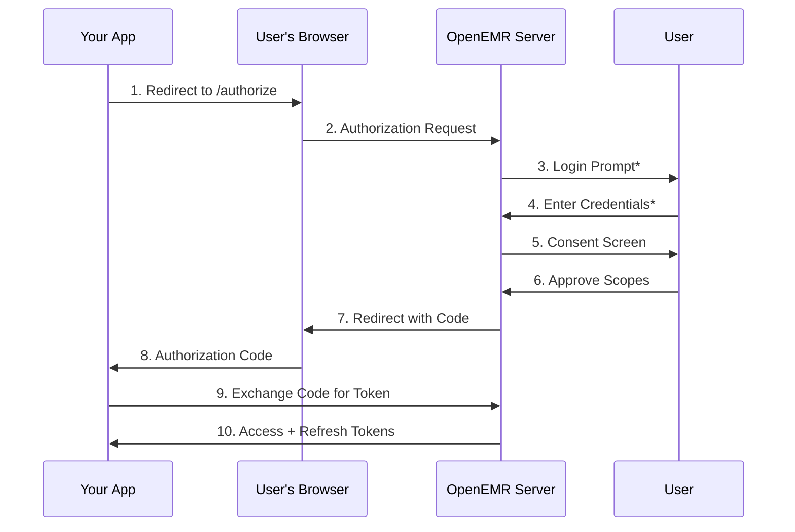
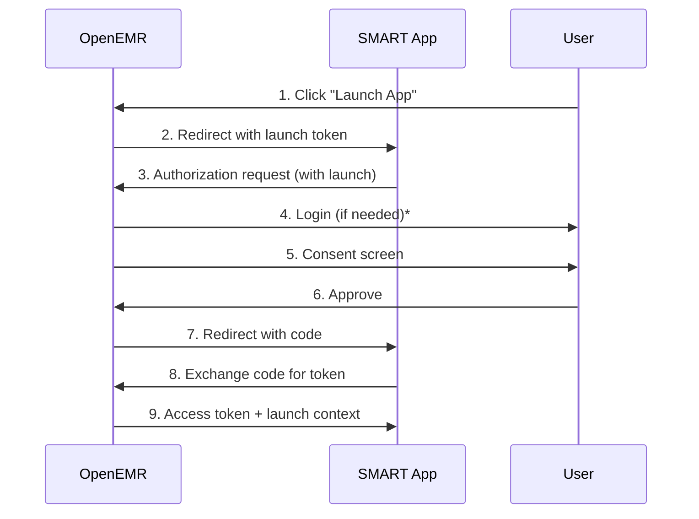

# Authentication

Complete guide to authenticating with the OpenEMR API using OAuth 2.0 and OpenID Connect.

## Table of Contents
- [Overview](#overview)
- [Prerequisites](#prerequisites)
- [Client Registration](#client-registration)
    - [Standard Registration](#standard-registration)
    - [SMART on FHIR Registration](#smart-on-fhir-registration)
    - [Asymmetric Client Authentication](#asymmetric-client-authentication)
- [Authorization Flows](#authorization-flows)
    - [Authorization Code Grant](#authorization-code-grant)
    - [POST-Based Authorization](#post-based-authorization)
    - [EHR Launch Flow](#ehr-launch-flow)
    - [Client Credentials Grant](#client-credentials-grant)
    - [Password Grant](#password-grant)
    - [Refresh Token Grant](#refresh-token-grant)
- [Token Management](#token-management)
    - [Token Introspection](#token-introspection)
    - [Token Revocation](#token-revocation)
    - [Token Lifetime](#token-lifetime)
- [Logout](#logout)
- [OpenID Connect](#openid-connect)
- [Security Considerations](#security-considerations)
- [Examples](#examples)

## Overview

OpenEMR uses **OAuth 2.0** with **OpenID Connect (OIDC)** for API authentication and authorization. This standards-based approach ensures secure access to patient data while maintaining interoperability with healthcare applications.

### Key Features
- ✅ OAuth 2.0 compliant authorization
- ✅ OpenID Connect authentication
- ✅ SMART on FHIR v2.2.0 support
- ✅ Multiple grant types for different use cases
- ✅ Refresh tokens for long-lived access
- ✅ Token introspection for validation
- ✅ Asymmetric client authentication (JWKS)
- ✅ EHR launch with context

### Base URLs

OAuth2 endpoints use the following base URL pattern:
```
https://{your-openemr-host}/oauth2/{site}/
```

**Example for default site:**
```
https://localhost:9300/oauth2/default/
```

## Prerequisites

### 1. Enable APIs
Enable the appropriate API services in OpenEMR:

**Administration → Config → Connectors**
- ☑ Enable OpenEMR Standard REST API (for `/api/` endpoints)
- ☑ Enable OpenEMR Standard FHIR REST API (for `/fhir/` endpoints)
- ☑ Enable OpenEMR Patient Portal REST API (for `/portal/` endpoints) - *EXPERIMENTAL*

### 2. Configure SSL/TLS
**SSL/TLS is required** for all OAuth2 operations.

Set your base URL:
**Administration → Config → Connectors → Site Address (required for OAuth2 and FHIR)**

Example: `https://your-openemr.example.com`

### 3. Security Settings
Configure OAuth2 security settings:

**Administration → Config → Connectors → OAuth2**
- **App Manual Approval**: Choose automatic or manual approval for apps
    - *Automatic*: Patient standalone apps auto-approved (ONC Cures compliant)
    - *Manual*: All apps require administrator approval (most secure)
- **Enable Password Grant**: ⚠️ Not recommended for production

## Client Registration

Before using the API, you must register your application to obtain credentials.

### Standard Registration

Register a client application via API call:
```bash
curl -X POST -k -H 'Content-Type: application/json' \
  https://localhost:9300/oauth2/default/registration \
  --data '{
    "application_type": "private",
    "redirect_uris": ["https://client.example.org/callback"],
    "post_logout_redirect_uris": ["https://client.example.org/logout/callback"],
    "client_name": "My Healthcare App",
    "token_endpoint_auth_method": "client_secret_post",
    "contacts": ["admin@example.org"],
    "scope": "openid offline_access api:oemr api:fhir user/Patient.read user/Observation.read"
  }'
```

#### Registration Parameters

| Parameter | Required | Description |
|-----------|----------|-------------|
| `application_type` | Yes | `private` (confidential) or `public` |
| `redirect_uris` | Yes | Array of allowed redirect URLs |
| `post_logout_redirect_uris` | No | Redirect URLs after logout |
| `client_name` | Yes | Human-readable app name |
| `token_endpoint_auth_method` | Yes | `client_secret_post`, `client_secret_basic`, or `private_key_jwt` |
| `contacts` | No | Admin email addresses |
| `scope` | Yes | Space-separated list of requested scopes |
| `jwks_uri` | No | URL to public JWKS (for asymmetric auth) |
| `jwks` | No | Inline JWKS (for asymmetric auth) |

#### Registration Response
```json
{
  "client_id": "LnjqojEEjFYe5j2Jp9m9UnmuxOnMg4VodEJj3yE8_OA",
  "client_secret": "j21ecvLmFi9HPc_Hv0t7Ptmf1pVcZQLtHjIdU7U9tkS9WAjFJwVM...",
  "registration_access_token": "uiDSXx2GNSvYy5n8eW50aGrJz0HjaGpUdrGf07Agv_Q",
  "registration_client_uri": "https://localhost:9300/oauth2/default/client/6eUVG0-qK2dY...",
  "client_id_issued_at": 1604767861,
  "client_secret_expires_at": 0,
  "contacts": ["admin@example.org"],
  "application_type": "private",
  "client_name": "My Healthcare App",
  "redirect_uris": ["https://client.example.org/callback"],
  "token_endpoint_auth_method": "client_secret_post",
  "scope": "openid offline_access api:oemr api:fhir user/Patient.read..."
}
```

**Important**: Save your `client_id` and `client_secret` securely. The secret cannot be retrieved later.

### SMART on FHIR Registration

SMART apps can be registered through the web interface:

1. Navigate to: `https://your-openemr.example.com/interface/smart/register-app.php`
2. Fill in the app details:
    - App Name
    - Launch URL
    - Redirect URI(s)
    - Scopes
    - App Type (confidential/public)
3. Submit the registration

After registration:
1. Go to **Administration → System → API Clients**
2. Find your app and click **Enable**
3. The app will appear in the **Patient Summary → SMART Enabled Apps** widget

See [SMART on FHIR documentation](SMART_ON_FHIR.md) for more details.

### Asymmetric Client Authentication

**New in SMART v2.2.0**: Confidential clients can use asymmetric authentication with JSON Web Keys (JWKS) instead of client secrets.

#### Benefits
- ✅ More secure than shared secrets
- ✅ Required for bulk FHIR exports (`system/*.$export`)
- ✅ Supports key rotation (when using JWKS URI)
- ✅ No secret transmission

#### Registration with JWKS

**Option 1: JWKS URI** (recommended)
```json
{
  "application_type": "private",
  "redirect_uris": ["https://client.example.org/callback"],
  "client_name": "Secure Healthcare App",
  "token_endpoint_auth_method": "private_key_jwt",
  "jwks_uri": "https://client.example.org/.well-known/jwks.json",
  "scope": "openid api:fhir system/Group.$export"
}
```

**Option 2: Inline JWKS**
```json
{
  "application_type": "private",
  "redirect_uris": ["https://client.example.org/callback"],
  "client_name": "Secure Healthcare App",
  "token_endpoint_auth_method": "private_key_jwt",
  "jwks": {
    "keys": [
      {
        "kty": "RSA",
        "kid": "my-key-1",
        "use": "sig",
        "alg": "RS384",
        "n": "0vx7agoebGcQSuuPiLJXZptN9nndrQmbXEps2aiAFbWhM78LhWx...",
        "e": "AQAB"
      }
    ]
  },
  "scope": "openid api:fhir system/Group.$export"
}
```

#### Key Requirements
- **Algorithm**: RS384 (RSA with SHA-384)
- **Key Type**: RSA
- **Key Size**: 2048 bits minimum (4096 recommended)
- **Public Key**: Exposed via JWKS
- **Private Key**: Securely stored by client (never shared)

See [Using Asymmetric Authentication](#using-asymmetric-authentication) for implementation details.

## Authorization Flows

### Authorization Code Grant

**Recommended** for most applications. Secure, standards-based flow for web and mobile apps.

#### Flow Overview

\* Steps 3,4 are skipped in EHR Launch context if the `OAuth2 EHR-Launch Authorization Flow Skip Enable App Setting` is set to true
#### Step 1: Authorization Request (GET)

Redirect the user's browser to the authorization endpoint:
```
GET /oauth2/default/authorize?
  response_type=code&
  client_id=YOUR_CLIENT_ID&
  redirect_uri=https%3A%2F%2Fclient.example.org%2Fcallback&
  scope=openid%20offline_access%20patient%2FPatient.read%20patient%2FObservation.read&
  state=RANDOM_STATE_STRING&
  aud=https://localhost:9300/apis/default/fhir
```

**Parameters:**

| Parameter | Required | Description |
|-----------|----------|-------------|
| `response_type` | Yes | Must be `code` |
| `client_id` | Yes | Your registered client ID |
| `redirect_uri` | Yes | Must match registered redirect URI |
| `scope` | Yes | Space-separated scopes (URL encoded) |
| `state` | Yes | Random string for CSRF protection |
| `aud` | Conditional | Required for FHIR: FHIR base URL |
| `code_challenge` | Recommended | PKCE code challenge (required for public apps) |
| `code_challenge_method` | Recommended | `S256` (SHA-256) |

**Example:**
```
https://localhost:9300/oauth2/default/authorize?response_type=code&client_id=LnjqojEEjFYe5j2Jp9m9UnmuxOnMg4VodEJj3yE8_OA&redirect_uri=https%3A%2F%2Fclient.example.org%2Fcallback&scope=openid%20offline_access%20patient%2FPatient.read&state=af0ifjsldkj&aud=https://localhost:9300/apis/default/fhir
```

#### Step 2: User Authentication & Consent

OpenEMR will:
1. Prompt user to log in (if not already authenticated)
2. Display consent screen showing requested scopes
3. Ask user to approve or deny access to the scope resources.

#### Step 3: Authorization Response

After approval, OpenEMR redirects back to your `redirect_uri`:
```
https://client.example.org/callback?
  code=def50200a8f...(authorization_code)&
  state=af0ifjsldkj
```

**Verify** that the `state` parameter matches your original request (CSRF protection).

#### Step 4: Token Exchange

Exchange the authorization code for tokens:

**For Confidential Apps (using client_secret_post):**
```bash
curl -X POST -k \
  -H 'Content-Type: application/x-www-form-urlencoded' \
  https://localhost:9300/oauth2/default/token \
  --data-urlencode 'grant_type=authorization_code' \
  --data-urlencode 'client_id=YOUR_CLIENT_ID' \
  --data-urlencode 'client_secret=YOUR_CLIENT_SECRET' \
  --data-urlencode 'redirect_uri=https://client.example.org/callback' \
  --data-urlencode 'code=def50200a8f...'
```

**For Confidential Apps (using client_secret_basic):**
```bash
curl -X POST -k \
  -H 'Content-Type: application/x-www-form-urlencoded' \
  -H 'Authorization: Basic BASE64(client_id:client_secret)' \
  https://localhost:9300/oauth2/default/token \
  --data-urlencode 'grant_type=authorization_code' \
  --data-urlencode 'redirect_uri=https://client.example.org/callback' \
  --data-urlencode 'code=def50200a8f...'
```

**For Public Apps (with PKCE):**
```bash
curl -X POST -k \
  -H 'Content-Type: application/x-www-form-urlencoded' \
  https://localhost:9300/oauth2/default/token \
  --data-urlencode 'grant_type=authorization_code' \
  --data-urlencode 'client_id=YOUR_CLIENT_ID' \
  --data-urlencode 'redirect_uri=https://client.example.org/callback' \
  --data-urlencode 'code=def50200a8f...' \
  --data-urlencode 'code_verifier=ORIGINAL_CODE_VERIFIER'
```

#### Token Response
```json
{
  "id_token": "eyJ0eXAiOiJKV1QiLCJhbGciOiJSUzI1NiJ9.eyJhdWQiOiJrYn...",
  "token_type": "Bearer",
  "expires_in": 3600,
  "access_token": "eyJ0eXAiOiJKV1QiLCJhbGciOiJSUzI1NiJ9.eyJhdWQiOiJrYnl1RkRp...",
  "refresh_token": "def5020017b484b0add020bf3491a8a537fa04eda12...",
  "scope": "openid offline_access patient/Patient.read patient/Observation.read"
}
```

**Note**: `refresh_token` is only provided if `offline_access` scope was requested.

### POST-Based Authorization

**New in SMART v2.2.0**: Authorization requests can be submitted via POST for enhanced security.

#### Benefits
- ✅ Prevents URL logging/caching of sensitive parameters
- ✅ Supports larger request payloads
- ✅ Reduces risk of parameter tampering
- ✅ Better for parameters with special characters

#### POST Authorization Request

Instead of GET with query parameters, submit a form POST:
```html
<form method="POST" action="https://localhost:9300/oauth2/default/authorize">
  <input type="hidden" name="response_type" value="code">
  <input type="hidden" name="client_id" value="YOUR_CLIENT_ID">
  <input type="hidden" name="redirect_uri" value="https://client.example.org/callback">
  <input type="hidden" name="scope" value="openid offline_access patient/Patient.read">
  <input type="hidden" name="state" value="RANDOM_STATE">
  <input type="hidden" name="aud" value="https://localhost:9300/apis/default/fhir">
  <input type="hidden" name="code_challenge" value="CODE_CHALLENGE">
  <input type="hidden" name="code_challenge_method" value="S256">
  <button type="submit">Authorize</button>
</form>
```

**Using curl:**
```bash
curl -X POST -k \
  -H 'Content-Type: application/x-www-form-urlencoded' \
  https://localhost:9300/oauth2/default/authorize \
  --data-urlencode 'response_type=code' \
  --data-urlencode 'client_id=YOUR_CLIENT_ID' \
  --data-urlencode 'redirect_uri=https://client.example.org/callback' \
  --data-urlencode 'scope=openid offline_access patient/Patient.read' \
  --data-urlencode 'state=RANDOM_STATE' \
  --data-urlencode 'aud=https://localhost:9300/apis/default/fhir' \
  --data-urlencode 'code_challenge=CODE_CHALLENGE' \
  --data-urlencode 'code_challenge_method=S256'
```

**Parameters**: Same as GET-based authorization (see above).

**Response**: Same redirect behavior with authorization code.

#### When to Use POST vs GET
- **POST**: Recommended for all new implementations
- **GET**: Supported for backward compatibility
- Both methods support the same parameters and produce identical results

### EHR Launch Flow

#### Overview
EHR Launch allows apps to be launched with pre-established context (patient, encounter, etc.) without requiring the user to select these resources.

#### Launch Sequence

\* Step 4 is skipped in EHR Launch context if the `OAuth2 EHR-Launch Authorization Flow Skip Enable App Setting` is set to true
#### Step 1: EHR Initiates Launch

OpenEMR redirects to your app's launch URL with a `launch` parameter:
```
https://client.example.org/launch?
  iss=https://localhost:9300/apis/default/fhir&
  launch=eyJhbGciOiJIUzI1NiIsInR5cCI6IkpXVCJ9...
```

**Parameters:**
- `iss`: FHIR base URL (issuer)
- `launch`: Opaque launch token (use in authorization request)

#### Step 2: Authorization Request with Launch

Redirect user to authorization endpoint, including the `launch` parameter:
```
GET /oauth2/default/authorize?
  response_type=code&
  client_id=YOUR_CLIENT_ID&
  redirect_uri=https://client.example.org/callback&
  scope=openid launch patient/Patient.read patient/Observation.read&
  state=RANDOM_STATE&
  aud=https://localhost:9300/apis/default/fhir&
  launch=eyJhbGciOiJIUzI1NiIsInR5cCI6IkpXVCJ9...
```

**Required Scopes:**
- `launch` - Indicates EHR launch flow
- `openid` - OpenID Connect
- Additional resource scopes as needed

**Optional Context Scopes:**
- `launch/patient` - Receive patient context
- `fhirUser` - Receive practitioner context

#### Step 3: Token Response with Context

After code exchange, the token response includes launch context:
```json
{
  "access_token": "eyJ0eXAiOiJKV1QiLCJhbGciOiJSUzI1NiJ9...",
  "token_type": "Bearer",
  "expires_in": 3600,
  "scope": "openid launch patient/Patient.read",
  "patient": "123",
  "encounter": "456",
  "fhirUser": "Practitioner/789"
}
```

**Context Fields:**
- `patient`: Patient resource ID (if `launch/patient` scope approved).  If a patient has not been selected in the EHR, the authorization flow will force a patient to be selected.
- `encounter`: Encounter resource ID (if encounter context available) if an encounter has been selected within the EHR.
- `fhirUser`: Practitioner/RelatedPerson resource reference

#### Using Launch Context

Your app can immediately access the context resources:
```javascript
const tokenResponse = await exchangeCodeForToken(code);

// Extract context
const patientId = tokenResponse.patient;
const encounterId = tokenResponse.encounter;

// Make FHIR requests
const patient = await fetch(
  `https://localhost:9300/apis/default/fhir/Patient/${patientId}`,
  { headers: { 'Authorization': `Bearer ${tokenResponse.access_token}` }}
);

if (encounterId) {
  const encounter = await fetch(
    `https://localhost:9300/apis/default/fhir/Encounter/${encounterId}`,
    { headers: { 'Authorization': `Bearer ${tokenResponse.access_token}` }}
  );
}
```

See [SMART on FHIR documentation](SMART_ON_FHIR.md#ehr-launch-flow) for complete details.

### Client Credentials Grant

** Intended for SMART clients that can manage and sign assertions with asymmetric keys, commonly used for backend services and bulk data operations.**

**Only option allowed for system/* level scopes ** (e.g., bulk exports, backend services).

#### Requirements
- ✅ Confidential client with `private_key_jwt` authentication
- ✅ JWKS registered (URI or inline)
- ✅ RS384 signing algorithm

#### Use Cases
- Bulk FHIR exports (`system/*.$export`)
- Automated data synchronization
- Analytics and reporting systems
- Backend services without user context
- More secure authorization than symmetric shared secrets

#### Token Request

Create a signed JWT assertion:

**JWT Header:**
```json
{
  "alg": "RS384",
  "kid": "my-key-1",
  "typ": "JWT"
}
```

**JWT Claims:**
```json
{
  "iss": "YOUR_CLIENT_ID",
  "sub": "YOUR_CLIENT_ID",
  "aud": "https://localhost:9300/oauth2/default/token",
  "exp": 1609459200,
  "jti": "unique-jwt-id-12345",
  "iat": 1609455600
}
```

**Required Claims:**
- `iss`: Your client_id (issuer)
- `sub`: Your client_id (subject)
- `aud`: Token endpoint URL
- `exp`: Expiration time (Unix timestamp, max 5 minutes from `iat`)
- `jti`: Unique JWT identifier (prevent replay attacks)
- `iat`: Issued at time (Unix timestamp)

**Sign with your private key** (RS384 algorithm).

**Token Request:**
```bash
curl -X POST -k \
  -H 'Content-Type: application/x-www-form-urlencoded' \
  https://localhost:9300/oauth2/default/token \
  --data-urlencode 'grant_type=client_credentials' \
  --data-urlencode 'client_assertion_type=urn:ietf:params:oauth:client-assertion-type:jwt-bearer' \
  --data-urlencode 'client_assertion=eyJhbGciOiJSUzM4NCIsImtpZCI6Im15LWtleS0xIiwidHlwIjoiSldUIn0...' \
  --data-urlencode 'scope=system/Patient.read system/Group.$export'
```

**Response:**
```json
{
  "token_type": "Bearer",
  "expires_in": 60,
  "access_token": "eyJ0eXAiOiJKV1QiLCJhbGciOiJSUzI1NiJ9...",
  "scope": "system/Patient.read system/Patient.$export"
}
```

**⚠️ Token Lifetime**: Client credentials tokens are short-lived (60 seconds). Request new tokens as needed. There is no refresh token with this grant.

#### Example: Bulk Export with Client Credentials
```bash
# 1. Get access token
TOKEN=$(curl -X POST -k -H 'Content-Type: application/x-www-form-urlencoded' \
  https://localhost:9300/oauth2/default/token \
  --data-urlencode 'grant_type=client_credentials' \
  --data-urlencode 'client_assertion_type=urn:ietf:params:oauth:client-assertion-type:jwt-bearer' \
  --data-urlencode 'client_assertion=YOUR_SIGNED_JWT' \
  --data-urlencode 'scope=system/Patient.$export system/*.$bulkdata-status system/Binary.read' \
  | jq -r '.access_token')

# 2. Initiate bulk export
curl -X GET -k \
  -H "Authorization: Bearer $TOKEN" \
  -H "Accept: application/fhir+json" \
  -H "Prefer: respond-async" \
  https://localhost:9300/apis/default/fhir/Patient/\$export
```

See [Bulk FHIR Exports](FHIR_API.md#bulk-fhir-exports) for complete workflow.

### Password Grant

⚠️ **NOT RECOMMENDED** for production. Less secure than authorization code flow.

#### Limitations
- Requires user to share credentials with app
- No refresh tokens for patient role
- Disabled by default
- Does not support MFA
- No consent screen

#### Enable Password Grant

**Administration → Config → Connectors → Enable OAuth2 Password Grant (Not considered secure)**

#### Token Request (User Role)
```bash
curl -X POST -k \
  -H 'Content-Type: application/x-www-form-urlencoded' \
  https://localhost:9300/oauth2/default/token \
  --data-urlencode 'grant_type=password' \
  --data-urlencode 'client_id=YOUR_CLIENT_ID' \
  --data-urlencode 'scope=openid offline_access api:oemr user/Patient.read' \
  --data-urlencode 'user_role=users' \
  --data-urlencode 'username=admin' \
  --data-urlencode 'password=pass'
```

#### Token Request (Patient Role)
```bash
curl -X POST -k \
  -H 'Content-Type: application/x-www-form-urlencoded' \
  https://localhost:9300/oauth2/default/token \
  --data-urlencode 'grant_type=password' \
  --data-urlencode 'client_id=YOUR_CLIENT_ID' \
  --data-urlencode 'scope=openid api:port patient/Patient.read' \
  --data-urlencode 'user_role=patient' \
  --data-urlencode 'username=patient123' \
  --data-urlencode 'password=patientpass' \
  --data-urlencode 'email=patient@example.com'
```

**Parameters:**
- `grant_type`: Must be `password`
- `user_role`: `users` or `patient`
- `username`: OpenEMR username
- `password`: User's password
- `email`: Required for patient role

### Refresh Token Grant

Obtain new access tokens without re-authentication.

#### Requirements
- Original authorization must have included `offline_access` scope
- Refresh token must not be expired (3 months for most grants)

#### Refresh Request
```bash
curl -X POST -k \
  -H 'Content-Type: application/x-www-form-urlencoded' \
  https://localhost:9300/oauth2/default/token \
  --data-urlencode 'grant_type=refresh_token' \
  --data-urlencode 'client_id=YOUR_CLIENT_ID' \
  --data-urlencode 'refresh_token=def5020017b484b0add020bf3491a8a537fa04eda12...'
```

**For confidential clients**, include client authentication:
```bash
curl -X POST -k \
  -H 'Content-Type: application/x-www-form-urlencoded' \
  -H 'Authorization: Basic BASE64(client_id:client_secret)' \
  https://localhost:9300/oauth2/default/token \
  --data-urlencode 'grant_type=refresh_token' \
  --data-urlencode 'refresh_token=def5020017b484b0add020bf3491a8a537fa04eda12...'
```

#### Response
```json
{
  "id_token": "eyJ0eXAiOiJKV1QiLCJhbGciOiJSUzI1NiJ9...",
  "token_type": "Bearer",
  "expires_in": 3600,
  "access_token": "eyJ0eXAiOiJKV1QiLCJhbGciOiJSUzI1NiJ9...",
  "refresh_token": "def5020089a766d16..."
}
```

**Note**: A new refresh token is always issued as part of this flow. Store it and discard the old one.

## Token Management

### Token Introspection

#### Purpose
- ✅ Verify token is still active (not revoked/expired)
- ✅ Inspect token metadata (scopes, expiration, subject)
- ✅ Validate tokens from other sources
- ✅ Audit and compliance

#### Introspection Endpoint
```
POST /oauth2/{site}/introspect
```

#### Request
```bash
curl -X POST -k \
  -H 'Content-Type: application/x-www-form-urlencoded' \
  -H 'Authorization: Basic BASE64(client_id:client_secret)' \
  https://localhost:9300/oauth2/default/introspect \
  --data-urlencode 'token=eyJ0eXAiOiJKV1QiLCJhbGciOiJSUzI1NiJ9...'
```

**Authentication**: Requires client authentication (Basic Auth or client_assertion).

**Parameters:**
- `token`: The access token or refresh token to introspect
- `token_type_hint`: Optional. `access_token` or `refresh_token`

#### Response (Active Token)
```json
{
  "active": true,
  "scope": "openid patient/Patient.read patient/Observation.read",
  "client_id": "LnjqojEEjFYe5j2Jp9m9UnmuxOnMg4VodEJj3yE8_OA",
  "username": "admin",
  "token_type": "Bearer",
  "exp": 1640000000,
  "iat": 1639996400,
  "sub": "user-uuid-12345",
  "aud": "https://localhost:9300/apis/default/fhir",
  "iss": "https://localhost:9300/oauth2/default"
}
```

#### Response (Inactive or Invalid Token)
```json
{
  "active": false
}
```

**Reasons for inactive tokens:**
- Token expired
- Token revoked
- Invalid token
- Token not found

#### Use Cases

**Validating incoming requests:**
```javascript
async function validateToken(token) {
  const response = await fetch('https://localhost:9300/oauth2/default/introspect', {
    method: 'POST',
    headers: {
      'Content-Type': 'application/x-www-form-urlencoded',
      'Authorization': `Basic ${btoa(clientId + ':' + clientSecret)}`
    },
    body: `token=${token}`
  });

  const result = await response.json();

  if (!result.active) {
    throw new Error('Token is not active');
  }

  return result;
}
```

**Checking before API calls:**
```javascript
// Before making API request, verify token is still active
const tokenInfo = await introspectToken(accessToken);

if (!tokenInfo.active) {
  // Token expired or revoked - refresh it
  const newTokens = await refreshAccessToken(refreshToken);
  accessToken = newTokens.access_token;
}

// Proceed with API call
const patients = await fetchPatients(accessToken);
```

#### Best Practices
- ✅ Cache introspection results briefly (30-60 seconds)
- ✅ Use introspection for high-security operations
- ✅ Don't introspect before every API call (performance impact)
- ✅ Implement fallback to refresh flow

### Token Revocation

See [AUTHORIZATION.md - Revoking Access](AUTHORIZATION.md#revoking-access) for details on:
- Revoking client access
- Revoking user authorizations
- Revoking specific tokens

### Token Lifetime

| Token Type | Default Lifetime | Refresh? |
|------------|------------------|----------|
| Access Token (Authorization Code) | 1 hour | Yes |
| Access Token (Client Credentials) | 1 minute | No |
| Refresh Token (Authorization Code) | 3 months | No, but new refresh token issued on use |
| Refresh Token (Native App) | 3 months | No, but new refresh token issued on use |
| ID Token | 1 hour | N/A |

## Logout

Revoke a user's session and tokens.

### Logout Endpoint
```
GET /oauth2/{site}/logout?id_token_hint={id_token}
```

### Parameters
- `id_token_hint` (required): The ID token from the original authorization
- `post_logout_redirect_uri` (optional): Where to redirect after logout
- `state` (optional): Opaque value for client

### Example
```bash
# Simple logout
curl -X GET \
  'https://localhost:9300/oauth2/default/logout?id_token_hint=eyJ0eXAiOiJKV1QiLCJhbGci...'

# Logout with redirect
curl -X GET \
  'https://localhost:9300/oauth2/default/logout?id_token_hint=eyJ0eXAiOiJKV1QiLCJhbGci...&post_logout_redirect_uri=https://client.example.org/goodbye&state=xyz123'
```

**Note**: `post_logout_redirect_uri` must be registered during client registration.

### JavaScript Example
```javascript
function logout(idToken, redirectUri) {
  const params = new URLSearchParams({
    id_token_hint: idToken,
    post_logout_redirect_uri: redirectUri,
    state: generateRandomState()
  });

  window.location.href =
    `https://localhost:9300/oauth2/default/logout?${params}`;
}
```

## OpenID Connect

### Discovery Endpoint

OpenEMR provides OIDC discovery at:
```
GET /oauth2/{site}/.well-known/openid-configuration
```

**Example:**
```bash
curl https://localhost:9300/oauth2/default/.well-known/openid-configuration
```

**Response:**
```json
{
  "issuer": "https://localhost:9300/oauth2/default",
  "authorization_endpoint": "https://localhost:9300/oauth2/default/authorize",
  "token_endpoint": "https://localhost:9300/oauth2/default/token",
  "jwks_uri": "https://localhost:9300/oauth2/default/jwk",
  "userinfo_endpoint": "https://localhost:9300/oauth2/default/userinfo",
  "registration_endpoint": "https://localhost:9300/oauth2/default/registration",
  "end_session_endpoint": "https://localhost:9300/oauth2/default/logout",
  "introspection_endpoint": "https://localhost:9300/oauth2/default/introspect",
  "scopes_supported": [
    "openid",
    "fhirUser",
    "online_access",
    "offline_access",
    "launch",
    "launch/patient",
    "api:oemr",
    "api:fhir",
    "api:port"
  ],
  "response_types_supported": ["code"],
  "grant_types_supported": [
    "authorization_code",
    "refresh_token",
    "client_credentials",
    "password"
  ],
  "token_endpoint_auth_methods_supported": [
    "client_secret_post",
    "client_secret_basic",
    "private_key_jwt"
  ],
  "code_challenge_methods_supported": ["S256"]
}
```

### UserInfo Endpoint

Retrieve information about the authenticated user:
```bash
curl -X GET \
  -H 'Authorization: Bearer YOUR_ACCESS_TOKEN' \
  https://localhost:9300/oauth2/default/userinfo
```

**Response:**
```json
{
  "sub": "user-uuid-12345",
  "name": "Dr. John Smith",
  "email": "jsmith@example.com",
  "fhirUser": "Practitioner/789"
}
```

## Security Considerations

### ✅ Required Security Measures

1. **Use HTTPS/TLS for all API communication**
    - Never use OAuth2 over unencrypted connections
    - Configure valid SSL certificates

2. **Implement PKCE for public apps**
    - Required for native and single-page applications
    - Recommended for all authorization code flows
    - Use S256 (SHA-256) code challenge method

3. **Validate state parameter**
    - Generate cryptographically random state
    - Verify state matches on callback
    - Prevents CSRF attacks

4. **Secure token storage**
    - Never store tokens in localStorage (XSS risk)
    - Use httpOnly cookies or secure storage APIs
    - Encrypt tokens at rest

5. **Rotate refresh tokens**
    - New refresh token issued on each use
    - Invalidate old refresh tokens
    - Detect token replay attacks

6. **Limit token lifetime**
    - Access tokens: 1 hour max
    - Refresh tokens: Appropriate for use case
    - Client credentials: 1 minute (bulk export only)

7. **Use asymmetric authentication when possible**
    - Private key never leaves client
    - More secure than shared secrets
    - Required for system/* scopes

### ⚠️ Security Anti-Patterns

❌ **Don't use password grant** in production

❌ **Don't expose client secrets** in public apps

❌ **Don't transmit tokens in URLs** (query parameters)

❌ **Don't skip TLS certificate validation**

❌ **Don't hardcode credentials** in source code

❌ **Don't use wildcard redirect URIs**

### PKCE (Proof Key for Code Exchange)

**Required for public apps, recommended for all apps.**

#### Generate Code Verifier and Challenge
```javascript
// 1. Generate code verifier (random string)
function generateCodeVerifier() {
  const array = new Uint8Array(32);
  crypto.getRandomValues(array);
  return base64URLEncode(array);
}

// 2. Generate code challenge from verifier
async function generateCodeChallenge(verifier) {
  const encoder = new TextEncoder();
  const data = encoder.encode(verifier);
  const hash = await crypto.subtle.digest('SHA-256', data);
  return base64URLEncode(new Uint8Array(hash));
}

// 3. Base64 URL encoding
function base64URLEncode(buffer) {
  return btoa(String.fromCharCode(...buffer))
    .replace(/\+/g, '-')
    .replace(/\//g, '_')
    .replace(/=/g, '');
}

// Usage
const codeVerifier = generateCodeVerifier();
const codeChallenge = await generateCodeChallenge(codeVerifier);

// Store codeVerifier securely
sessionStorage.setItem('code_verifier', codeVerifier);
```

#### Include in Authorization Request
```
GET /oauth2/default/authorize?
  ...
  &code_challenge=E9Melhoa2OwvFrEMTJguCHaoeK1t8URWbuGJSstw-cM
  &code_challenge_method=S256
```

#### Include in Token Request
```bash
curl -X POST ... \
  --data-urlencode 'code_verifier=dBjftJeZ4CVP-mB92K27uhbUJU1p1r_wW1gFWFOEjXk'
```

### Using Asymmetric Authentication

#### 1. Generate RSA Key Pair
```bash
# Generate private key (4096-bit RSA)
openssl genrsa -out private_key.pem 4096

# Extract public key
openssl rsa -in private_key.pem -pubout -out public_key.pem

# Convert to JWK format (use online tool or library)
```

#### 2. Create JWKS
```json
{
  "keys": [
    {
      "kty": "RSA",
      "kid": "my-key-2024",
      "use": "sig",
      "alg": "RS384",
      "n": "0vx7agoebGcQSuuPiLJXZptN9nndrQmbXEps2aiAFbWhM78LhWx...",
      "e": "AQAB"
    }
  ]
}
```

#### 3. Host JWKS (Recommended)
```
GET https://client.example.org/.well-known/jwks.json
```

Register with `jwks_uri`:
```json
{
  "jwks_uri": "https://client.example.org/.well-known/jwks.json"
}
```

#### 4. Create JWT Assertion
```javascript
const jwt = require('jsonwebtoken');
const fs = require('fs');

const privateKey = fs.readFileSync('private_key.pem');

const payload = {
  iss: 'YOUR_CLIENT_ID',
  sub: 'YOUR_CLIENT_ID',
  aud: 'https://localhost:9300/oauth2/default/token',
  exp: Math.floor(Date.now() / 1000) + 300, // 5 minutes
  jti: crypto.randomUUID(),
  iat: Math.floor(Date.now() / 1000)
};

const token = jwt.sign(payload, privateKey, {
  algorithm: 'RS384',
  keyid: 'my-key-2024'
});
```

#### 5. Use in Token Request
```bash
curl -X POST \
  -H 'Content-Type: application/x-www-form-urlencoded' \
  https://localhost:9300/oauth2/default/token \
  --data-urlencode 'grant_type=authorization_code' \
  --data-urlencode 'code=AUTHORIZATION_CODE' \
  --data-urlencode 'redirect_uri=https://client.example.org/callback' \
  --data-urlencode 'client_assertion_type=urn:ietf:params:oauth:client-assertion-type:jwt-bearer' \
  --data-urlencode "client_assertion=$token"
```

---

**Next Steps:**
- Review [Authorization & Scopes](AUTHORIZATION.md) for detailed scope information
- See [FHIR API](FHIR_API.md) for FHIR-specific endpoints
- Learn about [SMART on FHIR](SMART_ON_FHIR.md) app integration
- Check [Security Best Practices](DEVELOPER_GUIDE.md#security)

---
## Documentation Attribution

### Authorship
This documentation represents the collective knowledge and contributions of the OpenEMR open-source community. The content is based on:
- Original documentation by OpenEMR developers and contributors
- Technical specifications from the OpenEMR codebase
- Community feedback and real-world implementation experience

### AI Assistance
The organization, structure, and presentation of this documentation was enhanced using Claude AI (Anthropic) to:
- Reorganize content into a more accessible modular structure
- Add comprehensive examples and use cases
- Improve navigation and cross-referencing
- Enhance clarity and consistency across documents

All technical accuracy is maintained from the original community-authored documentation.

### Contributing
OpenEMR is an open-source project. To contribute to this documentation:
- **Report Issues:** [GitHub Issues](https://github.com/openemr/openemr/issues)
- **Discuss:** [Community Forum](https://community.open-emr.org/)
- **Submit Changes:** [Pull Requests](https://github.com/openemr/openemr/pulls)

**Last Updated:** November 2025
**License:** GPL v3

For complete documentation, see **[Documentation/api/](Documentation/api/)**
