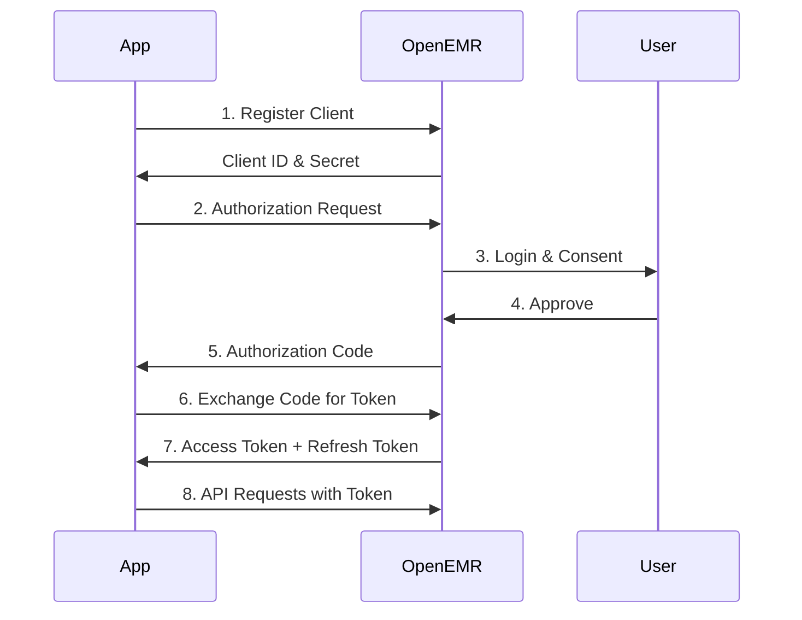

# OpenEMR API Documentation

Complete documentation for OpenEMR's REST API, FHIR API, and SMART on FHIR integration.

## Documentation Overview

| Document | Description |
|----------|-------------|
| [AUTHENTICATION.md](AUTHENTICATION.md) | OAuth2 flows, client registration, token management, and introspection |
| [AUTHORIZATION.md](AUTHORIZATION.md) | Scopes, permissions, and granular access control |
| [STANDARD_API.md](STANDARD_API.md) | OpenEMR REST API (`/api/` endpoints) |
| [FHIR_API.md](FHIR_API.md) | FHIR R4 API (`/fhir/` endpoints) |
| [SMART_ON_FHIR.md](SMART_ON_FHIR.md) | SMART app integration and launch flows |
| [DEVELOPER_GUIDE.md](DEVELOPER_GUIDE.md) | Internal usage, multisite, security, and development |

## Quick Start

### Prerequisites
1. SSL/TLS configured (required)
2. Base URL set: **Administration → Config → Connectors → Site Address**
   - Example: `https://your-openemr-install` or `https://your-openemr-install/openemr` (note this should be the root of your openemr installation without a trailing slash)
3. APIs enabled:
    - **Standard API**: Administration → Config → Connectors → Enable OpenEMR Standard REST API
    - **FHIR API**: Administration → Config → Connectors → Enable OpenEMR Standard FHIR REST API

### Choose Your Integration Path

#### Building a Healthcare Application?
→ Start with [FHIR API](FHIR_API.md)

#### Building a SMART on FHIR App?
→ Start with [SMART on FHIR](SMART_ON_FHIR.md)

#### Need Custom OpenEMR Integration?
→ Start with [Standard API](STANDARD_API.md)

#### Internal Development?
→ Start with [Developer Guide](DEVELOPER_GUIDE.md)

## API Endpoints

### Standard API (OpenEMR REST)
```
https://localhost:9300/apis/default/api
```
[Full Documentation →](STANDARD_API.md)

### FHIR API (FHIR R4)
```
https://localhost:9300/apis/default/fhir
```
[Full Documentation →](FHIR_API.md)

### Patient Portal API (Experimental)
```
https://localhost:9300/apis/default/portal
```
[Full Documentation →](STANDARD_API.md#patient-portal-api)

## Standards & Compliance

- **FHIR R4** - HL7 FHIR Release 4
- **US Core 8.0 IG** - US Core Implementation Guide
- **SMART on FHIR v2.2.0** - App launch framework
- **OAuth 2.0** - Authorization framework
- **OpenID Connect** - Authentication layer
- **ONC Cures Update** - Information blocking compliance

## Authentication Flow (Authorization Code Grant)


[Detailed Authentication Guide →](AUTHENTICATION.md)

## Key Concepts

### Scopes
Define what data your application can access. [Learn more →](AUTHORIZATION.md)
```
patient/Patient.rs
user/Observation.rs
system/Patient.$export
```

### OAuth2 Grants
Different authentication flows for different use cases:
- **Authorization Code** - Standard flow for web apps
- **Client Credentials** - System-to-system (bulk export)
- **EHR Launch** - Context-aware SMART apps
- **Standalone Launch** - Patient-facing apps

[Learn more →](AUTHENTICATION.md)

### Multisite Support
Include site name in endpoint:
```
/apis/{site}/fhir/Patient
/apis/{site}/api/patient
```
[Learn more →](DEVELOPER_GUIDE.md#multisite-support)

## What's New

### SMART on FHIR v2.2.0
- ✨ **New Scope Syntax** - `.cruds` syntax with backwards compatibility for `.read`/`.write`
- ✨ **Granular Scopes** - Fine-grained restrictions permissions with `?category=` and `?type=`
- ✨ **POST-Based Authorization** - More secure authorization flow
- ✨ **EHR Launch** - Context-aware app launches with encounter context
- ✨ **Asymmetric Authentication** - JWKS support for authorization_code grant
- ✨ **Token Introspection** - Validate token status
- ✨ **SMART Configuration** - `.well-known/smart-configuration` discovery

### New FHIR Resources
- **ServiceRequest** - Lab and procedure orders
- **Specimen** - Laboratory specimens
- **MedicationDispense** - Pharmacy dispensing
- **RelatedPerson** - Patient relationships
- **Resource updates for US Core 8.0 IG** - New profiles and extensions

## Support & Resources

- **Interactive Testing**: https://your-openemr-install/swagger/
- **Online Demos**: https://www.open-emr.org/wiki/index.php/Development_Demo
- **Community Forum**: https://community.open-emr.org/
- **Issue Tracker**: https://github.com/openemr/openemr/issues

## Security

⚠️ **Critical Security Requirements**:
- SSL/TLS required for all API endpoints
- Never expose client secrets in public apps
- Use PKCE for native applications
- Implement proper token storage
- Validate tokens before use

[Security Best Practices →](DEVELOPER_GUIDE.md#security-best-practices)

## Compliance

API integrations must comply with your jurisdiction's applicable healthcare regulations such as HIPAA in the USA. Ensure proper handling of Protected Health Information (PHI) and follow best practices for data security and patient privacy.

For US healthcare providers see [ONC EHR Certification Requiremens](https://www.open-emr.org/wiki/index.php/OpenEMR_7.0.4_ONC_Ambulatory_EHR_Certification_Requirements)

---
## Documentation Attribution

### Authorship
This documentation represents the collective knowledge and contributions of the OpenEMR open-source community. The content is based on:
- Original documentation by OpenEMR developers and contributors
- Technical specifications from the OpenEMR codebase
- Community feedback and real-world implementation experience

### AI Assistance
The organization, structure, and presentation of this documentation was enhanced using Claude AI (Anthropic) to:
- Reorganize content into a more accessible modular structure
- Add comprehensive examples and use cases
- Improve navigation and cross-referencing
- Enhance clarity and consistency across documents

All technical accuracy is maintained from the original community-authored documentation.

### Contributing
OpenEMR is an open-source project. To contribute to this documentation:
- **Report Issues:** [GitHub Issues](https://github.com/openemr/openemr/issues)
- **Discuss:** [Community Forum](https://community.open-emr.org/)
- **Submit Changes:** [Pull Requests](https://github.com/openemr/openemr/pulls)

**Last Updated:** November 2025
**License:** GPL v3

For complete documentation, see **[Documentation/api/](Documentation/api/)**
