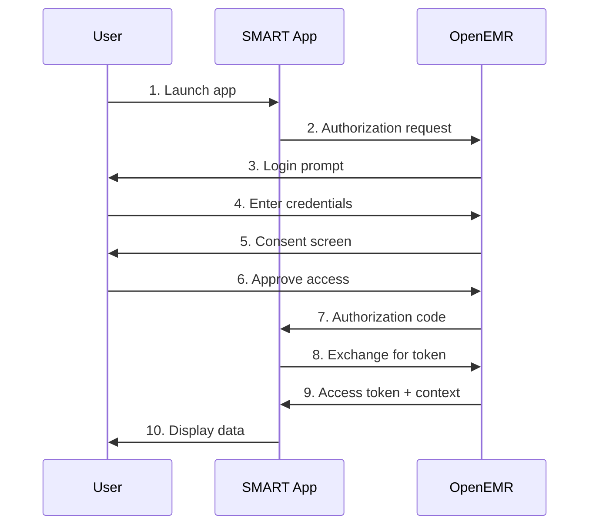
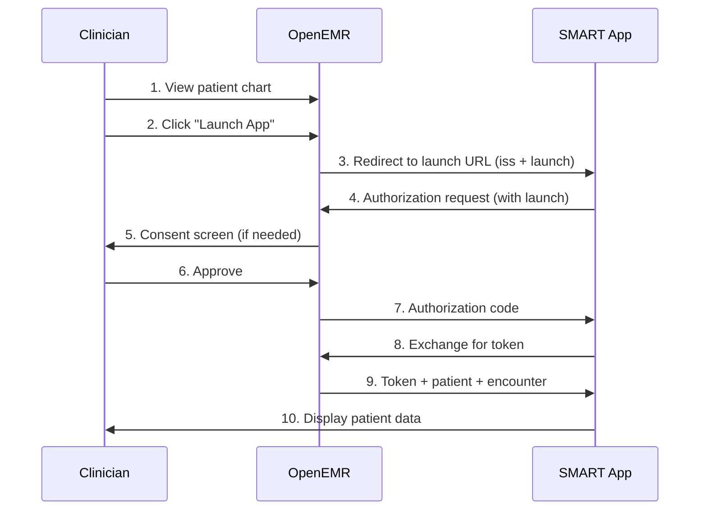

# SMART on FHIR

Complete guide to integrating SMART on FHIR applications with OpenEMR.

## Table of Contents
- [Overview](#overview)
- [SMART v2.2.0 Features](#smart-v220-features)
- [App Registration](#app-registration)
    - [Web-Based Registration](#web-based-registration)
    - [API-Based Registration](#api-based-registration)
    - [App Approval](#app-approval)
- [Launch Flows](#launch-flows)
    - [Standalone Launch](#standalone-launch)
    - [EHR Launch](#ehr-launch)
    - [Choosing Launch Type](#choosing-launch-type)
- [Launch Contexts](#launch-contexts)
    - [Patient Context](#patient-context)
    - [Encounter Context](#encounter-context)
    - [User Context (fhirUser)](#user-context-fhiruser)
- [SMART Configuration](#smart-configuration)
- [Native Applications](#native-applications)
- [App Management](#app-management)
    - [Enabling Apps](#enabling-apps)
    - [Disabling Apps](#disabling-apps)
    - [Monitoring Usage](#monitoring-usage)
- [Security Considerations](#security-considerations)
- [Examples](#examples)
- [Troubleshooting](#troubleshooting)

## Overview

**SMART on FHIR** (Substitutable Medical Applications, Reusable Technologies on Fast Healthcare Interoperability Resources) is a specification for integrating third-party applications with electronic health record systems.

### What is SMART on FHIR?

SMART on FHIR enables:
- ✅ **Interoperable apps** that work across different EHR systems
- ✅ **Secure data access** via OAuth 2.0 and FHIR APIs
- ✅ **Context-aware launches** with patient/encounter information
- ✅ **Standardized authorization** with granular scopes
- ✅ **User-friendly integration** without custom EHR modifications

### OpenEMR Support

OpenEMR fully supports:
- **SMART on FHIR v2.2.0** - Latest specification
- **EHR Launch** - Apps launched from within OpenEMR
- **Standalone Launch** - Apps launched independently
- **Native Apps** - Mobile and desktop applications
- **Patient Standalone Apps** - Patient-facing applications
- **Provider Apps** - Clinician-facing applications

### Standards Compliance

| Standard | Version | Status |
|----------|---------|--------|
| SMART on FHIR | v2.2.0 | ✅ Full Support |
| SMART App Launch | 1.1.0 | ✅ Compliant |
| OAuth 2.0 | RFC 6749 | ✅ Implemented |
| OpenID Connect | 1.0 | ✅ Supported |
| PKCE | RFC 7636 | ✅ Required for public apps |

## SMART v2.2.0 Features

OpenEMR implements **SMART on FHIR v2.2.0** with the following enhancements:

### New Features

#### 1. Granular Scopes
Fine-grained permissions with `.cruds` syntax:
```
patient/Observation.rs    # Read and search only
user/Patient.crus         # Create, read, update, search
```
See [Authorization Guide](AUTHORIZATION.md#granular-scopes) for details.


#### 2. POST-Based Authorization
More secure authorization requests via POST:
```http
POST /oauth2/default/authorize
Content-Type: application/x-www-form-urlencoded

response_type=code&client_id=...
```
See [Authentication Guide](AUTHENTICATION.md#post-based-authorization) for details.

#### 3. Asymmetric Client Authentication
JWKS-based authentication for confidential clients:
```json
{
  "token_endpoint_auth_method": "private_key_jwt",
  "jwks_uri": "https://app.example.com/.well-known/jwks.json"
}
```
See [Authentication Guide](AUTHENTICATION.md#asymmetric-client-authentication) for details.

#### 4. SMART Configuration Endpoint
Discovery endpoint for SMART capabilities:
```
GET /fhir/.well-known/smart-configuration
```
See [SMART Configuration](#smart-configuration) section below.

#### 5. Token Introspection
Validate token status:
```
POST /oauth2/default/introspect
```
See [Authentication Guide](AUTHENTICATION.md#token-introspection) for details.

### Enhanced Capabilities

- ✅ **Granular scope filtering** - Category-based resource access
- ✅ **Enhanced security** - Asymmetric authentication, POST auth
- ✅ **Better context** - Encounter-aware app launches
- ✅ **Improved discovery** - SMART configuration endpoint
- ✅ **Token validation** - Introspection support

## App Registration

SMART apps must be registered before use. OpenEMR provides two registration methods.

### Web-Based Registration

**Recommended for SMART apps** - User-friendly registration interface.

#### Steps

1. **Navigate to registration page:**
```
   https://your-openemr.example.com/interface/smart/register-app.php
```

2. **Fill in app details:**
    - **App Name:** Display name for the app
    - **Launch URL:** Where to redirect for EHR launch
    - **Redirect URI(s):** OAuth callback URLs (one per line)
    - **App Type:**
        - **Confidential** - Can securely store secret (server apps)
        - **Public** - Cannot store secret (browser/mobile apps)
    - **Scopes:** Select required scopes from checkboxes

3. **Submit registration**

4. **Receive credentials:**
    - Client ID
    - Client Secret (confidential apps only)

5. **Enable the app** (see [Enabling Apps](#enabling-apps))

#### Registration Form Fields

| Field | Required | Description | Example |
|-------|----------|-------------|---------|
| App Name | Yes | Display name | "Cardiac Risk Calculator" |
| Launch URL | For EHR launch | EHR launch endpoint | `https://app.example.com/launch` |
| Redirect URI | Yes | OAuth callback(s) | `https://app.example.com/callback` |
| App Type | Yes | Confidential or Public | Confidential |
| Client Authentication | Conditional | For confidential apps | client_secret_post |
| JWKS URI | For asymmetric auth | Public key location | `https://app.example.com/jwks` |
| Scopes | Yes | Required permissions | patient/Patient.rs |
| Logo URL | No | App icon | `https://app.example.com/logo.png` |
| Contacts | No | Admin emails | admin@example.com |

### API-Based Registration

**For programmatic registration** - See [Authentication Guide](AUTHENTICATION.md#standard-registration).

**Example:**
```bash
curl -X POST https://localhost:9300/oauth2/default/registration \
  -H 'Content-Type: application/json' \
  --data '{
    "application_type": "private",
    "client_name": "My SMART App",
    "redirect_uris": ["https://app.example.com/callback"],
    "launch_uris": ["https://app.example.com/launch"],
    "token_endpoint_auth_method": "client_secret_post",
    "scope": "openid fhirUser launch launch/patient patient/Patient.rs patient/Observation.rs",
    "contacts": ["admin@example.com"]
  }'
```

**Response includes:**
- `client_id`
- `client_secret` (confidential apps)
- Registration details

### App Approval

After registration, apps require approval based on configuration.

#### Approval Settings

**Administration → Config → Connectors → OAuth2 → App Manual Approval**

**Options:**

1. **Automatic Approval (Default)**
    - ✅ Patient standalone apps auto-approved
    - ✅ ONC Cures compliant (48-hour rule)
    - ⚠️ Provider/system apps require manual approval
    - **Use when:** Compliance required

2. **Manual Approval**
    - ⚠️ All apps require administrator approval
    - ✅ Most secure option
    - ✅ Full control over app access
    - **Use when:** Maximum security needed but requires monitoring to comply with ONC Cure Act for patient apps to be approved within 48 hours.

#### Patient Standalone Apps

**Auto-approved if:**
- Uses `patient/*` scopes ONLY
- No `user/*` or `system/*` scopes
- Registered as public OR confidential

**Why auto-approve?**
- ONC 21st Century Cures Act requirement
- Patients have right to choose apps
- Must be approved within 48 hours
- Information blocking penalties if delayed

#### Provider/System Apps

**Require manual approval:**
- Apps requesting `user/*` scopes
- Apps requesting `system/*` scopes
- Backend services (client credentials)

**Administrator can:**
- Review app details
- Verify app authenticity
- Request additional security measures
- Approve or deny access

## Launch Flows

SMART supports two launch patterns: **Standalone** and **EHR Launch**.

### Standalone Launch

**User-initiated** - App launched directly by user (outside EHR).

#### Characteristics
- ✅ User starts app independently
- ✅ App obtains authorization from scratch
- ✅ User selects patient (if multi-patient app)
- ✅ Suitable for patient-facing apps
- ✅ No pre-established context

#### Flow Diagram


#### Required Scopes

Standalone launch does NOT use `launch` scope (it may choose to use the `launch/patient` scope):

**Patient standalone:**
```
openid
offline_access
patient/Patient.rs
patient/Observation.rs
```

**Provider standalone:**
```
openid
fhirUser
offline_access
user/Patient.rs
user/Observation.rs
```

#### Implementation

**Step 1: App redirects to authorization endpoint**
```javascript
const authUrl = new URL('https://localhost:9300/oauth2/default/authorize');
authUrl.searchParams.set('response_type', 'code');
authUrl.searchParams.set('client_id', 'YOUR_CLIENT_ID');
authUrl.searchParams.set('redirect_uri', 'https://app.example.com/callback');
authUrl.searchParams.set('scope', 'openid offline_access patient/Patient.rs patient/Observation.rs');
authUrl.searchParams.set('state', generateRandomState());
authUrl.searchParams.set('aud', 'https://localhost:9300/apis/default/fhir');

// For public apps, add PKCE
authUrl.searchParams.set('code_challenge', codeChallenge);
authUrl.searchParams.set('code_challenge_method', 'S256');

window.location.href = authUrl.toString();
```

**Step 2: Handle callback**

After user approval, OpenEMR redirects to `redirect_uri`:
```
https://app.example.com/callback?code=AUTHORIZATION_CODE&state=STATE
```

**Step 3: Exchange code for token**

See [Authentication Guide](AUTHENTICATION.md#authorization-code-grant) for token exchange.

**Step 4: Use access token**
```javascript
const response = await fetch('https://localhost:9300/apis/default/fhir/Patient/123', {
  headers: {
    'Authorization': `Bearer ${accessToken}`,
    'Accept': 'application/fhir+json'
  }
});
```

#### Use Cases
- Patient portals
- Personal health apps
- Mobile health applications
- Wellness trackers
- Medication adherence apps

### EHR Launch

**EHR-initiated** - App launched from within OpenEMR with pre-established context.

#### Characteristics
- ✅ Launched from OpenEMR UI
- ✅ Patient context pre-selected
- ✅ Encounter context available (SMART v2.2.0)
- ✅ User already authenticated
- ✅ Faster workflow for clinicians
- ✅ Context-aware applications

#### Flow Diagram


#### Required Scopes

EHR launch REQUIRES `launch` scope:

**Minimal EHR launch:**
```
openid
fhirUser
launch
user/Patient.rs
user/Observation.rs
```

**With patient context:**
```
openid
fhirUser
launch
launch/patient
user/Patient.rs
user/Observation.rs
```

#### Implementation

**Step 1: OpenEMR redirects to launch URL**

OpenEMR initiates launch with:
```
https://app.example.com/launch?
  iss=https://localhost:9300/apis/default/fhir&
  launch=eyJhbGciOiJIUzI1NiIsInR5cCI6IkpXVCJ9...
```

**Parameters:**
- `iss` - FHIR base URL (issuer)
- `launch` - Opaque launch token (single-use)

**Step 2: App initiates authorization**

App must include the `launch` parameter:
```javascript
// Extract parameters from launch URL
const params = new URLSearchParams(window.location.search);
const iss = params.get('iss');
const launchToken = params.get('launch');

// Store launch token
sessionStorage.setItem('launch_token', launchToken);

// Build authorization URL
const authUrl = new URL('https://localhost:9300/oauth2/default/authorize');
authUrl.searchParams.set('response_type', 'code');
authUrl.searchParams.set('client_id', 'YOUR_CLIENT_ID');
authUrl.searchParams.set('redirect_uri', 'https://app.example.com/callback');
authUrl.searchParams.set('scope', 'openid fhirUser launch launch/patient user/Patient.rs user/Observation.rs');
authUrl.searchParams.set('state', generateRandomState());
authUrl.searchParams.set('aud', iss);
authUrl.searchParams.set('launch', launchToken); // CRITICAL

// PKCE for public apps
authUrl.searchParams.set('code_challenge', codeChallenge);
authUrl.searchParams.set('code_challenge_method', 'S256');

window.location.href = authUrl.toString();
```

**Step 3: Handle callback**

Same as standalone launch - receive authorization code.

**Step 4: Exchange for token with context**

Exchange code as normal. Response includes context:
```json
{
  "access_token": "eyJ0eXAiOiJKV1QiLCJhbGci...",
  "token_type": "Bearer",
  "expires_in": 3600,
  "scope": "openid fhirUser launch launch/patient user/Patient.rs",
  "id_token": "eyJ0eXAiOiJKV1QiLCJhbGci...",
  "patient": "123",
  "encounter": "456",
  "fhirUser": "Practitioner/789"
}
```

**Step 5: Use context**
```javascript
const tokenResponse = await exchangeCodeForToken(code);

// Extract context
const patientId = tokenResponse.patient;      // "123"
const encounterId = tokenResponse.encounter;  // "456"
const fhirUser = tokenResponse.fhirUser;      // "Practitioner/789"

// Fetch patient data
const patient = await fetch(
  `https://localhost:9300/apis/default/fhir/Patient/${patientId}`,
  { headers: { 'Authorization': `Bearer ${tokenResponse.access_token}` }}
);

// Fetch encounter data (if provided)
if (encounterId) {
  const encounter = await fetch(
    `https://localhost:9300/apis/default/fhir/Encounter/${encounterId}`,
    { headers: { 'Authorization': `Bearer ${tokenResponse.access_token}` }}
  );
}
```

#### Enabling in OpenEMR

**Step 1: Register app** (see [App Registration](#app-registration))

**Step 2: Enable app**
1. Navigate to **Administration → System → API Clients**
2. Find your app
3. Click **Enable**

**Step 3: App appears in Patient Summary**
- Go to patient chart
- Find **SMART Enabled Apps** widget
- Click your app to launch

#### Use Cases
- Clinical decision support
- Documentation aids
- Order entry enhancements
- Risk calculators
- Clinical workflows
- Specialty-specific tools

### Choosing Launch Type

| Factor | Standalone | EHR Launch |
|--------|------------|------------|
| **Initiated by** | User/Patient | EHR/Clinician |
| **Context** | User provides | Pre-established |
| **User Type** | Patients, Providers | Providers |
| **Workflow** | Independent | Integrated |
| **Setup** | Simpler | More complex |
| **Use Cases** | Patient apps, portals | Clinical tools, CDS |

**Can support both:**
- Register app with both standalone and launch capabilities
- App detects launch type based on presence of `launch` parameter
- Provides flexibility for different workflows

## Launch Contexts

SMART apps can receive contextual information about the launch environment.

### Patient Context

**Scope:** `launch/patient`

**Provides:** Patient ID in token response

#### When Available
- ✅ EHR launch from patient chart
- ✅ Patient standalone apps (patient is authorized user)
- ❌ Standalone provider apps (no pre-selected patient)

#### Requesting Patient Context

Include `launch/patient` in scopes:
```
openid fhirUser launch launch/patient user/Patient.rs
```

#### Receiving Patient Context

**Token response:**
```json
{
  "access_token": "...",
  "patient": "123"
}
```

#### Using Patient Context
```javascript
const patientId = tokenResponse.patient;

if (patientId) {
  // Fetch patient demographics
  const patient = await fetch(
    `${fhirBaseUrl}/Patient/${patientId}`,
    { headers: { 'Authorization': `Bearer ${accessToken}` }}
  );

  // Fetch patient's observations
  const observations = await fetch(
    `${fhirBaseUrl}/Observation?patient=${patientId}`,
    { headers: { 'Authorization': `Bearer ${accessToken}` }}
  );
} else {
  // No patient context - prompt user to select patient
  showPatientSelector();
}
```

### Receiving Encounter Context

**Token response (when encounter available):**
```json
{
  "access_token": "...",
  "patient": "123",
  "encounter": "456"
}
```

**Token response (no active encounter):**
```json
{
  "access_token": "...",
  "patient": "123"
}
```

**Note:** `encounter` field only present if user is in an active encounter.

#### Using Encounter Context
```javascript
const patientId = tokenResponse.patient;
const encounterId = tokenResponse.encounter;

// Always fetch patient
const patient = await fetch(
  `${fhirBaseUrl}/Patient/${patientId}`,
  { headers: { 'Authorization': `Bearer ${accessToken}` }}
);

if (encounterId) {
  // Encounter context available - fetch encounter details
  const encounter = await fetch(
    `${fhirBaseUrl}/Encounter/${encounterId}`,
    { headers: { 'Authorization': `Bearer ${accessToken}` }}
  );

  // Fetch encounter-specific data
  const encounterObservations = await fetch(
    `${fhirBaseUrl}/Observation?patient=${patientId}&encounter=${encounterId}`,
    { headers: { 'Authorization': `Bearer ${accessToken}` }}
  );

  // Display encounter-specific UI
  showEncounterView(encounter, encounterObservations);
} else {
  // No encounter context - show all patient data
  showPatientView(patient);
}
```

#### Use Cases

**Apps that benefit from encounter context:**

1. **Clinical Documentation**
    - Create notes for current visit
    - Document procedures performed
    - Record clinical findings

2. **Order Entry**
    - Place orders for current encounter
    - Associate results with visit
    - Track encounter-specific orders

3. **Clinical Decision Support**
    - Encounter-specific alerts
    - Visit-appropriate recommendations
    - Context-aware guidance

4. **Quality Measures**
    - Document encounter-based measures
    - Track visit-specific interventions
    - Performance reporting

5. **Billing/Coding**
    - Assign diagnosis codes to encounter
    - Generate encounter-based charges
    - Visit documentation support

#### Handling Missing Encounter Context

**Always check for encounter presence:**
```javascript
function handleLaunchContext(tokenResponse) {
  const patientId = tokenResponse.patient;
  const encounterId = tokenResponse.encounter;

  if (!patientId) {
    throw new Error('Patient context required but not provided');
  }

  if (encounterId) {
    // Encounter-specific mode
    return {
      mode: 'encounter',
      patientId: patientId,
      encounterId: encounterId
    };
  } else {
    // Patient-level mode (no active encounter)
    return {
      mode: 'patient',
      patientId: patientId
    };
  }
}

// Use context
const context = handleLaunchContext(tokenResponse);

if (context.mode === 'encounter') {
  // Show encounter-specific features
  enableEncounterDocumentation();
  loadEncounterData(context.patientId, context.encounterId);
} else {
  // Show patient-level features
  enablePatientView();
  loadPatientData(context.patientId);
}
```

### User Context (fhirUser)

**Scope:** `fhirUser`

**Provides:** Practitioner or Patient reference for authenticated user

#### Requesting fhirUser

Include `fhirUser` in scopes:
```
openid fhirUser launch user/Patient.rs
```

#### Receiving fhirUser

**Token response:**
```json
{
  "access_token": "...",
  "fhirUser": "Practitioner/789"
}
```

**Or for patient:**
```json
{
  "access_token": "...",
  "fhirUser": "Patient/123"
}
```

**Or for staff that are not Practitioners:**
```json
{
  "access_token": "...",
  "fhirUser": "Person/123"
}
```

#### Using fhirUser
```javascript
const fhirUser = tokenResponse.fhirUser;

// Parse user reference
const [resourceType, userId] = fhirUser.split('/');

if (resourceType === 'Practitioner') {
  // Fetch practitioner details
  const practitioner = await fetch(
    `${fhirBaseUrl}/Practitioner/${userId}`,
    { headers: { 'Authorization': `Bearer ${accessToken}` }}
  );

  // Display provider name in UI
  displayProviderInfo(practitioner);

} else if (resourceType === 'Patient') {
  // Patient user
  const patient = await fetch(
    `${fhirBaseUrl}/Patient/${userId}`,
    { headers: { 'Authorization': `Bearer ${accessToken}` }}
  );

  displayPatientInfo(patient);
} else if (resourceType === 'Person') {
    // Person user
    const person = await fetch(
        `${fhirBaseUrl}/Person/${userId}`,
        { headers: { 'Authorization': `Bearer ${accessToken}` }}
    );

    displayPersonInfo(person);
}
```

#### Use Cases
- Display logged-in user's name
- Attribute actions to specific user
- User-specific preferences
- Audit trail
- Personalized UI

### Context Summary

| Context | Scope | Field | Example Value | When Available |
|---------|-------|-------|---------------|----------------|
| **Patient** | `launch/patient` | `patient` | `"123"` | EHR launch, patient apps |
| **User** | `fhirUser` | `fhirUser` | `"Practitioner/789"` | All authenticated launches |

**Example token response with all contexts:**
```json
{
  "access_token": "eyJ0eXAiOiJKV1Qi...",
  "token_type": "Bearer",
  "expires_in": 3600,
  "scope": "openid fhirUser launch launch/patient launch/encounter user/Patient.rs user/Encounter.rs",
  "patient": "123",
  "encounter": "456",
  "fhirUser": "Practitioner/789"
}
```

## SMART Configuration

### Endpoint
```
GET /fhir/.well-known/smart-configuration
```

**No authentication required.**

### Purpose

- ✅ Discover SMART capabilities dynamically
- ✅ Configure apps without hardcoding URLs
- ✅ Detect supported features
- ✅ Identify OAuth endpoints
- ✅ Determine available scopes

### Request
```bash
curl -X GET 'https://localhost:9300/apis/default/fhir/.well-known/smart-configuration' \
  -H 'Accept: application/json'
```

### Response
```json
{
  "issuer": "https://localhost:9300/oauth2/default",
  "authorization_endpoint": "https://localhost:9300/oauth2/default/authorize",
  "token_endpoint": "https://localhost:9300/oauth2/default/token",
  "token_endpoint_auth_methods_supported": [
    "client_secret_basic",
    "client_secret_post",
    "private_key_jwt"
  ],
  "grant_types_supported": [
    "authorization_code",
    "refresh_token",
    "client_credentials"
  ],
  "registration_endpoint": "https://localhost:9300/oauth2/default/registration",
  "scopes_supported": [
    "openid",
    "fhirUser",
    "launch",
    "launch/patient",
    "launch/encounter",
    "offline_access",
    "online_access",
    "patient/Patient.rs",
    "user/Patient.rs",
    "system/Patient.rs"
  ],
  "response_types_supported": ["code"],
  "capabilities": [
    "launch-ehr",
    "launch-standalone",
    "client-public",
    "client-confidential-symmetric",
    "client-confidential-asymmetric",
    "context-banner",
    "context-style",
    "context-ehr-patient",
    "context-ehr-encounter",
    "sso-openid-connect",
    "permission-offline",
    "permission-patient",
    "permission-user",
    "permission-v1",
    "permission-v2"
  ],
  "code_challenge_methods_supported": ["S256"],
  "introspection_endpoint": "https://localhost:9300/oauth2/default/introspect",
  "revocation_endpoint": "https://localhost:9300/oauth2/default/revoke"
}
```

### SMART Capabilities

| Capability                       | Description                                                                    |
|----------------------------------|--------------------------------------------------------------------------------|
| `launch-ehr`                     | Supports EHR launch flow                                                       |
| `launch-standalone`              | Supports standalone launch flow                                                |
| `client-public`                  | Supports public clients (PKCE required)                                        |
| `client-confidential-symmetric`  | Supports client secrets                                                        |
| `client-confidential-asymmetric` | Supports JWKS authentication                                                   |
| `context-ehr-patient`            | Provides patient context in EHR launch                                         |
| `context-ehr-encounter`          | Provides encounter context in EHR launch ✨ NEW                                 |
| `sso-openid-connect`             | OpenID Connect single sign-on                                                  |
| `permission-offline`             | Offline access (refresh tokens)                                                |
| `permission-patient`             | Patient-level scopes supported                                                 |
| `permission-user`                | User-level scopes supported                                                    |
| `authorize-post` | Pass data via POST directly to authorization endpoint instead of via GET ✨ NEW |
| `permission-v1`                  | SMART v1 scopes (Backwards compatability) ✨ NEW                                |
| `permission-v2`                  | SMART v2 scopes (granular permissions) ✨ NEW                                   |

### Using SMART Configuration

**Dynamic app configuration:**
```javascript
class SMARTApp {
  async initialize(fhirBaseUrl) {
    // Discover SMART configuration
    const configUrl = `${fhirBaseUrl}/.well-known/smart-configuration`;
    const config = await fetch(configUrl).then(r => r.json());

    // Store endpoints
    this.authorizationEndpoint = config.authorization_endpoint;
    this.tokenEndpoint = config.token_endpoint;
    this.registrationEndpoint = config.registration_endpoint;

    // Check capabilities
    this.supportsEHRLaunch = config.capabilities.includes('launch-ehr');
    this.supportsEncounterContext = config.capabilities.includes('context-ehr-encounter');
    this.supportsGranularScopes = config.capabilities.includes('permission-v2');

    // Check PKCE requirement
    this.requiresPKCE = config.code_challenge_methods_supported?.includes('S256');

    console.log('SMART configuration loaded:', {
      ehrLaunch: this.supportsEHRLaunch,
      encounterContext: this.supportsEncounterContext,
      granularScopes: this.supportsGranularScopes
    });
  }

  buildAuthorizationUrl(scopes) {
    const url = new URL(this.authorizationEndpoint);
    url.searchParams.set('response_type', 'code');
    url.searchParams.set('client_id', this.clientId);
    url.searchParams.set('redirect_uri', this.redirectUri);

    // Use granular scopes if supported
    if (this.supportsGranularScopes) {
      url.searchParams.set('scope', scopes.join(' '));
    } else {
      // Fall back to v1 scopes
      const v1Scopes = scopes.map(s => s.replace('.rs', '.read'));
      url.searchParams.set('scope', v1Scopes.join(' '));
    }

    return url.toString();
  }
}
```

### Relationship to OpenID Configuration

**Two discovery endpoints:**

1. **OpenID Configuration** - General OAuth/OIDC
```
   GET /oauth2/default/.well-known/openid-configuration
```

2. **SMART Configuration** - FHIR/SMART specific
```
   GET /fhir/.well-known/smart-configuration
```

**SMART apps should use:** SMART configuration endpoint

**Benefits:**
- FHIR-specific capabilities
- SMART launch support indicators
- Granular scope information
- FHIR context details

## Native Applications

SMART supports native applications (mobile, desktop) with additional security requirements.

### Requirements for Native Apps

#### 1. Public Client Registration
```json
{
  "application_type": "public",
  "client_name": "My Mobile App"
}
```

**No client secret** - Cannot be securely stored in native apps.

#### 2. PKCE Required

**Proof Key for Code Exchange (PKCE)** is mandatory:
```javascript
// Generate code verifier
const codeVerifier = generateRandomString(128);
sessionStorage.setItem('code_verifier', codeVerifier);

// Generate code challenge
const codeChallenge = await sha256(codeVerifier).then(base64url);

// Include in authorization request
authUrl.searchParams.set('code_challenge', codeChallenge);
authUrl.searchParams.set('code_challenge_method', 'S256');
```

See [Authentication Guide](AUTHENTICATION.md#pkce-proof-key-for-code-exchange) for implementation.

#### 3. Custom URI Scheme

**Redirect URI** should use custom scheme:
```
com.example.myapp://callback
myapp://oauth/callback
```

**Registration:**
```json
{
  "redirect_uris": ["com.example.myapp://callback"]
}
```

**Platform-specific:**
- **iOS:** Configure URL scheme in Info.plist
- **Android:** Configure intent filter in AndroidManifest.xml
- **Desktop:** Register custom protocol handler

#### 4. Secure Token Storage

**Required:** Store tokens securely

**iOS:**
- Use Keychain Services
- Enable Data Protection

**Android:**
- Use Android Keystore
- Encrypted SharedPreferences

**Desktop:**
- OS credential manager
- Encrypted storage

**Never:**
- ❌ Plain text files
- ❌ Unencrypted databases
- ❌ Application properties
- ❌ Logging tokens

#### 5. Refresh Token Support

**Scope:** `offline_access`

Native apps should request refresh tokens:
```
openid offline_access patient/Patient.rs patient/Observation.rs
```

**Refresh token lifetime:** 3 months

**Rotation:** New refresh token issued on each use

#### 6. Certificate Pinning

**Recommended:** Pin server certificates to prevent MITM attacks
```swift
// iOS example
func urlSession(_ session: URLSession,
                didReceive challenge: URLAuthenticationChallenge,
                completionHandler: @escaping (URLSession.AuthChallengeDisposition, URLCredential?) -> Void) {

    guard let serverTrust = challenge.protectionSpace.serverTrust else {
        completionHandler(.cancelAuthenticationChallenge, nil)
        return
    }

    // Verify certificate against pinned certificate
    if verifyCertificate(serverTrust) {
        completionHandler(.useCredential, URLCredential(trust: serverTrust))
    } else {
        completionHandler(.cancelAuthenticationChallenge, nil)
    }
}
```

### Native App Example (React Native)
```javascript
import { authorize } from 'react-native-app-auth';
import * as Keychain from 'react-native-keychain';

class SMARTNativeApp {
  async login() {
    // SMART configuration
    const config = {
      issuer: 'https://localhost:9300/oauth2/default',
      clientId: 'YOUR_CLIENT_ID',
      redirectUrl: 'com.example.app://callback',
      scopes: [
        'openid',
        'offline_access',
        'patient/Patient.rs',
        'patient/Observation.rs'
      ],

      // PKCE automatically handled
      usePKCE: true,

      // Additional parameters
      additionalParameters: {
        aud: 'https://localhost:9300/apis/default/fhir'
      }
    };

    try {
      // Perform authorization
      const result = await authorize(config);

      // Securely store tokens
      await Keychain.setGenericPassword(
        'access_token',
        result.accessToken,
        { service: 'smart_tokens' }
      );

      await Keychain.setGenericPassword(
        'refresh_token',
        result.refreshToken,
        { service: 'smart_tokens' }
      );

      // Extract context
      const patientId = result.tokenAdditionalParameters?.patient;

      return {
        accessToken: result.accessToken,
        refreshToken: result.refreshToken,
        patientId: patientId
      };

    } catch (error) {
      console.error('Authorization failed:', error);
      throw error;
    }
  }

  async getAccessToken() {
    // Retrieve from secure storage
    const credentials = await Keychain.getGenericPassword({
      service: 'smart_tokens'
    });

    if (credentials) {
      return credentials.password; // access_token
    }

    throw new Error('No access token found');
  }

  async refreshAccessToken() {
    // Implement refresh token flow
    // See Authentication Guide for details
  }
}
```

### Best Practices for Native Apps

✅ **Always use PKCE** - Required for public clients
✅ **Secure token storage** - Use platform-specific secure storage
✅ **Certificate pinning** - Prevent MITM attacks
✅ **Short-lived tokens** - Request refresh tokens for long-term access
✅ **Token rotation** - Handle refresh token rotation
✅ **Error handling** - Gracefully handle token expiration
✅ **Deep linking** - Handle custom URI scheme properly
✅ **Network security** - Use TLS, validate certificates

❌ **Don't hardcode secrets** - No client secrets in native apps
❌ **Don't log tokens** - Prevent token leakage
❌ **Don't use embedded browsers** - Use system browser (ASWebAuthenticationSession, Chrome Custom Tabs)

### Compliance

Native apps must follow [RFC 8252: OAuth 2.0 for Native Apps](https://tools.ietf.org/html/rfc8252)

**Key requirements:**
- Use system browser (not embedded WebView)
- Implement PKCE
- Use custom URI schemes or claimed HTTPS URLs
- Secure token storage
- No client secrets

## App Management

Administrators manage SMART apps through the OpenEMR interface.

### Enabling Apps

After registration, apps must be enabled:

**Steps:**
1. Navigate to **Administration → System → API Clients**
2. Find your app in the list
3. Click **Edit**
4. Click **Enable** button
5. App appears in **Patient Summary → SMART Enabled Apps**

**Auto-enabled:**
- Patient standalone apps (if auto-approval enabled)

**Require enabling:**
- Provider/system apps
- Apps in manual approval mode

### Disabling Apps

Temporarily disable app without deleting:

**Steps:**
1. Navigate to **Administration → System → API Clients**
2. Find app to disable
3. Click **Edit**
4. Click **Disable** button

**Effect:**
- ❌ App removed from SMART Enabled Apps widget
- ❌ All tokens for app become invalid
- ❌ App cannot request new tokens
- ✅ App registration preserved
- ✅ Can be re-enabled later

**Use when:**
- App under investigation
- Temporary suspension
- Testing/development

### Monitoring Usage

**View app usage:**
1. **Administration → System → API Clients**
2. Edit app
3. View sections:
    - **Authenticated API Users** - Users who authorized app
    - **Access Tokens** - Active tokens
    - **Refresh Tokens** - Issued refresh tokens

**Information available:**
- Number of authorized users
- Token issuance dates
- Token expiration times
- Last token use
- Scopes granted

### Revoking Access

See [Authorization Guide - Revoking Access](AUTHORIZATION.md#revoking-access) for:
- Revoking entire client
- Revoking specific user's authorization
- Revoking individual tokens

## Security Considerations

### For App Developers

✅ **Use HTTPS only** - All communication over TLS
✅ **Validate state parameter** - Prevent CSRF attacks
✅ **Implement PKCE** - Required for public apps, recommended for all
✅ **Secure token storage** - Never expose tokens
✅ **Validate tokens** - Use introspection for high-security operations
✅ **Handle token expiration** - Implement refresh flow
✅ **Minimize scope requests** - Request only necessary permissions
✅ **Use granular scopes** - Limit data access
✅ **Validate redirect URIs** - Ensure exact match
✅ **Log security events** - Track authorization attempts

❌ **Don't expose client secrets** - In public apps or client-side code
❌ **Don't bypass SSL validation** - Always validate certificates
❌ **Don't store tokens in logs** - Prevent token leakage
❌ **Don't use wildcard redirects** - Security risk
❌ **Don't request excessive scopes** - Follow least privilege

### For Administrators

✅ **Review app registrations** - Verify app legitimacy
✅ **Monitor app usage** - Regular audits
✅ **Enable manual approval** - For maximum security
✅ **Revoke suspicious apps** - Act on security incidents
✅ **Educate users** - About app permissions
✅ **Maintain audit logs** - Track API access
✅ **Update OpenEMR** - Apply security patches

❌ **Don't auto-approve system apps** - Review carefully
❌ **Don't ignore security alerts** - Investigate promptly
❌ **Don't share credentials** - Each app gets unique ID

### Security Best Practices

**Authentication:**
- Use asymmetric authentication when possible with a JWKS URI
- Rotate client secrets regularly
- Implement token introspection

**Authorization:**
- Request minimum scopes
- Use granular filters
- Implement proper consent screens

**Data Protection:**
- Encrypt tokens at rest
- Use secure communication channels
- Implement proper access controls

**Incident Response:**
- Have revocation procedures
- Monitor for suspicious activity
- Document security events


## Troubleshooting

### Common Issues

#### Issue: "Invalid launch token"

**Symptoms:** Authorization fails with invalid launch token error

**Causes:**
- Launch token already used
- Launch token expired
- Missing `launch` parameter in authorization request

**Solutions:**
- ✅ Include launch token from original launch URL
- ✅ Don't reuse launch tokens
- ✅ Complete authorization within timeout period

#### Issue: "No patient context"

**Symptoms:** Token response missing `patient` field

**Causes:**
- `launch/patient` scope not requested
- EHR launch without patient selection
- Standalone launch (no patient context)

**Solutions:**
- ✅ Request `launch/patient` scope
- ✅ Launch from patient chart
- ✅ Handle missing patient context gracefully

#### Issue: "Insufficient scope"

**Symptoms:** 403 Forbidden when accessing resources

**Causes:**
- Requested resource requires different scope
- Granular scope too restrictive
- User denied scope during authorization

**Solutions:**
- ✅ Request appropriate scopes during registration
- ✅ Check granted scopes in token response
- ✅ Handle scope denials gracefully

#### Issue: "App not appearing in widget"

**Symptoms:** App not visible in SMART Enabled Apps

**Causes:**
- App not enabled
- App pending approval
- App disabled by administrator

**Solutions:**
- ✅ Enable app in Administration → System → API Clients
- ✅ Wait for administrator approval
- ✅ Check app status

#### Issue: "PKCE verification failed"

**Symptoms:** Token exchange fails with PKCE error

**Causes:**
- Code verifier doesn't match challenge
- Code verifier not sent in token request
- Wrong PKCE method

**Solutions:**
- ✅ Store code verifier from authorization
- ✅ Send same verifier in token request
- ✅ Use S256 method (SHA-256)

### Debug Checklist

**For authorization issues:**
- [ ] Check client ID matches registration
- [ ] Verify redirect URI matches exactly
- [ ] Confirm scopes are valid
- [ ] Validate state parameter
- [ ] Check PKCE implementation (public apps)

**For launch issues:**
- [ ] Verify launch token included
- [ ] Check launch URL parameters
- [ ] Confirm scopes include `launch`
- [ ] Validate ISS parameter

**For token issues:**
- [ ] Verify token not expired
- [ ] Check token has required scopes
- [ ] Validate Bearer token format
- [ ] Confirm SSL/TLS used

**For context issues:**
- [ ] Check requested context scopes
- [ ] Verify context available in launch
- [ ] Handle missing context gracefully

---

**Next Steps:**
- Review [Authentication Guide](AUTHENTICATION.md) for OAuth2 details
- See [Authorization Guide](AUTHORIZATION.md) for scope information
- Check [FHIR API](FHIR_API.md) for endpoint documentation
- Read [Developer Guide](DEVELOPER_GUIDE.md) for implementation

**Resources:**
- SMART App Launch IG: http://hl7.org/fhir/smart-app-launch/
- SMART on FHIR: https://smarthealthit.org/
- Community Forum: https://community.open-emr.org/
- Example Apps: https://github.com/smart-on-fhir/

**Support:**
- Community Forum: https://community.open-emr.org/
- GitHub Issues: https://github.com/openemr/openemr/issues

---
## Documentation Attribution

### Authorship
This documentation represents the collective knowledge and contributions of the OpenEMR open-source community. The content is based on:
- Original documentation by OpenEMR developers and contributors
- Technical specifications from the OpenEMR codebase
- Community feedback and real-world implementation experience

### AI Assistance
The organization, structure, and presentation of this documentation was enhanced using Claude AI (Anthropic) to:
- Reorganize content into a more accessible modular structure
- Add comprehensive examples and use cases
- Improve navigation and cross-referencing
- Enhance clarity and consistency across documents

All technical accuracy is maintained from the original community-authored documentation.

### Contributing
OpenEMR is an open-source project. To contribute to this documentation:
- **Report Issues:** [GitHub Issues](https://github.com/openemr/openemr/issues)
- **Discuss:** [Community Forum](https://community.open-emr.org/)
- **Submit Changes:** [Pull Requests](https://github.com/openemr/openemr/pulls)

**Last Updated:** November 2025
**License:** GPL v3

For complete documentation, see **[Documentation/api/](Documentation/api/)**
