# Vietnamese PT Module - Technical Architecture

**Version:** 1.0
**Last Updated:** 2025-11-22
**Author:** Dang Tran <tqvdang@msn.com>

## Table of Contents

- [Overview](#overview)
- [System Architecture](#system-architecture)
- [Component Diagrams](#component-diagrams)
- [Request Flow](#request-flow)
- [Service Layer Architecture](#service-layer-architecture)
- [Event System](#event-system)
- [Database Architecture](#database-architecture)
- [Integration Points](#integration-points)
- [Security Architecture](#security-architecture)

---

## Overview

The Vietnamese PT Module extends OpenEMR with comprehensive bilingual physiotherapy capabilities. It follows OpenEMR's modern architecture patterns with PSR-4 namespaced PHP, REST APIs, event-driven design, and service-oriented architecture.

### Core Design Principles

1. **Bilingual First**: Every data field has English and Vietnamese variants
2. **Service-Oriented**: Business logic isolated in service classes
3. **Event-Driven**: Services dispatch events for extensibility
4. **Validation-Centric**: All input validated before processing
5. **REST-Compliant**: Standard HTTP methods and status codes

---

## System Architecture

### High-Level Architecture

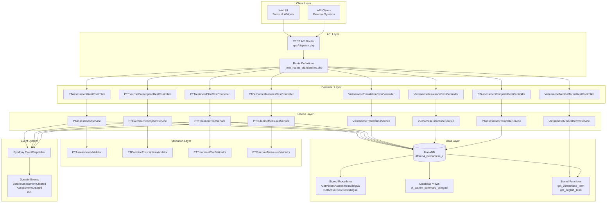

---

## Component Diagrams

### Module Component Structure

```mermaid
graph LR
    subgraph "Vietnamese PT Module"
        subgraph "src/RestControllers/VietnamesePT"
            RC1[PTAssessmentRestController]
            RC2[PTExercisePrescriptionRestController]
            RC3[PTTreatmentPlanRestController]
            RC4[PTOutcomeMeasuresRestController]
            RC5[VietnameseMedicalTermsRestController]
            RC6[VietnameseTranslationRestController]
            RC7[VietnameseInsuranceRestController]
            RC8[PTAssessmentTemplateRestController]
        end

        subgraph "src/Services/VietnamesePT"
            S1[PTAssessmentService]
            S2[PTExercisePrescriptionService]
            S3[PTTreatmentPlanService]
            S4[PTOutcomeMeasuresService]
            S5[VietnameseMedicalTermsService]
            S6[VietnameseTranslationService]
            S7[VietnameseInsuranceService]
            S8[PTAssessmentTemplateService]
        end

        subgraph "src/Validators/VietnamesePT"
            V1[PTAssessmentValidator]
            V2[PTExercisePrescriptionValidator]
            V3[PTTreatmentPlanValidator]
            V4[PTOutcomeMeasuresValidator]
        end

        subgraph "interface/forms"
            F1[vietnamese_pt_assessment]
            F2[vietnamese_pt_exercise]
            F3[vietnamese_pt_treatment_plan]
            F4[vietnamese_pt_outcome]
        end

        subgraph "library/custom"
            W1[vietnamese_pt_widget.php]
        end
    end

    RC1 --> S1
    RC2 --> S2
    RC3 --> S3
    RC4 --> S4
    RC5 --> S5
    RC6 --> S6
    RC7 --> S7
    RC8 --> S8

    S1 --> V1
    S2 --> V2
    S3 --> V3
    S4 --> V4

    F1 --> S1
    F2 --> S2
    F3 --> S3
    F4 --> S4

    W1 --> S1
    W1 --> S2
    W1 --> S3
    W1 --> S4
```

---

## Request Flow

### REST API Request Flow

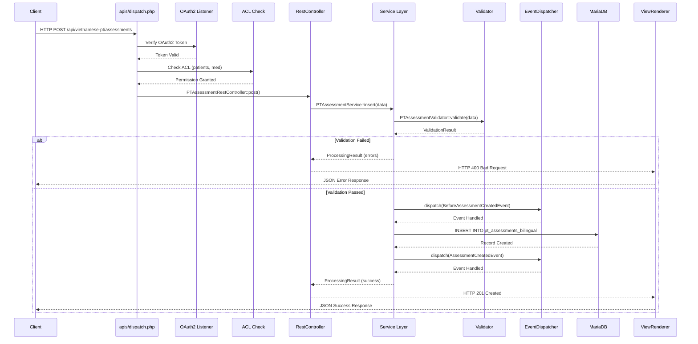

### Traditional Form Flow

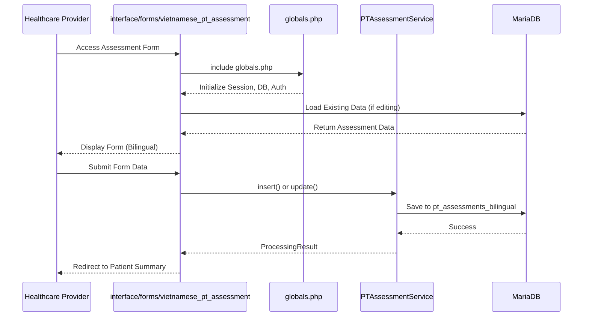

---

## Service Layer Architecture

### BaseService Extension Pattern

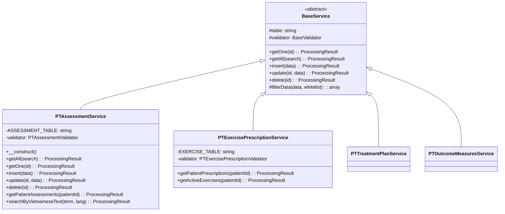

### Service Method Pattern

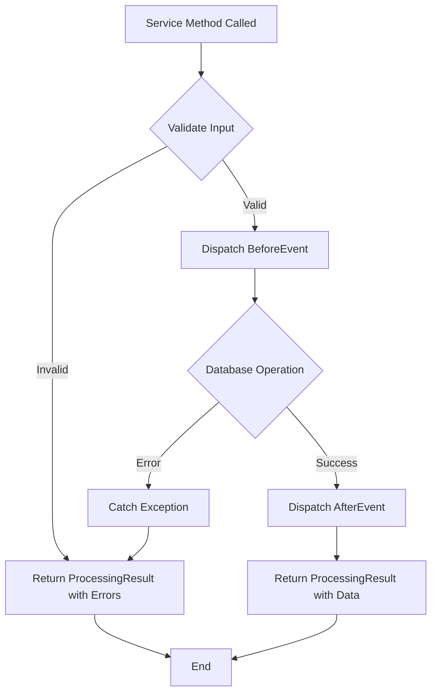

---

## Event System

### Event Dispatch Flow

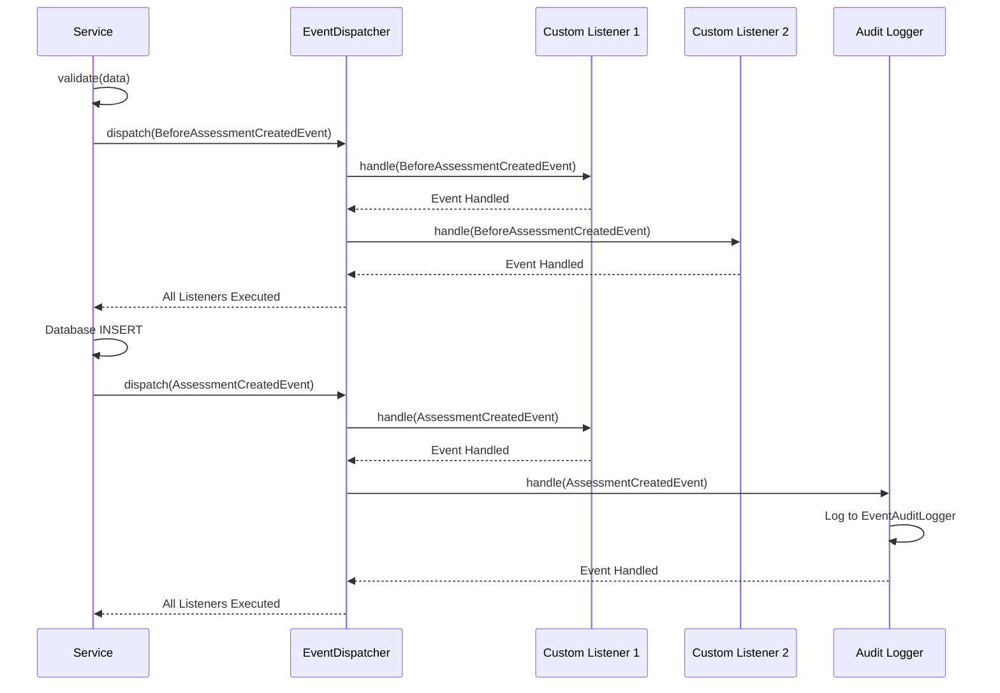

### Available Events

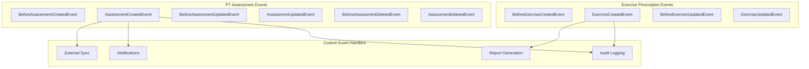

---

## Database Architecture

### Entity Relationship Diagram

See [DATABASE_SCHEMA.md](./DATABASE_SCHEMA.md) for detailed ER diagram.

### Database Layer Components

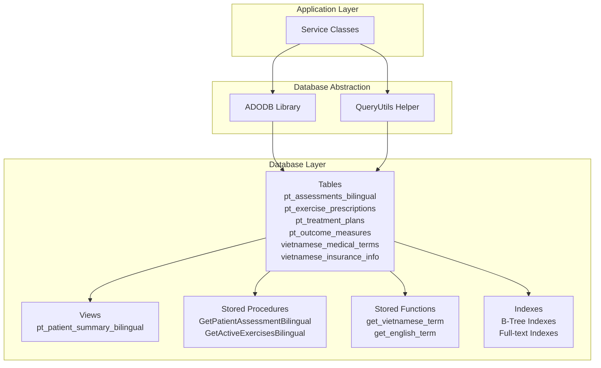

### Bilingual Data Storage Pattern

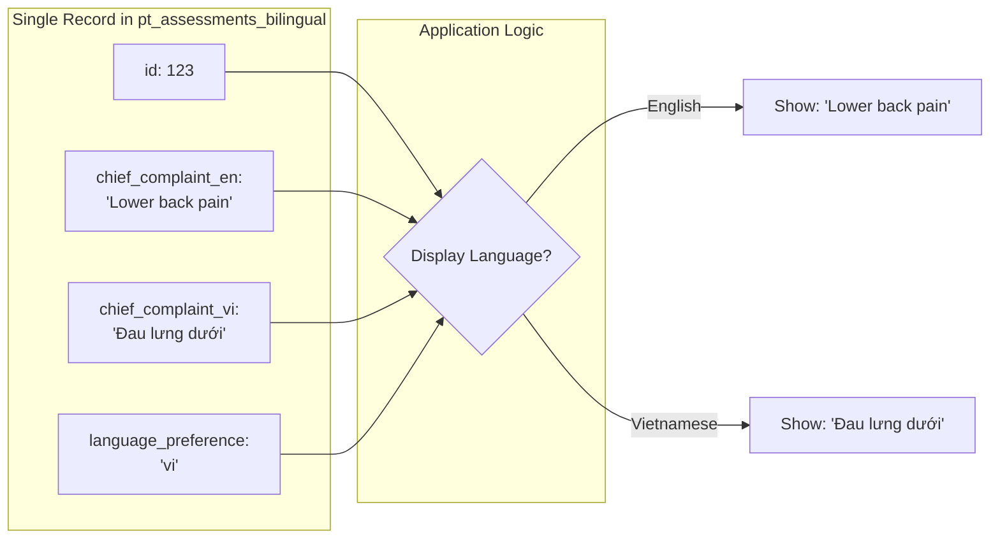

---

## Integration Points

### OpenEMR Core Integration

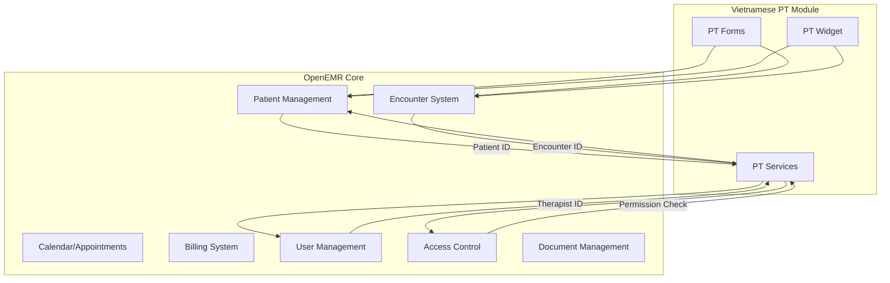

### External System Integration

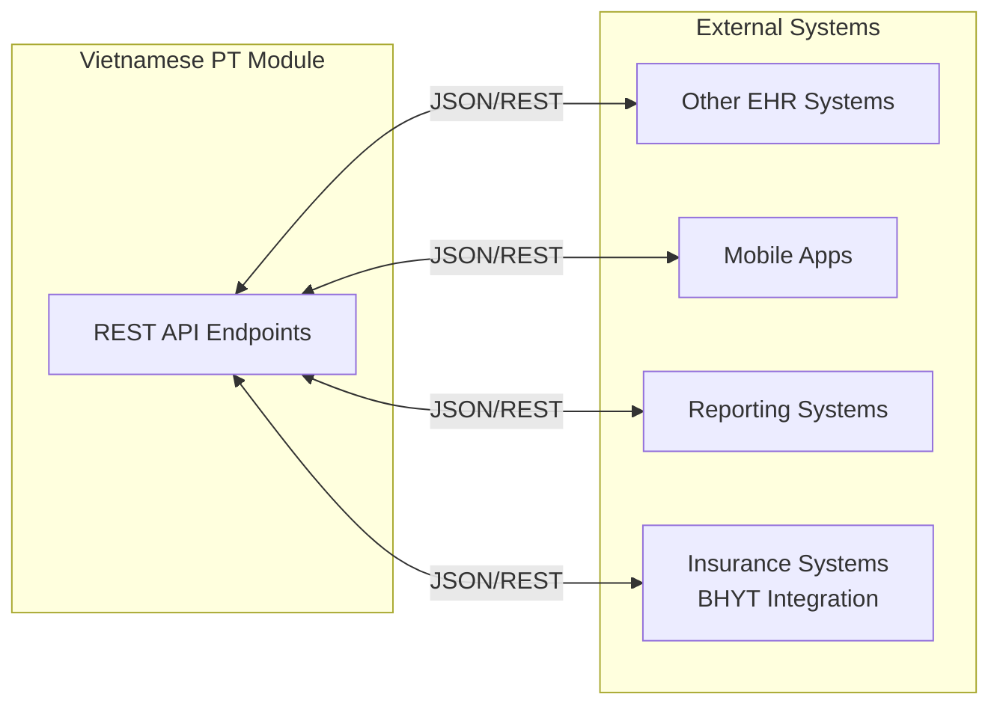

---

## Security Architecture

### Authentication & Authorization Flow

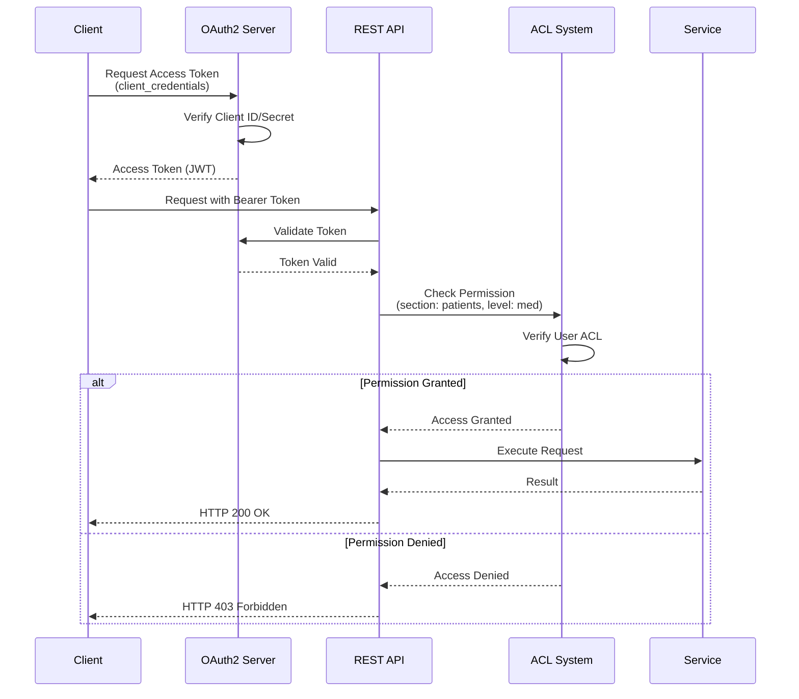

### Data Security Layers

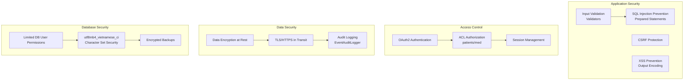

---

## Deployment Architecture

### Development Environment

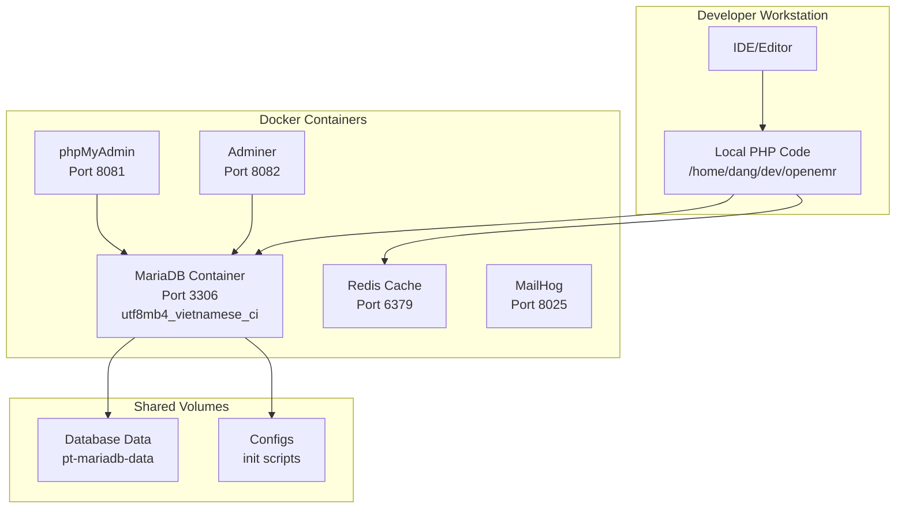

### Production Architecture

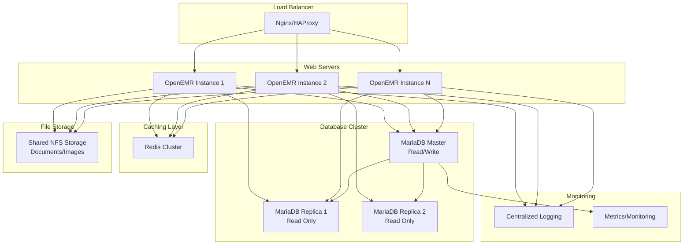

---

## Performance Optimization

### Caching Strategy

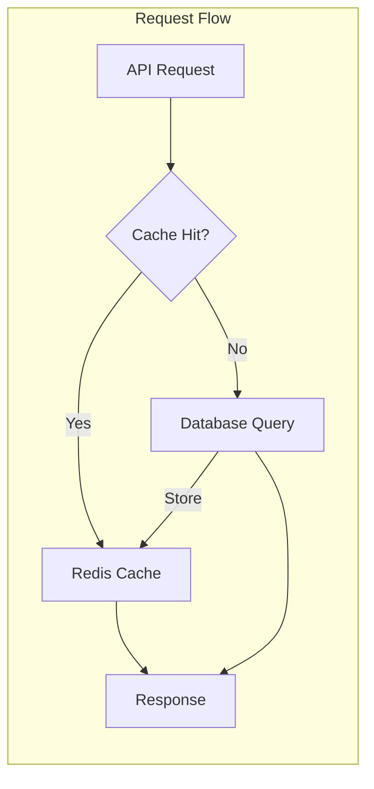

### Database Indexing Strategy

All Vietnamese PT tables include:
- **Primary Key Indexes**: Fast lookups by ID
- **Foreign Key Indexes**: Join optimization (patient_id, encounter_id, therapist_id)
- **Status/Date Indexes**: Query filtering
- **Full-text Indexes**: Bilingual text search on EN/VI fields
- **Composite Indexes**: Multi-column query optimization

---

## Technology Stack

| Layer | Technology | Purpose |
|-------|-----------|---------|
| **Backend** | PHP 8.2+ | Application logic |
| **Framework** | Symfony Components | Event system, validation |
| **API** | REST (JSON) | External interface |
| **Database** | MariaDB 10.11+ | Data persistence |
| **Collation** | utf8mb4_vietnamese_ci | Vietnamese character support |
| **Caching** | Redis | Performance optimization |
| **Auth** | OAuth2 | API authentication |
| **ACL** | OpenEMR ACL System | Authorization |
| **Frontend** | Bootstrap 4, jQuery | UI components |

---

## File Structure

```
openemr/
├── src/
│   ├── RestControllers/VietnamesePT/     # 8 REST controllers
│   ├── Services/VietnamesePT/            # 8 service classes
│   └── Validators/VietnamesePT/          # 4 validators
├── interface/forms/
│   ├── vietnamese_pt_assessment/         # Assessment form
│   ├── vietnamese_pt_exercise/           # Exercise form
│   ├── vietnamese_pt_treatment_plan/     # Treatment plan form
│   └── vietnamese_pt_outcome/            # Outcome measures form
├── library/custom/
│   └── vietnamese_pt_widget.php          # Patient summary widget
├── apis/routes/
│   └── _rest_routes_standard.inc.php     # PT API routes (lines 7293-7581)
├── sql/
│   └── vietnamese_pt_functions.sql       # Database functions
├── docker/development-physiotherapy/
│   └── configs/mariadb/init/
│       ├── 02-pt-bilingual-schema.sql    # Table definitions
│       └── 04-physiotherapy-extensions.sql # Extensions
├── tests/Tests/
│   ├── Services/Vietnamese/              # Service tests
│   └── Vietnamese/                       # Integration tests
└── Documentation/physiotherapy/          # This documentation
```

---

## Related Documentation

- **[Database Schema](./DATABASE_SCHEMA.md)** - Detailed database structure
- **[API Reference](../development/API_REFERENCE.md)** - API endpoint documentation
- **[Production Deployment](./PRODUCTION_DEPLOYMENT.md)** - Deployment guide
- **[Development Guide](../development/HYBRID_DEVELOPMENT_GUIDE.md)** - Developer setup

---

**Architecture Documentation Version:** 1.0
**Last Updated:** 2025-11-22
**Maintainer:** Dang Tran <tqvdang@msn.com>
