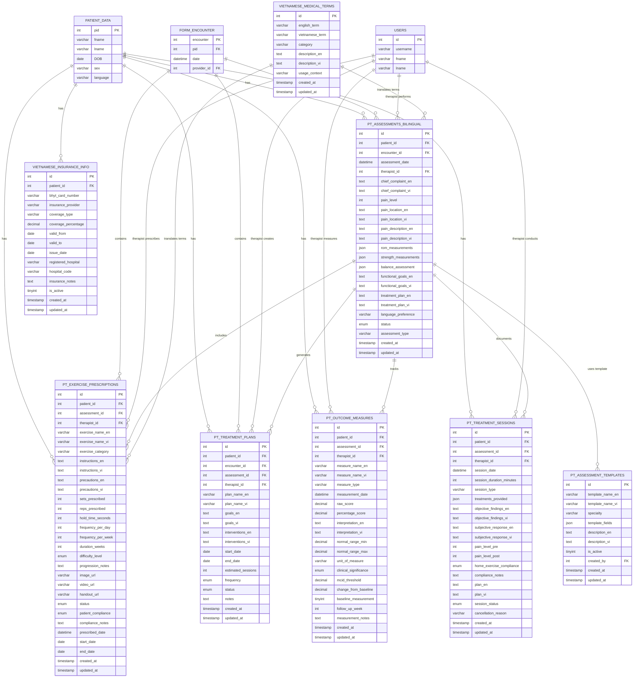

# Vietnamese PT Module - Database Schema

**Version:** 1.0
**Last Updated:** 2025-11-22
**Database:** MariaDB 10.11+
**Character Set:** utf8mb4
**Collation:** utf8mb4_vietnamese_ci

## Table of Contents

- [Overview](#overview)
- [Entity Relationship Diagram](#entity-relationship-diagram)
- [Table Definitions](#table-definitions)
- [Stored Procedures](#stored-procedures)
- [Stored Functions](#stored-functions)
- [Database Views](#database-views)
- [Indexes](#indexes)
- [Data Migration](#data-migration)

---

## Overview

The Vietnamese PT Module uses 8 dedicated tables with bilingual support (English/Vietnamese). All tables use `utf8mb4_vietnamese_ci` collation for proper Vietnamese character handling and sorting.

### Design Principles

1. **Bilingual Fields**: Separate columns for English (`_en`) and Vietnamese (`_vi`) content
2. **JSON Storage**: Complex data (ROM measurements, strength tests) stored as JSON
3. **Full-text Search**: FULLTEXT indexes on bilingual text fields
4. **Referential Integrity**: Foreign keys to core OpenEMR tables (patient_data, users)
5. **Audit Trail**: created_at, updated_at, created_by, updated_by timestamps

---

## Entity Relationship Diagram



---

## Table Definitions

### pt_assessments_bilingual

Stores comprehensive bilingual physiotherapy assessments.

**Purpose:** Initial, follow-up, and discharge assessments for PT patients.

**Columns:**

| Column | Type | Null | Default | Description |
|--------|------|------|---------|-------------|
| id | INT(11) | NO | AUTO_INCREMENT | Primary key |
| patient_id | INT(11) | NO | - | FK to patient_data.pid |
| encounter_id | INT(11) | NO | - | FK to form_encounter.encounter |
| assessment_date | DATETIME | NO | - | Date/time of assessment |
| therapist_id | INT(11) | YES | NULL | FK to users.id (therapist) |
| chief_complaint_en | TEXT | YES | NULL | Chief complaint in English |
| chief_complaint_vi | TEXT | YES | NULL | Chief complaint in Vietnamese |
| pain_level | INT(2) | YES | NULL | Pain scale 0-10 |
| pain_location_en | TEXT | YES | NULL | Pain location in English |
| pain_location_vi | TEXT | YES | NULL | Pain location in Vietnamese |
| pain_description_en | TEXT | YES | NULL | Pain description in English |
| pain_description_vi | TEXT | YES | NULL | Pain description in Vietnamese |
| rom_measurements | JSON | YES | NULL | Range of motion data (degrees) |
| strength_measurements | JSON | YES | NULL | Muscle strength data (0-5 scale) |
| balance_assessment | JSON | YES | NULL | Balance and coordination data |
| functional_goals_en | TEXT | YES | NULL | Functional goals in English |
| functional_goals_vi | TEXT | YES | NULL | Functional goals in Vietnamese |
| treatment_plan_en | TEXT | YES | NULL | Treatment plan in English |
| treatment_plan_vi | TEXT | YES | NULL | Treatment plan in Vietnamese |
| language_preference | VARCHAR(10) | YES | 'en' | Patient language preference (en/vi) |
| communication_notes | TEXT | YES | NULL | Communication notes |
| status | ENUM | YES | 'draft' | Status: draft, completed, reviewed, cancelled |
| assessment_type | VARCHAR(50) | YES | 'initial' | Type: initial, follow-up, discharge |
| created_at | TIMESTAMP | NO | CURRENT_TIMESTAMP | Creation timestamp |
| updated_at | TIMESTAMP | NO | CURRENT_TIMESTAMP | Last update timestamp |
| created_by | INT(11) | YES | NULL | User who created record |
| updated_by | INT(11) | YES | NULL | User who last updated record |

**Indexes:**
- PRIMARY KEY (id)
- INDEX idx_patient (patient_id)
- INDEX idx_encounter (encounter_id)
- INDEX idx_therapist (therapist_id)
- INDEX idx_assessment_date (assessment_date)
- INDEX idx_status (status)
- INDEX idx_language (language_preference)
- INDEX idx_type (assessment_type)
- FULLTEXT idx_complaint_search (chief_complaint_en, chief_complaint_vi)
- FULLTEXT idx_goals_search (functional_goals_en, functional_goals_vi)
- FULLTEXT idx_plan_search (treatment_plan_en, treatment_plan_vi)

**JSON Field Examples:**

```json
// rom_measurements
{
  "lumbar_flexion": 45,
  "lumbar_extension": 20,
  "left_rotation": 30,
  "right_rotation": 35,
  "shoulder_abduction_left": 170,
  "shoulder_abduction_right": 180
}

// strength_measurements
{
  "hip_flexors": "4/5",
  "knee_extensors": "5/5",
  "ankle_dorsiflexors": "5/5",
  "shoulder_abductors": "4/5"
}

// balance_assessment
{
  "single_leg_stance_left": 25,
  "single_leg_stance_right": 30,
  "romberg_test": "negative",
  "tandem_stance": 45
}
```

---

### vietnamese_insurance_info

Stores Vietnamese health insurance (BHYT - Bảo hiểm Y tế) information.

**Purpose:** Track Vietnamese national health insurance coverage.

**Columns:**

| Column | Type | Null | Default | Description |
|--------|------|------|---------|-------------|
| id | INT(11) | NO | AUTO_INCREMENT | Primary key |
| patient_id | INT(11) | NO | - | FK to patient_data.pid |
| bhyt_card_number | VARCHAR(50) | YES | NULL | BHYT card number (15 digits) |
| insurance_provider | VARCHAR(255) | YES | 'Bảo hiểm Xã hội Việt Nam' | Insurance provider name |
| coverage_type | VARCHAR(100) | YES | NULL | Type of coverage |
| coverage_percentage | DECIMAL(5,2) | YES | 80.00 | Coverage percentage (0-100) |
| valid_from | DATE | YES | NULL | Coverage start date |
| valid_to | DATE | YES | NULL | Coverage end date |
| issue_date | DATE | YES | NULL | Card issue date |
| registered_hospital | VARCHAR(255) | YES | NULL | Registered hospital name |
| hospital_code | VARCHAR(20) | YES | NULL | Hospital code |
| insurance_notes | TEXT | YES | NULL | Additional notes |
| is_active | TINYINT(1) | YES | 1 | Active status (0/1) |
| created_at | TIMESTAMP | NO | CURRENT_TIMESTAMP | Creation timestamp |
| updated_at | TIMESTAMP | NO | CURRENT_TIMESTAMP | Last update timestamp |

**Indexes:**
- PRIMARY KEY (id)
- INDEX idx_patient (patient_id)
- INDEX idx_bhyt (bhyt_card_number)
- INDEX idx_provider (insurance_provider)
- INDEX idx_validity (valid_from, valid_to)
- INDEX idx_active (is_active)

**BHYT Card Number Format:** `XX-Y-ZZ-WWWWWWWWWWW`
- XX: Province code (e.g., DN for Da Nang)
- Y: Membership type (1-6)
- ZZ: Insurance type code
- WWWWWWWWWWW: 11-digit unique identifier

---

### pt_exercise_prescriptions

Stores bilingual exercise prescriptions with detailed parameters.

**Purpose:** Document home exercise programs and therapeutic exercises.

**Columns:**

| Column | Type | Null | Default | Description |
|--------|------|------|---------|-------------|
| id | INT(11) | NO | AUTO_INCREMENT | Primary key |
| patient_id | INT(11) | NO | - | FK to patient_data.pid |
| assessment_id | INT(11) | NO | - | FK to pt_assessments_bilingual.id |
| therapist_id | INT(11) | NO | - | FK to users.id |
| exercise_name_en | VARCHAR(255) | NO | - | Exercise name in English |
| exercise_name_vi | VARCHAR(255) | NO | - | Exercise name in Vietnamese |
| exercise_category | VARCHAR(100) | YES | NULL | Category: strengthening, stretching, balance, etc. |
| instructions_en | TEXT | YES | NULL | Instructions in English |
| instructions_vi | TEXT | YES | NULL | Instructions in Vietnamese |
| precautions_en | TEXT | YES | NULL | Precautions in English |
| precautions_vi | TEXT | YES | NULL | Precautions in Vietnamese |
| sets_prescribed | INT(3) | YES | NULL | Number of sets |
| reps_prescribed | INT(4) | YES | NULL | Repetitions per set |
| hold_time_seconds | INT(4) | YES | NULL | Hold time in seconds |
| frequency_per_day | INT(2) | YES | NULL | Times per day |
| frequency_per_week | INT(2) | YES | NULL | Days per week |
| duration_weeks | INT(3) | YES | NULL | Total duration in weeks |
| difficulty_level | ENUM | YES | 'beginner' | Difficulty: beginner, intermediate, advanced |
| progression_notes | TEXT | YES | NULL | Progression notes |
| image_url | VARCHAR(500) | YES | NULL | Exercise image URL |
| video_url | VARCHAR(500) | YES | NULL | Exercise video URL |
| handout_url | VARCHAR(500) | YES | NULL | Handout PDF URL |
| status | ENUM | YES | 'active' | Status: active, completed, discontinued, modified |
| patient_compliance | ENUM | YES | 'unknown' | Compliance: excellent, good, fair, poor, unknown |
| compliance_notes | TEXT | YES | NULL | Compliance tracking notes |
| prescribed_date | DATETIME | NO | - | Date prescribed |
| start_date | DATE | YES | NULL | Start date |
| end_date | DATE | YES | NULL | End date |
| created_at | TIMESTAMP | NO | CURRENT_TIMESTAMP | Creation timestamp |
| updated_at | TIMESTAMP | NO | CURRENT_TIMESTAMP | Last update timestamp |

**Indexes:**
- PRIMARY KEY (id)
- INDEX idx_patient (patient_id)
- INDEX idx_assessment (assessment_id)
- INDEX idx_therapist (therapist_id)
- INDEX idx_category (exercise_category)
- INDEX idx_status (status)
- INDEX idx_difficulty (difficulty_level)
- INDEX idx_prescribed_date (prescribed_date)
- FULLTEXT idx_exercise_search (exercise_name_en, exercise_name_vi, instructions_en, instructions_vi)

**Exercise Categories:**
- strengthening
- stretching
- balance
- coordination
- endurance
- functional
- postural

---

### pt_treatment_plans

Stores structured treatment plans.

**Purpose:** Document comprehensive treatment strategies and goals.

**Columns:**

| Column | Type | Null | Default | Description |
|--------|------|------|---------|-------------|
| id | INT(11) | NO | AUTO_INCREMENT | Primary key |
| patient_id | INT(11) | NO | - | FK to patient_data.pid |
| encounter_id | INT(11) | NO | - | FK to form_encounter.encounter |
| assessment_id | INT(11) | YES | NULL | FK to pt_assessments_bilingual.id |
| therapist_id | INT(11) | NO | - | FK to users.id |
| plan_name_en | VARCHAR(255) | YES | NULL | Plan name in English |
| plan_name_vi | VARCHAR(255) | YES | NULL | Plan name in Vietnamese |
| goals_en | TEXT | YES | NULL | Treatment goals in English |
| goals_vi | TEXT | YES | NULL | Treatment goals in Vietnamese |
| interventions_en | TEXT | YES | NULL | Interventions in English |
| interventions_vi | TEXT | YES | NULL | Interventions in Vietnamese |
| start_date | DATE | YES | NULL | Plan start date |
| end_date | DATE | YES | NULL | Plan end date |
| estimated_sessions | INT(3) | YES | NULL | Estimated number of sessions |
| frequency | ENUM | YES | NULL | Frequency: daily, 2x/week, 3x/week, weekly |
| status | ENUM | YES | 'active' | Status: active, completed, discontinued, on_hold |
| notes | TEXT | YES | NULL | Additional notes |
| created_at | TIMESTAMP | NO | CURRENT_TIMESTAMP | Creation timestamp |
| updated_at | TIMESTAMP | NO | CURRENT_TIMESTAMP | Last update timestamp |

**Indexes:**
- PRIMARY KEY (id)
- INDEX idx_patient (patient_id)
- INDEX idx_encounter (encounter_id)
- INDEX idx_assessment (assessment_id)
- INDEX idx_therapist (therapist_id)
- INDEX idx_status (status)
- FULLTEXT idx_plan_search (plan_name_en, plan_name_vi, goals_en, goals_vi)

---

### pt_outcome_measures

Stores standardized outcome measurements for tracking progress.

**Purpose:** Document patient progress using validated outcome measures.

**Columns:**

| Column | Type | Null | Default | Description |
|--------|------|------|---------|-------------|
| id | INT(11) | NO | AUTO_INCREMENT | Primary key |
| patient_id | INT(11) | NO | - | FK to patient_data.pid |
| assessment_id | INT(11) | NO | - | FK to pt_assessments_bilingual.id |
| therapist_id | INT(11) | NO | - | FK to users.id |
| measure_name_en | VARCHAR(255) | NO | - | Measure name in English |
| measure_name_vi | VARCHAR(255) | NO | - | Measure name in Vietnamese |
| measure_type | VARCHAR(100) | YES | NULL | Type: functional, pain, quality_of_life, etc. |
| measurement_date | DATETIME | NO | - | Date/time measured |
| raw_score | DECIMAL(10,2) | YES | NULL | Raw measurement score |
| percentage_score | DECIMAL(5,2) | YES | NULL | Percentage score (0-100) |
| interpretation_en | TEXT | YES | NULL | Interpretation in English |
| interpretation_vi | TEXT | YES | NULL | Interpretation in Vietnamese |
| normal_range_min | DECIMAL(10,2) | YES | NULL | Normal range minimum |
| normal_range_max | DECIMAL(10,2) | YES | NULL | Normal range maximum |
| unit_of_measure | VARCHAR(50) | YES | NULL | Unit (cm, degrees, kg, etc.) |
| clinical_significance | ENUM | YES | NULL | Significance: improved, stable, declined, etc. |
| mcid_threshold | DECIMAL(10,2) | YES | NULL | Minimal Clinically Important Difference |
| change_from_baseline | DECIMAL(10,2) | YES | NULL | Change from baseline measurement |
| baseline_measurement | TINYINT(1) | YES | 0 | Is baseline measurement (0/1) |
| follow_up_week | INT(3) | YES | NULL | Follow-up week number |
| measurement_notes | TEXT | YES | NULL | Additional notes |
| created_at | TIMESTAMP | NO | CURRENT_TIMESTAMP | Creation timestamp |
| updated_at | TIMESTAMP | NO | CURRENT_TIMESTAMP | Last update timestamp |

**Indexes:**
- PRIMARY KEY (id)
- INDEX idx_patient (patient_id)
- INDEX idx_assessment (assessment_id)
- INDEX idx_therapist (therapist_id)
- INDEX idx_measure_type (measure_type)
- INDEX idx_measurement_date (measurement_date)
- INDEX idx_baseline (baseline_measurement)
- INDEX idx_significance (clinical_significance)
- FULLTEXT idx_measure_search (measure_name_en, measure_name_vi, interpretation_en, interpretation_vi)

**Common Outcome Measures:**
- Visual Analog Scale (VAS) for Pain
- Numeric Pain Rating Scale (NPRS)
- Oswestry Disability Index (ODI)
- Patient-Specific Functional Scale (PSFS)
- Timed Up and Go (TUG)
- 6-Minute Walk Test (6MWT)

---

### pt_treatment_sessions

Stores individual treatment session notes.

**Purpose:** Document each PT treatment session (SOAP notes).

**Columns:**

| Column | Type | Null | Default | Description |
|--------|------|------|---------|-------------|
| id | INT(11) | NO | AUTO_INCREMENT | Primary key |
| patient_id | INT(11) | NO | - | FK to patient_data.pid |
| assessment_id | INT(11) | NO | - | FK to pt_assessments_bilingual.id |
| therapist_id | INT(11) | NO | - | FK to users.id |
| session_date | DATETIME | NO | - | Session date/time |
| session_duration_minutes | INT(4) | YES | NULL | Duration in minutes |
| session_type | VARCHAR(100) | YES | 'individual' | Type: individual, group, home_visit |
| treatments_provided | JSON | YES | NULL | Array of treatments provided |
| objective_findings_en | TEXT | YES | NULL | Objective findings in English |
| objective_findings_vi | TEXT | YES | NULL | Objective findings in Vietnamese |
| subjective_response_en | TEXT | YES | NULL | Subjective response in English |
| subjective_response_vi | TEXT | YES | NULL | Subjective response in Vietnamese |
| pain_level_pre | INT(2) | YES | NULL | Pain level before session (0-10) |
| pain_level_post | INT(2) | YES | NULL | Pain level after session (0-10) |
| home_exercise_compliance | ENUM | YES | 'not_assessed' | Compliance level |
| compliance_notes | TEXT | YES | NULL | Compliance notes |
| plan_en | TEXT | YES | NULL | Plan for next session in English |
| plan_vi | TEXT | YES | NULL | Plan for next session in Vietnamese |
| session_status | ENUM | YES | 'completed' | Status: completed, partial, cancelled, no_show |
| cancellation_reason | VARCHAR(255) | YES | NULL | Reason if cancelled |
| created_at | TIMESTAMP | NO | CURRENT_TIMESTAMP | Creation timestamp |
| updated_at | TIMESTAMP | NO | CURRENT_TIMESTAMP | Last update timestamp |

**Indexes:**
- PRIMARY KEY (id)
- INDEX idx_patient (patient_id)
- INDEX idx_assessment (assessment_id)
- INDEX idx_therapist (therapist_id)
- INDEX idx_session_date (session_date)
- INDEX idx_session_type (session_type)
- INDEX idx_status (session_status)
- FULLTEXT idx_session_search (objective_findings_en, objective_findings_vi, subjective_response_en, subjective_response_vi)

**treatments_provided JSON Example:**
```json
[
  {
    "treatment": "Manual Therapy",
    "area": "Lumbar spine",
    "duration_minutes": 15
  },
  {
    "treatment": "Therapeutic Exercise",
    "exercises": ["Core strengthening", "Hip mobility"],
    "duration_minutes": 30
  },
  {
    "treatment": "Modalities",
    "modality": "Ultrasound",
    "duration_minutes": 10
  }
]
```

---

### pt_assessment_templates

Stores reusable assessment templates for standardization.

**Purpose:** Provide standardized assessment templates for different conditions.

**Columns:**

| Column | Type | Null | Default | Description |
|--------|------|------|---------|-------------|
| id | INT(11) | NO | AUTO_INCREMENT | Primary key |
| template_name_en | VARCHAR(255) | NO | - | Template name in English |
| template_name_vi | VARCHAR(255) | NO | - | Template name in Vietnamese |
| specialty | VARCHAR(100) | YES | NULL | Specialty area (orthopedic, neuro, etc.) |
| template_fields | JSON | YES | NULL | Template field definitions |
| description_en | TEXT | YES | NULL | Description in English |
| description_vi | TEXT | YES | NULL | Description in Vietnamese |
| is_active | TINYINT(1) | YES | 1 | Active status (0/1) |
| created_by | INT(11) | YES | NULL | FK to users.id |
| created_at | TIMESTAMP | NO | CURRENT_TIMESTAMP | Creation timestamp |
| updated_at | TIMESTAMP | NO | CURRENT_TIMESTAMP | Last update timestamp |

**Indexes:**
- PRIMARY KEY (id)
- INDEX idx_specialty (specialty)
- INDEX idx_active (is_active)
- INDEX idx_created_by (created_by)

---

### vietnamese_medical_terms

Stores English-Vietnamese medical terminology dictionary.

**Purpose:** Provide medical term translation via stored functions.

**Columns:**

| Column | Type | Null | Default | Description |
|--------|------|------|---------|-------------|
| id | INT(11) | NO | AUTO_INCREMENT | Primary key |
| english_term | VARCHAR(255) | NO | - | English medical term |
| vietnamese_term | VARCHAR(255) | NO | - | Vietnamese translation |
| category | VARCHAR(100) | YES | NULL | Category (symptom, diagnosis, treatment, etc.) |
| description_en | TEXT | YES | NULL | Description in English |
| description_vi | TEXT | YES | NULL | Description in Vietnamese |
| usage_context | VARCHAR(100) | YES | NULL | Usage context |
| created_at | TIMESTAMP | NO | CURRENT_TIMESTAMP | Creation timestamp |
| updated_at | TIMESTAMP | NO | CURRENT_TIMESTAMP | Last update timestamp |

**Indexes:**
- PRIMARY KEY (id)
- UNIQUE INDEX idx_english_term (english_term)
- INDEX idx_vietnamese_term (vietnamese_term)
- INDEX idx_category (category)
- FULLTEXT idx_term_search (english_term, vietnamese_term)

**Sample Terms:**
- pain → đau
- physical therapy → vật lý trị liệu
- exercise → bài tập
- treatment → điều trị
- assessment → đánh giá

---

## Stored Procedures

### GetPatientAssessmentBilingual

Retrieves patient assessment in preferred language.

**Parameters:**
- `p_patient_id` (INT) - Patient ID
- `p_assessment_id` (INT) - Assessment ID (0 for latest)
- `p_language` (VARCHAR) - Language preference ('en' or 'vi')

**Usage:**
```sql
CALL GetPatientAssessmentBilingual(123, 0, 'vi');
```

**Returns:** Assessment data with language-specific fields.

---

### GetActiveExercisesBilingual

Retrieves active exercise prescriptions in preferred language.

**Parameters:**
- `p_patient_id` (INT) - Patient ID
- `p_language` (VARCHAR) - Language preference ('en' or 'vi')

**Usage:**
```sql
CALL GetActiveExercisesBilingual(123, 'vi');
```

**Returns:** List of active exercises with bilingual fields resolved.

---

## Stored Functions

### get_vietnamese_term

Translates English medical term to Vietnamese.

**Parameters:**
- `term` (VARCHAR) - English term to translate

**Returns:** Vietnamese translation or original term if not found

**Usage:**
```sql
SELECT get_vietnamese_term('pain') AS vi_term;
-- Returns: 'đau'
```

**Implementation:**
```sql
CREATE FUNCTION get_vietnamese_term(term VARCHAR(255))
RETURNS VARCHAR(255)
DETERMINISTIC
READS SQL DATA
BEGIN
    DECLARE viet_term VARCHAR(255);

    SELECT vietnamese_term INTO viet_term
    FROM vietnamese_medical_terms
    WHERE english_term COLLATE utf8mb4_general_ci = term COLLATE utf8mb4_general_ci
    LIMIT 1;

    RETURN COALESCE(viet_term, term);
END
```

---

### get_english_term

Translates Vietnamese medical term to English.

**Parameters:**
- `term` (VARCHAR) - Vietnamese term to translate

**Returns:** English translation or original term if not found

**Usage:**
```sql
SELECT get_english_term('đau') AS en_term;
-- Returns: 'pain'
```

**Implementation:**
```sql
CREATE FUNCTION get_english_term(term VARCHAR(255))
RETURNS VARCHAR(255)
DETERMINISTIC
READS SQL DATA
BEGIN
    DECLARE eng_term VARCHAR(255);

    SELECT english_term INTO eng_term
    FROM vietnamese_medical_terms
    WHERE vietnamese_term COLLATE utf8mb4_vietnamese_ci = term COLLATE utf8mb4_vietnamese_ci
    LIMIT 1;

    RETURN COALESCE(eng_term, term);
END
```

---

## Database Views

### pt_patient_summary_bilingual

Provides a convenient summary of PT patient data with bilingual support.

**Columns:**
- patient_id, fname, lname, DOB, sex, patient_language
- latest_assessment_id, latest_assessment_date
- chief_complaint (language-aware)
- bhyt_card_number, coverage_type, coverage_percentage
- measure_name_en, measure_name_vi
- latest_score, latest_measurement_date
- active_exercises_count

**Usage:**
```sql
SELECT * FROM pt_patient_summary_bilingual
WHERE patient_id = 123;
```

**Definition:**
```sql
CREATE OR REPLACE VIEW pt_patient_summary_bilingual AS
SELECT
  p.pid as patient_id,
  p.fname,
  p.lname,
  p.DOB,
  p.sex,
  p.language as patient_language,

  -- Latest assessment info
  pa.id as latest_assessment_id,
  pa.assessment_date as latest_assessment_date,
  CASE
    WHEN p.language = 'Vietnamese' THEN pa.chief_complaint_vi
    ELSE pa.chief_complaint_en
  END as chief_complaint,

  -- Insurance info
  vi.bhyt_card_number,
  vi.coverage_type,
  vi.coverage_percentage,

  -- Latest outcome measures
  om.measure_name_en,
  om.measure_name_vi,
  om.raw_score as latest_score,
  om.measurement_date as latest_measurement_date,

  -- Active exercises count
  (SELECT COUNT(*) FROM pt_exercise_prescriptions pep
   WHERE pep.patient_id = p.pid AND pep.status = 'active') as active_exercises_count

FROM patient_data p
LEFT JOIN pt_assessments_bilingual pa ON p.pid = pa.patient_id
  AND pa.id = (SELECT MAX(id) FROM pt_assessments_bilingual WHERE patient_id = p.pid)
LEFT JOIN vietnamese_insurance_info vi ON p.pid = vi.patient_id AND vi.is_active = 1
LEFT JOIN pt_outcome_measures om ON p.pid = om.patient_id
  AND om.id = (SELECT MAX(id) FROM pt_outcome_measures WHERE patient_id = p.pid)
WHERE p.pid IN (SELECT DISTINCT patient_id FROM pt_assessments_bilingual);
```

---

## Indexes

### Index Strategy

1. **Primary Keys**: Auto-increment IDs on all tables
2. **Foreign Keys**: All patient_id, encounter_id, therapist_id, assessment_id
3. **Status/Date Indexes**: Filter by status, date ranges
4. **Full-text Indexes**: Bilingual text search on EN/VI fields
5. **Composite Indexes**: Multi-column queries (valid_from, valid_to)

### Full-text Search Usage

```sql
-- Search assessments by chief complaint in either language
SELECT * FROM pt_assessments_bilingual
WHERE MATCH(chief_complaint_en, chief_complaint_vi)
AGAINST ('đau lưng' IN NATURAL LANGUAGE MODE);

-- Search exercises by name or instructions
SELECT * FROM pt_exercise_prescriptions
WHERE MATCH(exercise_name_en, exercise_name_vi, instructions_en, instructions_vi)
AGAINST ('stretching' IN NATURAL LANGUAGE MODE);
```

---

## Data Migration

### Importing Schema

```bash
# Import schema from SQL file
mysql -u openemr -p openemr < /path/to/02-pt-bilingual-schema.sql

# Import stored functions
mysql -u openemr -p openemr < /path/to/vietnamese_pt_functions.sql
```

### Exporting Data

```bash
# Export all PT tables
mysqldump -u openemr -p openemr \
  pt_assessments_bilingual \
  pt_exercise_prescriptions \
  pt_treatment_plans \
  pt_outcome_measures \
  pt_treatment_sessions \
  pt_assessment_templates \
  vietnamese_medical_terms \
  vietnamese_insurance_info \
  > vietnamese_pt_backup.sql
```

### Character Set Migration

If migrating from non-Vietnamese collation:

```sql
-- Convert existing table to Vietnamese collation
ALTER TABLE pt_assessments_bilingual
CONVERT TO CHARACTER SET utf8mb4
COLLATE utf8mb4_vietnamese_ci;

-- Convert specific columns
ALTER TABLE pt_assessments_bilingual
MODIFY chief_complaint_vi TEXT CHARACTER SET utf8mb4 COLLATE utf8mb4_vietnamese_ci;
```

---

## Performance Considerations

### Query Optimization

1. Use indexed columns in WHERE clauses
2. Leverage full-text search for text queries
3. Use stored procedures for complex bilingual queries
4. Index JSON fields if querying frequently (MariaDB 10.11+)

### Example Optimized Query

```sql
-- Good: Uses indexes
SELECT * FROM pt_assessments_bilingual
WHERE patient_id = 123
  AND status = 'completed'
  AND assessment_date >= '2025-01-01'
ORDER BY assessment_date DESC
LIMIT 10;

-- Better: Uses view
SELECT * FROM pt_patient_summary_bilingual
WHERE patient_id = 123;
```

---

## Related Documentation

- **[Architecture](./ARCHITECTURE.md)** - System architecture overview
- **[API Reference](../development/API_REFERENCE.md)** - REST API documentation
- **[Installation](./INSTALLATION.md)** - Installation guide
- **[Production Deployment](./PRODUCTION_DEPLOYMENT.md)** - Production deployment

---

**Database Schema Version:** 1.0
**Last Updated:** 2025-11-22
**Maintainer:** Dang Tran <tqvdang@msn.com>
