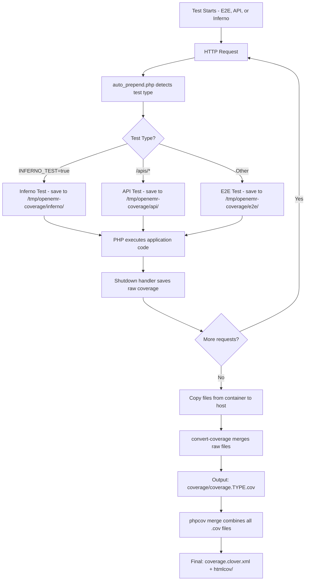

# Coverage Collection for E2E, API, and Inferno Tests

This directory contains scripts for capturing code coverage during end-to-end (E2E), API, and Inferno certification tests.

## How It Works

### 1. Prepend/Shutdown Bookends (`auto_prepend.php`)

A PHP auto-prepend script runs before every HTTP request during E2E, API, and Inferno tests:

- **Prepend**: Starts Xdebug coverage collection when `ENABLE_COVERAGE=true`
- **Shutdown**: Captures raw coverage data at request end and saves to:
  - `/tmp/openemr-coverage/e2e/coverage.e2e.*.raw.php` for E2E tests
  - `/tmp/openemr-coverage/api/coverage.api.*.raw.php` for API tests
  - `/tmp/openemr-coverage/inferno/coverage.inferno.*.raw.php` for Inferno tests

Each file contains a raw Xdebug coverage array from a single HTTP request. The test type is automatically detected based on:
- `INFERNO_TEST=true` environment variable → Inferno
- Request URI contains `/apis/*` → API
- Otherwise → E2E

### 2. Setup (`setup_e2e_bookends` in `ciLibrary.source`)

Configures PHP to auto-prepend the coverage script:
- Adds `auto_prepend_file` INI directive pointing to `ci/auto_prepend.php`
- Restarts web server to apply configuration
- Verifies prepend/shutdown handlers execute via marker files

### 3. Conversion (`convert-coverage`)

After tests complete, this generic CLI tool:
- Loads all raw Xdebug arrays from the specified input directory
- Merges them into a single `CodeCoverage` object
- Outputs `.cov` file (PHPUnit format) and Clover XML report

Examples:
```bash
./ci/convert-coverage /tmp/coverage-e2e-raw/e2e coverage/coverage.e2e.cov --clover=coverage.e2e.clover.xml
./ci/convert-coverage /tmp/coverage-api-raw/api coverage/coverage.api.cov --clover=coverage.api.clover.xml
./ci/convert-coverage /tmp/coverage-inferno-raw/inferno coverage/coverage.inferno-http.cov --clover=coverage.inferno-http.clover.xml
```

### 4. Merging (`merge_coverage` in `ciLibrary.source`)

The existing `phpcov merge` command combines all `.cov` files (unit, api, e2e, etc.) into final coverage reports.

## Environment Variables

- `OPENEMR_ENABLE_CI_PHP=1` - Enables CI scripts (set in docker-compose)
- `ENABLE_COVERAGE=true` - Activates coverage collection
- `INFERNO_TEST=true` - Identifies requests as Inferno certification tests
- `XDEBUG_ON=1` - Enables Xdebug
- `XDEBUG_MODE=coverage` - Sets Xdebug to coverage mode

## Files

- `auto_prepend.php` - Auto-prepend script with coverage hooks (supports E2E, API, and Inferno tests)
- `convert-coverage` - Generic Symfony Console CLI tool to merge raw coverage files
- `ciLibrary.source` - Contains `setup_e2e_bookends()`, `configure_coverage()`, and `merge_coverage()`
- `inferno/run.sh` - Contains `collect_inferno_coverage()` for Inferno-specific coverage handling

## GitHub Actions Workflow

In `.github/workflows/test.yml`, the coverage process happens in these steps:

### For API Tests:
1. **Api testing** - Runs API tests via `build_test api`
2. **Copy API coverage files from container** - Extracts raw coverage files from `/tmp/openemr-coverage/api`
3. **Convert API coverage to .cov format** - Runs `./ci/convert-coverage` to merge raw files into `coverage/coverage.api.cov`
4. **Upload api test coverage to Codecov** - Uploads the clover XML report

### For E2E Tests:
1. **E2e setup** - Calls `setup_e2e_bookends()` to configure auto-prepend
2. **E2e testing** - Runs E2E tests via `build_test e2e`
3. **Copy E2E coverage files from container** - Extracts raw coverage files from `/tmp/openemr-coverage/e2e`
4. **Convert E2E coverage to .cov format** - Runs `./ci/convert-coverage` to merge raw files into `coverage/coverage.e2e.cov`
5. **Upload e2e test coverage to Codecov** - Uploads the clover XML report

### Final Step:
- **Combine coverage** - Calls `merge_coverage()` which runs `phpcov merge coverage/` to combine all `.cov` files into final reports

### For Inferno Tests (in `.github/workflows/inferno-test.yml`):
1. **Run Inferno Certification Tests** - Runs `ci/inferno/run.sh` with `ENABLE_COVERAGE=true`, `INFERNO_TEST=true`, and Xdebug enabled
   - Calls `configure_coverage()` to set up Xdebug
   - Calls `setup_e2e_bookends()` to enable auto-prepend for HTTP request coverage
   - Runs PHPUnit certification tests with `--coverage-php` to capture unit test coverage
   - After tests complete, calls `collect_inferno_coverage()` to:
     - Extract raw HTTP coverage files from `/tmp/openemr-coverage/inferno`
     - Convert to `coverage/coverage.inferno-http.cov`
     - Merge with PHPUnit coverage via `merge_coverage()`
2. **Upload PHPUnit coverage to Codecov** - Uploads the PHPUnit-only clover XML report with `inferno,phpunit` flags
3. **Upload HTTP coverage to Codecov** - Uploads the HTTP request clover XML report with `inferno,http` flags
4. **Upload combined coverage to Codecov** - Uploads the merged clover XML report with `inferno,combined` flags
5. **Upload coverage artifacts to GitHub** - Saves all coverage reports as GitHub artifacts

## Workflow Diagram



## Why This Approach?

- **Unified infrastructure**: Same prepend/convert scripts for E2E, API, and Inferno tests
- **Minimal overhead**: Prepend/shutdown only capture raw data
- **No test changes**: Works transparently with existing tests
- **Automatic detection**: Test type determined by environment variable or request URI
- **Standard format**: Outputs PHPUnit-compatible `.cov` files
- **Merge-friendly**: Integrates with existing coverage workflow
- **Dual coverage**: Inferno tests capture both PHPUnit test coverage AND HTTP request coverage from the certification test suite
