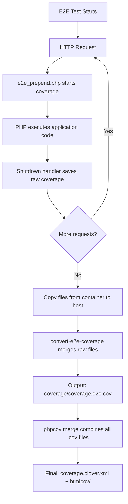

# E2E Coverage Collection

This directory contains scripts for capturing code coverage during end-to-end (e2e) tests.

## How It Works

### 1. Prepend/Shutdown Bookends (`e2e_prepend.php`)

A PHP auto-prepend script runs before every HTTP request during e2e tests:

- **Prepend**: Starts Xdebug coverage collection when `ENABLE_COVERAGE=true`
- **Shutdown**: Captures raw coverage data at request end and saves to `/tmp/openemr-coverage/e2e/coverage.e2e.*.raw.php`

Each file contains a raw Xdebug coverage array from a single HTTP request.

### 2. Setup (`setup_e2e_bookends` in `ciLibrary.source`)

Configures PHP to auto-prepend the coverage script:
- Adds `auto_prepend_file` INI directive pointing to `ci/e2e_prepend.php`
- Restarts web server to apply configuration
- Verifies prepend/shutdown handlers execute via marker files

### 3. Conversion (`convert-e2e-coverage`)

After e2e tests complete, this CLI tool:
- Loads all raw Xdebug arrays from `/tmp/openemr-coverage/e2e/`
- Merges them into a single `CodeCoverage` object
- Outputs `.cov` file (PHPUnit format) and Clover XML report

### 4. Merging (`merge_coverage` in `ciLibrary.source`)

The existing `phpcov merge` command combines all `.cov` files (unit, e2e, etc.) into final coverage reports.

## Environment Variables

- `OPENEMR_E2E_ENABLE_CI_PHP=1` - Enables CI scripts (set in docker-compose)
- `ENABLE_COVERAGE=true` - Activates coverage collection

## Files

- `e2e_prepend.php` - Auto-prepend script with coverage hooks
- `convert-e2e-coverage` - Symfony Console CLI tool to merge raw coverage
- `ciLibrary.source` - Contains `setup_e2e_bookends()` and `merge_coverage()`

## GitHub Actions Workflow

In `.github/workflows/test.yml`, the e2e coverage process happens in these steps:

1. **E2e setup** - Calls `setup_e2e_bookends()` to configure auto-prepend
2. **E2e testing** - Runs e2e tests via `build_test e2e`
3. **Copy E2E coverage files from container** - Extracts raw coverage files from `/tmp/openemr-coverage/e2e` to `$COVERAGE_RAW_TMPDIR` on host
4. **Convert E2E coverage to .cov format** - Runs `./ci/convert-e2e-coverage` to merge raw files into `coverage/coverage.e2e.cov`
5. **Combine coverage** - Calls `merge_coverage()` which runs `phpcov merge coverage/` to combine all `.cov` files

The `COVERAGE_RAW_TMPDIR` environment variable points to a temp directory outside the repo to prevent Codecov from finding raw coverage files.

## Workflow Diagram

## Why This Approach?

- **Minimal overhead**: Prepend/shutdown only capture raw data
- **No test changes**: Works transparently with existing e2e tests
- **Standard format**: Outputs PHPUnit-compatible `.cov` files
- **Merge-friendly**: Integrates with existing coverage workflow
