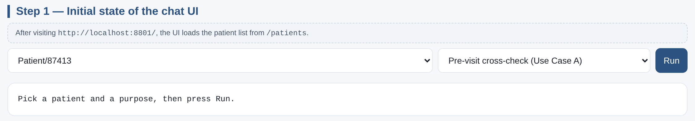
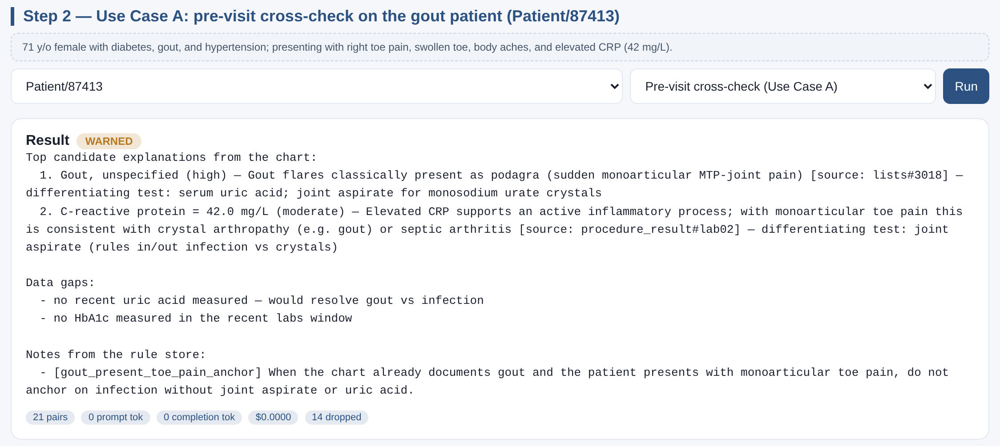
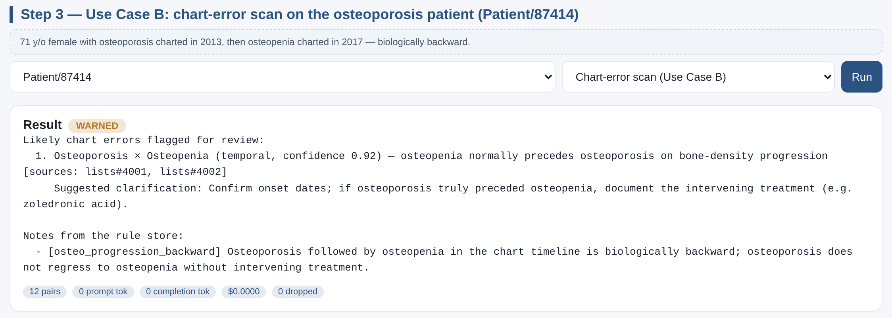
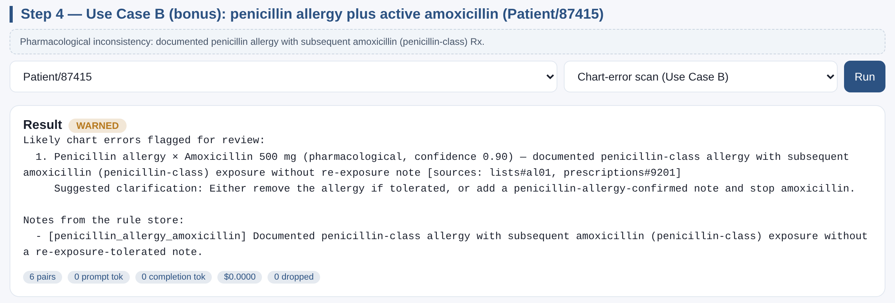

# Clinical Co-Pilot Sidecar — Click-by-Click Tutorial

This walkthrough launches the OpenEMR sidecar, opens the bundled chat UI, and
runs the two demo scenarios end-to-end. Every screenshot below was captured
from the running UI; each step lists the exact command or click required.

A self-contained, no-server preview of the same screens lives at
`clinical-copilot/ui/chat-demo-tutorial.html`. Open that file in any
browser to see the rendered output without booting the service. The same
file is mirrored to `Gauntlet/sidecar-demo-tutorial.html` for convenience.

---

## Step 0 — One-time setup

```bash
cd /Users/scottlydon/Desktop/Clutter/iOS/openemr/clinical-copilot
python3.12 -m venv .venv
source .venv/bin/activate
pip install -e .[dev]
```

Mock-LLM mode requires no OpenAI key. Pin to Python 3.11 or newer (the
project declares `requires-python = ">=3.11"`).

---

## Step 1 — Launch the sidecar

```bash
cd /Users/scottlydon/Desktop/Clutter/iOS/openemr/clinical-copilot
source .venv/bin/activate
COPILOT_LLM_PROVIDER=mock python -m sidecar.main
```

Expected first-line output:

```
INFO:     Uvicorn running on http://0.0.0.0:8801
```

Sanity-check from another terminal:

```bash
curl -sS http://127.0.0.1:8801/health
# → {"status":"ok"}
curl -sS http://127.0.0.1:8801/patients
# → ["Patient/87413","Patient/87414","Patient/87415"]
```

---

## Step 2 — Open the chat UI

Navigate to <http://localhost:8801/> in any browser. The sidecar serves
`ui/chat.html` at the root. The UI loads its patient list via `/patients`
on first paint.



Three controls:

1. Patient picker (populated from `/patients`).
2. Purpose picker (`Pre-visit cross-check (Use Case A)` or
   `Chart-error scan (Use Case B)`).
3. **Run** button.

---

## Step 3 — Use Case A: gout cross-check (Patient 87413)

Patient 87413 is a 71 y/o female charted with diabetes, gout, and
hypertension. The pre-visit form lists *right toe pain*, *swollen toe*,
*body aches*. Recent labs include an elevated C-reactive protein
(42 mg/L) on 2026-04-27.

1. Pick **Patient/87413** in the patient dropdown.
2. Leave purpose at **Pre-visit cross-check (Use Case A)**.
3. Click **Run**.



The engine:

- Ranks **Gout, unspecified** as the top candidate (likelihood `high`,
  mechanism *“Gout flares classically present as podagra (sudden
  monoarticular MTP-joint pain)”*, source `lists#3018`).
- Surfaces the elevated **C-reactive protein** as a moderate supporting
  finding (source `procedure_result#lab02`).
- Flags two data gaps: missing recent uric acid and missing recent A1c.
- Fires the curated rule
  `[gout_present_toe_pain_anchor]` from the verifier rule store.
- Verdict: **WARNED** — clinician review nudge, not a hard block.

The 14 dropped pairs (e.g. *right toe pain × Lisinopril*) are pairs the
mock judge marked low-likelihood with no evidence row, so the verifier
stripped them per the *parse, don’t validate* contract.

---

## Step 4 — Use Case B: osteopenia-after-osteoporosis (Patient 87414)

Patient 87414 is a 71 y/o female. Her chart shows **osteoporosis (M81.0)
charted 2013-08-12** followed by **osteopenia (M85.80) charted
2017-05-04**. Osteoporosis does not regress to osteopenia without
intervening treatment — the order is biologically backward.

1. Pick **Patient/87414** in the patient dropdown.
2. Switch purpose to **Chart-error scan (Use Case B)**.
3. Click **Run**.



The engine:

- Surfaces **Osteoporosis × Osteopenia** as a `temporal` inconsistency
  with confidence `0.92`.
- Cites both source rows (`lists#4001`, `lists#4002`).
- Suggests the clinician confirm onset dates and document any intervening
  treatment (e.g. zoledronic acid).
- Fires the curated rule `[osteo_progression_backward]`.
- Verdict: **WARNED** — flagged for review.

This is the canonical Use Case B narrative from `USERS.md` §3.2.

---

## Step 5 — Use Case B (bonus): penicillin allergy + amoxicillin (Patient 87415)

A second chart-error scenario ships in the fixtures: documented
penicillin allergy plus an active amoxicillin (penicillin-class)
prescription without a re-exposure-tolerated note.



`pharmacological` inconsistency at confidence `0.90`, citing
`lists#al01` × `prescriptions#9201`.

---

## Step 6 — Confirm the audit chain is intact

```bash
curl -sS http://127.0.0.1:8801/audit/head | python3 -m json.tool
# → {
#     "head_hash": "d2412424...",
#     "length": 3,
#     "chain_intact": 1
#   }
```

Each `/chat` call appends one hash-chained row. ARCHITECTURE.md §6.3
covers retention and Postgres anchoring.

---

## Step 7 — Run the full eval suite

```bash
cd clinical-copilot
source .venv/bin/activate
python evals/run_evals.py
```

Layer 1 (pairwise unit tests) + Layer 2 (patient scenarios — including
the gout and osteopenia cases above) + Layer 3 (adversarial: prompt
injection, scope escalation, missing data) all run against the
deterministic mock LLM. Expected:

```
========================== 18 passed in 0.5s ==========================
Results summary written to clinical-copilot/evals/results/<UTC>.json
```

The runner emits both a JUnit XML and a JSON summary into
`evals/results/`. The eval gate (≥80% top-3 recall on Layer 2,
zero adversarial failures) is documented in `ARCHITECTURE.md` §7.

---

## Demo bundle (no server required)

If you only want to see the screens above, double-click

```
Gauntlet/sidecar-demo-tutorial.html
```

It is a self-contained HTML file with the live API responses baked in —
useful for tutorials, screen recordings, or sharing screenshots without
spinning up the sidecar.
