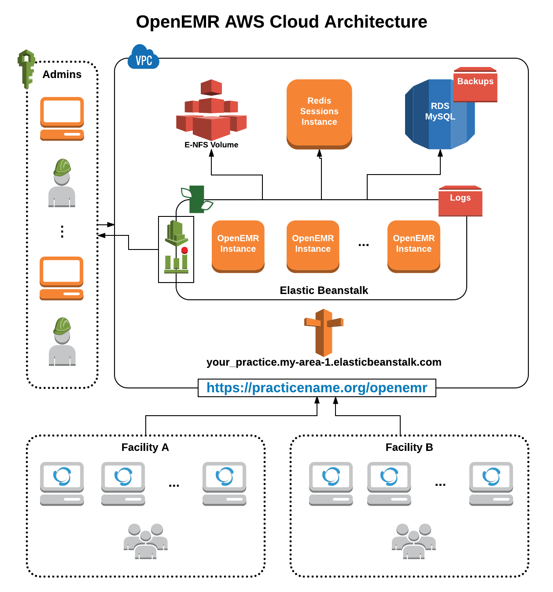

_[< previous chapter](08-CloudTrail.md)_

# 🎛 Administration

_This chapter is dedicated for Administrators for reference and answering common questions. Please review it throughly._

## GENERAL INFORMATION

### Can I Use This Beta Guide for Production?

Although this AWS Guide is in beta, it is suitable for production use for institutions mostly outside of the US because it is not HIPAA/BAA compliant. Although TeamEpsilon and OpenEMR community members have tested the guide, the following limitations should be noted:

- The guide is manual, which means that it is prone to human error and the Amazon UI changing.
- Cost estimates of monthly AWS are not provided in the guide.
- [There is a minor issue with autoscaling with a noted workaround but not a complete solution.](#im-occasionally-seeing-site-id-is-missing-from-session-data-errors)
- HIPAA/BAA compliance has not been met for this solution.
- Redis is set up as a large single instance as opposed to a cluster of instances.
- No SMTP solution is in place so OpenEMR emails will not be sent.

A **Stable** version of this solution is being worked on by TeamEpsilon. All of the above limitations will be addressed. In addition, the solution can be ran on Microsoft, Google, and Oracle clouds.

### What are the Recommendations for Development and Testing?

If you aren't planning on customizing OpenEMR source code, you can simply use one AWS environment. Otherwise, it is best to break out the environments as follows:

- **local** - A local installation of OpenEMR for developers to code against. Refer to the [wiki](http://www.open-emr.org/wiki/index.php/OpenEMR_Downloads) to see how to set it up on Debian-based Linux and Windows.

- **dev** - A small resources AWS environment for developers to try out their local code changes on. Although developers will have a local OpenEMR installation to work with, it is best to have an environment for testing these changes on an actual cloud environment. When going through the AWS Guide, select smaller instances, and select "Dev/Test" and not "Production" in the RDS section to save money.

- **test** - A small resources AWS environment for testers to ensure new code changes work. This is different from dev in that it testers may use a special dataset to test code changes more realistically and, unlike dev, it is dedicated to testers so that the developers can make changes to their environment without impacting the testing efforts. When going through the AWS Guide, select smaller instances, and select "Dev/Test" and not "Production" in the RDS section to save money.

- **stage** - This is an AWS environment identical to production for final testing efforts. Unlike dev and test, stage may contain a mirror of actual production data to achieve the most realistic verification before applying code changes to production.

- **production** - This is the live AWS environment in which users are using. Code changes should only be applied to production after going through dev, test, and stage.

### What are the Recommendations for Tracking Custom Code Changes?

As noted in the first section of this guide, the user is required to hold a local copy of OpenEMR. This is the actual source code that will run in the AWS environment. If you are planning on making a lot of code customizations, it is best to use [Git with a centralized cloud setup](https://www.sitepoint.com/git-for-beginners/). This approach makes certain that no changes are lost and multiple team members can access the code.

Regardless of if you planning on making a lot or a few changes to the OpenEMR source code, it is recommended to keep a running document of how to re-apply said changes when upgrading your OpenEMR codebase. This is best done in the Git repository via a markdown file should you choose that route. Otherwise, consider something like a [cloud file storage solution](http://www.makeuseof.com/tag/dropbox-vs-google-drive-vs-onedrive-cloud-storage-best/) to centrally and safely store the document.

## ARCHITECTURE

### What does the architecture look like?

## DEPLOYMENTS AND MAINTENANCE

### How do I deploy custom changes to my cloud?

The most robust and maintainable approach for deployments is to keep an internal changelog of your changes along with associated [version control tags](https://git-scm.com/book/en/v2/Git-Basics-Tagging). Not only will this help you stay organized, but you can also reference it in the case you wish to rollback to a previous deployment and aid in reapplying your custom changes when a newer version of OpenEMR is available.

1. In the AWS Management Console, click **Services**, **Elastic Beanstalk**, and then choose **openemr/your_practice**.
2. Click the **Upload and Deploy** button in the center of the screen.
3. Click **Choose File** and select "**openemr.zip**". Note that the name of this file must be exact.
4. Under **Label**, enter in **"openemr-deployment-N"** where **N** is most recent version of your deployment.
5. Click **Deploy**.

### How do I access system logs?

1. In the AWS Management Console, click **Services**, **Elastic Beanstalk**, and then choose **openemr/your_practice**.
2. In the left hand pane, click **Logs**.
3. Click the **Request Logs** button to the to pright of the screen.
4. Click **Full Logs** and wait a moment for the logs to download.
5. Extract the contents with your favorite archive extractor to view each instance's Apache logs in **logs_directory/var/log/httpd**.

### How do I restore a database backup?

1. In the AWS Management Console, click **Services**, **RDS**.
2. In the left hand pane, click **Instances**.
3. Checkbox your database instance.
4. Click the **Instance Actions** button in the center of the screen.
5. Click **Restore to Point in Time**.
6. Enter the date and time for your restore under **Use Custom Restore Time**.
7. Configure the database restore instance as you did when [creating the initial system](../chapters/04-Database-System.md).
8. SSH into any EC2 instance associated with the Elastic Beanstalk environment and note the values in **openemr/sites/default/sqlconf.php**.
9. Update your local **openemr/sites/default/sqlconf.php** with these noted values, but with the new MySQL restore endpoint information.
10. Reploy the application via [the instructions in the deployment section](#how-do-i-deploy-custom-changes-to-my-cloud).
### Can I Backup the RDS MySQL Database?

RDS does this for you and this AWS Guide has great defaults for its configuration. If you want to learn more about the backups or customize them further for your use case, please review http://docs.aws.amazon.com/AmazonRDS/latest/UserGuide/USER_WorkingWithAutomatedBackups.html.

### Can I Backup the EFS NFS Drive?

EFS is a "managed service" in that it is unlikely that it will experience downtime, "go away", or experience errors that you, the administrator, will have to deal with. For smaller institutions, backups may not be needed given these facts. However, larger institutions with a non-trival amount of documents will want to set up a backup solution for their use case.

EFS provides no automated backup solution and leaves it to the administrator to customize their own approach. Here are a variety of well-documented approaches to setting up a backup solution:
http://docs.aws.amazon.com/efs/latest/ug/efs-backup.html.

As far as recommendations from TeamEpsilon, we recommend setting up a special backup EC2 instance (e.g.: Ubuntu AMI) and setting up a cron job with a script that executes something like `aws s3 sync /nfs s3://bucket`. S3 is good for backups because it allows an unlimited amount of storage and is secure.

### How Do I Access CloudTrail Audit Logs?

1. Click on **Services** and then click **S3**.
2. Look for the bucket with a name following this format: **\<_your account ID_\>-cloudtrail-logs**.
3. Click into the bucket, then **AWSLogs**, then **\<_your account ID_\>**, then **CloudTrail**.
## SYSTEMS ACCESS

### How do I Access the Database?

1. Connect to OpenVPN. For more information, see the "**Prerequisites**" section below.
2. Assuming you have MySQL or simply a MySQL client library installed, perform your MySQL work by running `mysql -u openemr_db_user -p -h (noted RDS endpoint without port) openemr`
3. When prompted, enter your password.
4. Type `use openemr;` and hit enter.

### How do I SSH Into Instances?

Accessing your instances with SSH is one of the more challenging tasks in this guide. As such, be sure to treat this as a learning opportunity and pay close attention to the instructions to ensure the most seamless experience.

#### Prerequisites

1. This section assumes that you've already setup OpenVPN. If this is not the case, see chapter 2.
2. Download and install the latest [PuTTY MSI](https://www.chiark.greenend.org.uk/~sgtatham/putty/latest.html) software suite. If you aren't sure, click [here](https://the.earth.li/~sgtatham/putty/latest/w64/putty-64bit-0.69-installer.msi).
3. Using your AWS SSH keypair that is saved as "**your-username.pem**", convert it to a **ppk** file by following [these instructions](http://docs.aws.amazon.com/AWSEC2/latest/UserGuide/putty.html#putty-private-key).

_Note: If you are not already connected to OpenVPN, be sure that the **OpenVPN Connect** program is running. The **Server** field should be the public OpenVPN IP that was noted in chapter 2 and the **Username** field is "**openvpn**"._

#### OpenVPN

Using your "**your-username.ppk**" keypair, access your instance by following [these instructions](http://docs.aws.amazon.com/AWSEC2/latest/UserGuide/putty.html#putty-ssh). Note that step 1 can be skipped. Also note that "**user_name@public_dns_name**" is "**openvpnas@(your noted internal redis ip)**".

#### Redis Access

Using your "**your-username.ppk**" keypair, access your instance by following [these instructions](http://docs.aws.amazon.com/AWSEC2/latest/UserGuide/putty.html#putty-ssh). Note that step 1 can be skipped. Also note that "**user_name@public_dns_name**" is "**ubuntu@(your noted internal redis ip)**".

#### Elastic Beanstalk Instance Access

1. In the AWS Management Console, click **Services**, **EC2**, and then **Running Instances**.
2. Select the **openemr** instance you are interested in accessing (all instances are identical in configuration).
3. Under **Private IP**, note the address.
4. Using your "**your-username.ppk**" keypair, access your instance by following [these instructions](http://docs.aws.amazon.com/AWSEC2/latest/UserGuide/putty.html#putty-ssh). Note that step 1 can be skipped. Also note that "**user_name@public_dns_name**" is "**ec2-user@(your noted internal ec2 ip)**".

## KNOWN ISSUES

### I'm Occasionally Seeing "Site ID is missing from session data!" Errors

This is a known issue with this AWS Guide. This error will be shown when the ElasticBeanstalk is autoscaling a new instance. Fortunately, the time window for this error is extremely small (will only show if a user is load balanced to the new instance in a time window of about 30 seconds). However, this this downtime may be unacceptable for your use case (e.x.: bigger institutions) so you may set a finite number of instances for the load balanced cluster to minimize the chance of this error happening. Note this is not a full solution, but a workaround that will _reduce_ the odds of this error occuring:

1. In the AWS Management Console, click **Services**, **Elastic Beanstalk**, and then choose **openemr/your_practice**.
2. Click **Configuration**.
3. Under **Scaling**, click the gear icon.
4. Under **Auto Scaling**, enter "**4**" for **Minimum instance count** and "**4**" for **Maximum instance count**. Increase/decrease "**4**" as needed, just make sure the numbers are the same and are relatively high.
5. Click **Apply**.

Another workaround that will reduce the odds of this error occuring even more than the above workaround is the following:

1. In the AWS Management Console, click **Services**, **Elastic Beanstalk**, and then choose **openemr/your_practice**.
2. Click **Configuration**.
3. Under **Scaling**, click the gear icon.
4. Under **Environment type**, select **"Single instance"**.
5. Click **Apply**.

Note that it will most likely make sense to increase the size of the instance in this scenario because there is only one instance servicing all production traffic. This can be accomplished by in the **Instances**: **Instance type** section of **Configuration**.
