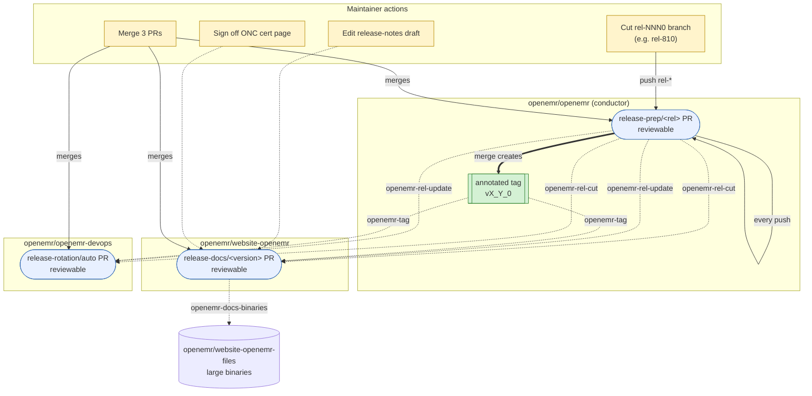

# OpenEMR Release Process

This document is the **complete release runbook** for tagged OpenEMR releases — every step from pre-release QA through post-release announcements, including the parts that are automated, the parts that aren't yet, and the parts that are irreducibly manual.

The automation core spans four repositories and is driven by `repository_dispatch` events (most emitted by this repo as the conductor; one — `openemr-docs-binaries` — emitted by `website-openemr` to `website-openemr-files`). It opens three reviewable PRs that cover code/version bumps, install/upgrade/release-notes pages, and CI/Docker pin rotation. Several post-merge steps (DockerHub readme, demo farm, Release History page, social/forum/email announcements) remain manual today; see [Automation gaps](#automation-gaps).

For background on why the flow is shaped this way, see [openemr/openemr-devops#664](https://github.com/openemr/openemr-devops/issues/664). For the per-slice plan documents, see the [Slice plans](#slice-plans) section below. For the end-to-end ordered checklist a release manager actually walks through, jump to [Release runbook](#release-runbook).

## Repositories involved

| Repository | Role |
| --- | --- |
| [`openemr/openemr`](https://github.com/openemr/openemr) | **Conductor.** Owns the release-prep PR. Merging it is the "we're shipping" decision; the merge commit gets the annotated release tag. Emits `repository_dispatch` to `openemr-devops` and `website-openemr`. (`website-openemr-files` is updated downstream by `website-openemr`, not directly by this repo.) |
| [`openemr/website-openemr`](https://github.com/openemr/website-openemr) | **Docs consumer.** Subscribes to `rel-*` events. Generates per-version Hugo pages (install, upgrade, OpenAPI, release notes draft, acknowledgements). DRAFT until the tag event flips it to FINAL. |
| [`openemr/website-openemr-files`](https://github.com/openemr/website-openemr-files) | **Binaries target.** Hosts large generated artifacts (EHI/B10 schemaspy HTML trees) referenced by the docs PR. Updated by the same workflow that updates `website-openemr`. |
| [`openemr/openemr-devops`](https://github.com/openemr/openemr-devops) | **Infra consumer.** Subscribes to `rel-*` and tag events. Rotates the `current` / `next` / `dev` slot in CI matrices, package versions, and Docker pins. Owns the canonical source for the cross-repo dispatch contract and tag verifier. |

## Cross-repo flow



**Legend.** Yellow nodes are maintainer actions. Blue nodes are reviewable PRs that workflows open and force-update on every dispatch. The green node is the annotated tag the conductor creates on merge. Solid arrows are git/PR actions; dotted arrows are `repository_dispatch` events labeled with the event name.

## Cross-repo events

The conductor in `openemr/openemr` emits `repository_dispatch` on every push to `rel-*` and on tag creation, targeting `openemr/openemr-devops` and `openemr/website-openemr`. Separately, `openemr/website-openemr` emits `openemr-docs-binaries` to `openemr/website-openemr-files` once large generated artifacts are ready to publish. Consumers subscribe via the matching `repository_dispatch` workflow trigger.

| Event | Emitter → target | When | `data` payload |
| --- | --- | --- | --- |
| `openemr-rel-cut` | `openemr/openemr` → devops, website-openemr | First push to a new `rel-*` branch | `{ branch, version, prev_release }` |
| `openemr-rel-update` | `openemr/openemr` → devops, website-openemr | Subsequent push to an existing `rel-*` branch | `{ branch, version, prev_release }` |
| `openemr-tag` | `openemr/openemr` → devops, website-openemr | Annotated tag created on `rel-*` HEAD | `{ tag, branch, version }` |
| `openemr-docs-binaries` | `openemr/website-openemr` → website-openemr-files | Large artifacts ready to publish to the binaries repo | `{ version, branch, files }` (`files` is a non-empty array) |

Common envelope on every event: `{ event, repo, sha, actor, dispatched_at, data }`.

**Schema location.** The canonical JSON Schema lives in `openemr-devops` at [`tools/release/contracts/dispatch.schema.json`](https://github.com/openemr/openemr-devops/blob/master/tools/release/contracts/dispatch.schema.json) and is vendored into each consumer (drift-checked in CI). The vendored copy in this repo is at [`tools/release/contracts/dispatch.schema.json`](../tools/release/contracts/dispatch.schema.json).

**Tag verifier.** The shared `TagVerifier` that confirms a tag is annotated (not a lightweight ref) lives at [`tools/release/src/TagVerifier.php`](../tools/release/src/TagVerifier.php), vendored from `openemr-devops`'s [`tools/release/src/TagVerifier.php`](https://github.com/openemr/openemr-devops/blob/master/tools/release/src/TagVerifier.php).

## What each PR contains

### Conductor PR — `release-prep/<rel-branch>` in `openemr/openemr`

Long-lived draft PR against the `rel-*` branch, force-updated by [`.github/workflows/release-prep.yml`](../.github/workflows/release-prep.yml) on every push to a production release branch (matching `rel-[0-9]*0`, with `docs/**`-only pushes ignored). Test branches like `rel-test` go through `workflow_dispatch` instead. The mechanical edits applied by `bin/console openemr:release-prep` are documented in [`docs/release-automation-plan.md`](release-automation-plan.md) (the conductor slice plan).

In short, the conductor rewrites: `version.php`, `library/globals.inc.php` (debug toggle), `docker/production/docker-compose.yml` (image pin), `src/RestControllers/OpenApi/OpenApiDefinitions.php`, `swagger/openemr-api.yaml` (regenerated from the CLI), every `docker-version` file, and (on master) a fresh `sql/X_Y_Z-to-X_Y_Z+1_upgrade.sql` skeleton.

### Docs PR — `release-docs/<version>` in `openemr/website-openemr`

Long-lived PR per release. Generated content: install/upgrade Hugo pages, OpenAPI YAML, release-notes draft (grouped by `feat:` / `bug:` / `refactor:` / `chore:` prefix), acknowledgements (from `git shortlog vPREV..HEAD`), Hugo aliases for legacy URLs. Pages render with a `DRAFT — based on rel-* @ <sha>` shortcode until the `openemr-tag` event flips them to FINAL.

Large binaries (EHI/B10 schemaspy output) are pushed by the same workflow to `openemr/website-openemr-files` under `files/openemr-<version>-ehi/`.

### Infra PR — `release-rotation/auto` in `openemr/openemr-devops`

Long-lived PR against `master`, force-updated on each dispatch. Rotates the three CI/version slots:

| Slot | Meaning |
| --- | --- |
| `current` | Most recent tagged release |
| `next` | Active `rel-*` branch (release candidate) |
| `dev` | Head of master (edge) |

Touches CI matrices, package version refs, raspberrypi / Docker pinned versions. Driven by `tools/release/versions.yml`.

## Release runbook

The complete ordered checklist for cutting a release. Each step is marked **[Automated]**, **[Manual]** (will be automated later — see [Automation gaps](#automation-gaps)), or **[Manual — judgment]** (irreducibly manual; requires human input).

### Phase 1 — Pre-release QA

1. **[Manual — judgment]** Confirm pre-release QA is complete. The QA process (test plan, regression coverage, sign-off) lives on the [QA and Release Process wiki page](https://www.open-emr.org/wiki/index.php/QA_and_Release_Process); follow it before cutting the branch. (Folding the QA gate into the automation is tracked under [Automation gaps](#automation-gaps).)

### Phase 2 — Branch cut and PR generation

2. **[Manual — judgment]** Cut the release branch: `rel-<MAJOR><MINOR>0` (e.g. `rel-810`) from `master`. This is the only step that creates new state from nothing.
3. **[Automated]** Conductor workflow (`release-prep.yml` in `openemr/openemr`) opens or updates the `release-prep/<rel-branch>` draft PR with all mechanical version bumps. Re-fires on every relevant push.
4. **[Automated]** Docs workflow (in `website-openemr`) opens or updates the `release-docs/<version>` draft PR with install/upgrade pages, OpenAPI YAML, release-notes draft, acknowledgements, Hugo aliases. Pages render with a `DRAFT — based on rel-* @ <sha>` banner.
5. **[Automated]** Infra workflow (`release-rotation.yml` in `openemr-devops`) opens or updates the `release-rotation/auto` draft PR rotating CI/version slots.

### Phase 3 — Manual editorial work (in the open PRs)

6. **[Manual — judgment]** In the `website-openemr` PR, edit the auto-generated release-notes draft for tone and what's noteworthy. The draft regenerates on every push; edits should be made on the PR branch (the workflow preserves manual edits in the rendered page).
7. **[Manual — judgment]** In the `website-openemr` PR, sign off on the ONC Ambulatory EHR Certification Requirements page.
8. **[Manual — judgment]** *(Major releases only)* Write the marketing piece for the website.

### Phase 4 — Merge the three PRs

Recommended order: **infra → conductor → docs.** Infra readies CI for the new branch; the conductor merge creates the annotated tag (which flips the docs PR's banner from DRAFT to FINAL and triggers the infra rotation's `next` → `current` promotion); merging the docs PR ships the now-FINAL pages.

9. **[Manual]** Merge the **infra PR** in `openemr-devops`.
10. **[Manual]** Merge the **conductor PR** in `openemr/openemr`. The merge commit gets the annotated release tag.
11. **[Manual]** Merge the **docs PR** in `website-openemr`. The DRAFT/FINAL banner flips to FINAL.

Steps 9–11 are slated to collapse into one ship-release workflow tracked at [openemr/openemr-devops#705](https://github.com/openemr/openemr-devops/issues/705). See [Partial merges and recovery](#partial-merges-and-recovery) for what happens if you stop partway.

### Phase 5 — Post-merge artifact and download verification

12. **[Manual — judgment]** Verify the source archives on the [GitHub release page](https://github.com/openemr/openemr/releases) are present and downloadable.
13. **[Manual]** Upload the source archives to SourceForge.
14. **[Automated]** Docker images for the new release build via the workflows in `openemr-devops` (triggered by the rotation PR's merge and the new tag).
15. **[Manual]** Update the DockerHub readme (the per-version description on [hub.docker.com/r/openemr/openemr](https://hub.docker.com/r/openemr/openemr)).
16. **[Manual]** *(Patch releases)* Update the [OpenEMR Patches wiki page](https://www.open-emr.org/wiki/index.php/OpenEMR_Patches) download list.
17. **[Manual]** Update the [OpenEMR Downloads / Release History wiki page](https://www.open-emr.org/wiki/index.php/OpenEMR_Downloads). (Long-term: this should move to `website-openemr` so it ships with the docs PR.)

### Phase 6 — Demo and promotion

18. **[Manual]** Point the demo farm (live demo servers at open-emr.org) to the new tag.
19. **[Manual]** Announce the release:
    - Forums
    - Chat
    - Twitter / X
    - Facebook
    - LinkedIn (group + company page)
    - Registered-users mailing list

## Automation gaps

The runbook above marks each currently-manual post-automation step **[Manual]**. None of them are irreducibly manual; they're tracked for follow-on automation:

| Step | What | Tracking |
| --- | --- | --- |
| 1 | Fold pre-release QA gate into the conductor (block `rel-cut` until QA sign-off) | [openemr/openemr-devops#707](https://github.com/openemr/openemr-devops/issues/707) |
| 9–11 | Single "ship release" workflow that merges all three PRs in order | [openemr/openemr-devops#705](https://github.com/openemr/openemr-devops/issues/705) |
| 13 | Automate SourceForge upload from the GitHub release artifacts | [openemr/openemr-devops#708](https://github.com/openemr/openemr-devops/issues/708) |
| 15 | Automate the DockerHub readme update | [openemr/openemr-devops#709](https://github.com/openemr/openemr-devops/issues/709) |
| 16 | Move the OpenEMR Patches download page off the wiki onto `website-openemr` | [openemr/website-openemr#119](https://github.com/openemr/website-openemr/issues/119) |
| 17 | Move the Release History wiki page onto `website-openemr` (auto-updates on tag) | [openemr/website-openemr#120](https://github.com/openemr/website-openemr/issues/120) |
| 18 | Automate the demo-farm tag bump (deploy hook from `openemr-tag`) | [openemr/openemr-devops#710](https://github.com/openemr/openemr-devops/issues/710) |
| 19 | Automated post-release announcement fan-out (forums, chat, social, mailing list) | [openemr/openemr-devops#711](https://github.com/openemr/openemr-devops/issues/711) |

Umbrella issue tracking the full gap closure: [openemr/openemr-devops#706](https://github.com/openemr/openemr-devops/issues/706).

## Partial merges and recovery

The three PRs are coupled only by `repository_dispatch` — nothing in the automation prevents a maintainer from merging out of order or stopping partway. Each scenario degrades differently:

| Merged | Effect |
| --- | --- |
| Conductor only | Annotated tag exists; CI matrices and Docker pins still target the prior `current`; website still advertises the prior version. Builds for the new release exist (the tag is real) but discoverability and CI rotation lag. |
| Docs only | Cannot reach FINAL — the DRAFT/FINAL banner is driven by the `openemr-tag` event, which the conductor never emitted. Merging publishes pages permanently stamped DRAFT for a version that was never tagged. **Avoid this case.** |
| Infra only | CI matrices roll forward to a `current` slot whose tag does not exist; builds for `current` fail until the conductor merges. Recoverable but noisy. |
| Conductor + infra (no docs) | Tag exists, CI green, but website still serves prior-version install/upgrade pages and no release notes. |
| Conductor + docs (no infra) | Tag exists, docs FINAL, but CI matrices still build the prior `current`/`next` slots — release-CI signal lags until the rotation PR merges. |
| Infra + docs (no conductor) | Both PRs reference a version whose tag does not exist. Docs stay DRAFT; CI builds for `current` fail. |

Recovery is always "merge the remaining PRs"; nothing is unrecoverable. The website may serve stale or DRAFT-stamped content, and CI may be red against `current`, until the set is complete.

A planned follow-on is a single "ship release" workflow that verifies all three PRs are mergeable and green and then merges them in the recommended order, collapsing the three-button maintainer step into one. Tracked in [openemr/openemr-devops#705](https://github.com/openemr/openemr-devops/issues/705).

## Naming and tag conventions

| Thing | Pattern | Example |
| --- | --- | --- |
| Release branch | `rel-<MAJOR><MINOR>0` | `rel-810` |
| Release tag | `v<MAJOR>_<MINOR>_<PATCH>` | `v8_1_0` |
| Hugo version param | `<MAJOR>.<MINOR>.<PATCH>` | `8.1.0` |
| Conductor PR branch | `release-prep/<rel-branch>` | `release-prep/rel-810` |
| Devops rotation PR branch | `release-rotation/auto` | — |
| Docs PR branch | `release-docs/<version>` | `release-docs/8.1.0` |

**Tags are always annotated** (Git object type `tag`, not `commit`). Lightweight tags lack author/date/message metadata and break `git describe`, downstream tooling, and consumers that introspect tag objects. The `TagVerifier` enforces this in CI on all three repos.

The tag message follows this template:

```
OpenEMR <version> released <YYYY-MM-DD>

Conductor PR: <url>
Merge commit: <sha>

Created by openemr-release-bot via automation
```

Tags are unsigned; the trailer line records that automation produced them. Revisit if maintainers later want signed tags.

## Bot identity and credentials

A GitHub App (the "release app") performs all automated git/PR actions. Its credentials live as repo secrets `RELEASE_APP_ID` and `RELEASE_APP_PRIVATE_KEY` on each of the four repos, and the App is installed on each.

Each repo carries a `release-permissions-check.yml` workflow (manual `workflow_dispatch`) that mints an App token and probes every permission the workflow needs — branch create/delete, PR open/close, tag create/delete, cross-repo `repository_dispatch`. Run it after installing the App or rotating the secrets; it fails loudly with the missing permission name.

This repo's check is at [`.github/workflows/release-permissions-check.yml`](../.github/workflows/release-permissions-check.yml).

## Slice plans

Each repo's slice has its own plan document with the per-slice mechanical detail (mutators, registry shape, consumer wiring, hypotheses, testing strategy):

- **Conductor:** [`docs/release-automation-plan.md`](release-automation-plan.md) in this repo.
- **Infra:** [`docs/release-automation-plan.md`](https://github.com/openemr/openemr-devops/blob/master/docs/release-automation-plan.md) in `openemr-devops`.
- **Docs:** the website-openemr slice was implemented in [openemr/website-openemr#82](https://github.com/openemr/website-openemr/pull/82); see the PR description for its design.

## Checklist templates

The conductor PR description embeds a maintainer-facing checklist of irreducibly-manual steps. The full and patch-release templates live in `openemr-devops`:

- [`tools/release/templates/full-checklist.md`](https://github.com/openemr/openemr-devops/blob/master/tools/release/templates/full-checklist.md)
- [`tools/release/templates/patch-checklist.md`](https://github.com/openemr/openemr-devops/blob/master/tools/release/templates/patch-checklist.md)

These templates are scoped to the devops slice; the conductor PR template (in this repo) collects the cross-repo checklist the release manager actually walks through.

## Wiki

The wiki pages [QA and Release Process](https://www.open-emr.org/wiki/index.php/QA_and_Release_Process) and [Steps for an official release](https://www.open-emr.org/wiki/index.php/Steps_for_an_official_release) historically described the manual flow that this automation replaces. Once the automated flow has cut its first release, those pages should be rewritten as short pointers to this document plus the manual checklist — keeping the URLs contributors already know without leaving stale step-by-step instructions in two places.
