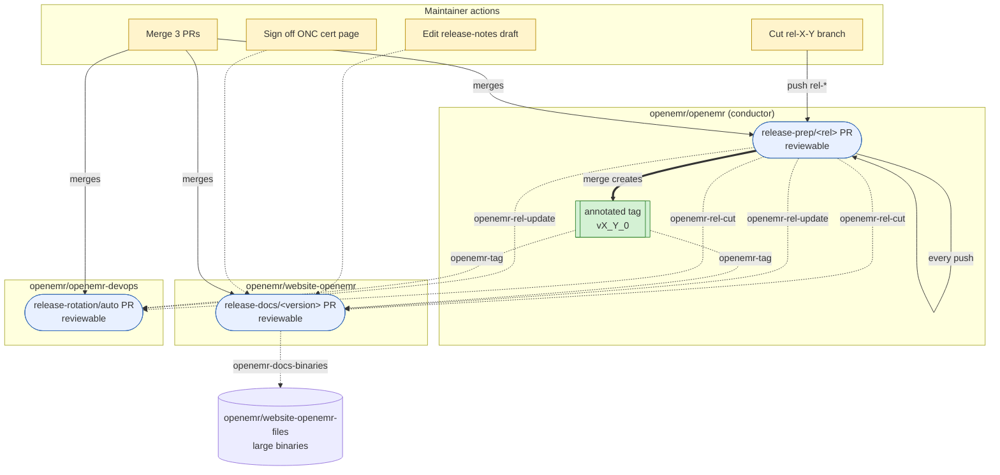

# OpenEMR Release Process

This document describes the **end-to-end automated release flow** for tagged OpenEMR releases. The flow spans four repositories, is driven by `repository_dispatch` events (most emitted by this repo as the conductor; one — `openemr-docs-binaries` — emitted by `website-openemr` to `website-openemr-files`), and shrinks the release manager's manual surface to: cut the branch, edit a generated release-notes draft, sign off the ONC certification page, and merge three pre-built PRs.

For background on why the flow is shaped this way, see [openemr/openemr-devops#664](https://github.com/openemr/openemr-devops/issues/664). For the per-slice plan documents, see the [Slice plans](#slice-plans) section below.

## Repositories involved

| Repository | Role |
| --- | --- |
| [`openemr/openemr`](https://github.com/openemr/openemr) | **Conductor.** Owns the release-prep PR. Merging it is the "we're shipping" decision; the merge commit gets the annotated release tag. Emits `repository_dispatch` to the other three repos. |
| [`openemr/website-openemr`](https://github.com/openemr/website-openemr) | **Docs consumer.** Subscribes to `rel-*` events. Generates per-version Hugo pages (install, upgrade, OpenAPI, release notes draft, acknowledgements). DRAFT until the tag event flips it to FINAL. |
| [`openemr/website-openemr-files`](https://github.com/openemr/website-openemr-files) | **Binaries target.** Hosts large generated artifacts (EHI/B10 schemaspy HTML trees) referenced by the docs PR. Updated by the same workflow that updates `website-openemr`. |
| [`openemr/openemr-devops`](https://github.com/openemr/openemr-devops) | **Infra consumer.** Subscribes to `rel-*` and tag events. Rotates the `current` / `next` / `dev` slot in CI matrices, package versions, and Docker pins. Owns the canonical source for the cross-repo dispatch contract and tag verifier. |

## Cross-repo flow



**Legend.** Yellow nodes are maintainer actions. Blue nodes are reviewable PRs that workflows open and force-update on every dispatch. The green node is the annotated tag the conductor creates on merge. Solid arrows are git/PR actions; dotted arrows are `repository_dispatch` events labeled with the event name.

## Cross-repo events

The conductor in `openemr/openemr` emits `repository_dispatch` on every push to `rel-*` and on tag creation, targeting `openemr/openemr-devops` and `openemr/website-openemr`. Separately, `openemr/website-openemr` emits `openemr-docs-binaries` to `openemr/website-openemr-files` once large generated artifacts are ready to publish. Consumers subscribe via the matching `repository_dispatch` workflow trigger.

| Event | Emitter → target | When | `data` payload |
| --- | --- | --- | --- |
| `openemr-rel-cut` | `openemr/openemr` → devops, website-openemr | First push to a new `rel-*` branch | `{ branch, version, prev_release }` |
| `openemr-rel-update` | `openemr/openemr` → devops, website-openemr | Subsequent push to an existing `rel-*` branch | `{ branch, version, prev_release }` |
| `openemr-tag` | `openemr/openemr` → devops, website-openemr | Annotated tag created on `rel-*` HEAD | `{ tag, branch, version }` |
| `openemr-docs-binaries` | `openemr/website-openemr` → website-openemr-files | Large artifacts ready to publish to the binaries repo | `{ version, branch, files }` (`files` is a non-empty array) |

Common envelope on every event: `{ event, repo, sha, actor, dispatched_at, data }`.

**Schema location.** The canonical JSON Schema lives in `openemr-devops` at [`tools/release/contracts/dispatch.schema.json`](https://github.com/openemr/openemr-devops/blob/master/tools/release/contracts/dispatch.schema.json) and is vendored into each consumer (drift-checked in CI). The vendored copy in this repo is at [`tools/release/contracts/dispatch.schema.json`](../tools/release/contracts/dispatch.schema.json).

**Tag verifier.** The shared `TagVerifier` that confirms a tag is annotated (not a lightweight ref) lives at [`tools/release/src/TagVerifier.php`](../tools/release/src/TagVerifier.php), vendored from `openemr-devops`'s [`tools/release/src/TagVerifier.php`](https://github.com/openemr/openemr-devops/blob/master/tools/release/src/TagVerifier.php).

## What each PR contains

### Conductor PR — `release-prep/<rel-branch>` in `openemr/openemr`

Long-lived draft PR against the `rel-*` branch, force-updated on every push by [`.github/workflows/release-prep.yml`](../.github/workflows/release-prep.yml). The mechanical edits applied by `bin/console openemr:release-prep` are documented in [`docs/release-automation-plan.md`](release-automation-plan.md) (the conductor slice plan).

In short, the conductor rewrites: `version.php`, `library/globals.inc.php` (debug toggle), `docker/production/docker-compose.yml` (image pin), `src/RestControllers/OpenApi/OpenApiDefinitions.php`, `swagger/openemr-api.yaml` (regenerated from the CLI), every `docker-version` file, and (on master) a fresh `sql/X_Y_Z-to-X_Y_Z+1_upgrade.sql` skeleton.

### Docs PR — `release-docs/<version>` in `openemr/website-openemr`

Long-lived PR per release. Generated content: install/upgrade Hugo pages, OpenAPI YAML, release-notes draft (grouped by `feat:` / `bug:` / `refactor:` / `chore:` prefix), acknowledgements (from `git shortlog vPREV..HEAD`), Hugo aliases for legacy URLs. Pages render with a `DRAFT — based on rel-* @ <sha>` shortcode until the `openemr-tag` event flips them to FINAL.

Large binaries (EHI/B10 schemaspy output) are pushed by the same workflow to `openemr/website-openemr-files` under `files/openemr-<version>-ehi/`.

### Infra PR — `release-rotation/auto` in `openemr/openemr-devops`

Long-lived PR against `master`, force-updated on each dispatch. Rotates the three CI/version slots:

| Slot | Meaning |
| --- | --- |
| `current` | Most recent tagged release |
| `next` | Active `rel-*` branch (release candidate) |
| `dev` | Head of master (edge) |

Touches CI matrices, package version refs, raspberrypi / Docker pinned versions. Driven by `tools/release/versions.yml`.

## Maintainer's manual steps

Even with full automation, the release manager still:

1. **Triggers the initial branch cut** (`rel-X-Y` from master). This is the only step that creates new state from nothing.
2. **Edits the auto-generated release-notes draft** in the `website-openemr` PR for tone and what's noteworthy. The draft is regenerated on every push, so edits should be made on the PR branch (workflow preserves manual edits in the rendered page).
3. **Signs off the ONC Ambulatory EHR Certification Requirements page** in the `website-openemr` PR.
4. **Writes the marketing piece** (major releases only).
5. **Merges the three PRs** — conductor (`openemr/openemr`), docs (`website-openemr`), infra (`openemr-devops`). Merging the conductor creates the annotated tag, which flips the docs PR's banner from DRAFT to FINAL and triggers the infra rotation's "promote `next` → `current`" step.

Recommended merge order: **infra first** (so CI is ready against the new branch), **conductor next** (creates the tag), **docs last** (consumes the tag to flip to FINAL).

Everything else — artifact builds, install/upgrade page rewrites, redirect setup, version bumps, acknowledgement lists, package version pins — is mechanical and lives in the workflows.

## Naming and tag conventions

| Thing | Pattern | Example |
| --- | --- | --- |
| Release branch | `rel-<MAJOR><MINOR>0` | `rel-810` |
| Release tag | `v<MAJOR>_<MINOR>_<PATCH>` | `v8_1_0` |
| Hugo version param | `<MAJOR>.<MINOR>.<PATCH>` | `8.1.0` |
| Conductor PR branch | `release-prep/<rel-branch>` | `release-prep/rel-810` |
| Devops rotation PR branch | `release-rotation/auto` | — |
| Docs PR branch | `release-docs/<version>` | `release-docs/8.1.0` |

**Tags are always annotated** (Git object type `tag`, not `commit`). Lightweight tags lack author/date/message metadata and break `git describe`, downstream tooling, and consumers that introspect tag objects. The `TagVerifier` enforces this in CI on all three repos.

The tag message follows this template:

```
OpenEMR <version> released <YYYY-MM-DD>

Conductor PR: <url>
Merge commit: <sha>

Created by openemr-release-bot via automation
```

Tags are unsigned; the trailer line records that automation produced them. Revisit if maintainers later want signed tags.

## Bot identity and credentials

A GitHub App (the "release app") performs all automated git/PR actions. Its credentials live as repo secrets `RELEASE_APP_ID` and `RELEASE_APP_PRIVATE_KEY` on each of the four repos, and the App is installed on each.

Each repo carries a `release-permissions-check.yml` workflow (manual `workflow_dispatch`) that mints an App token and probes every permission the workflow needs — branch create/delete, PR open/close, tag create/delete, cross-repo `repository_dispatch`. Run it after installing the App or rotating the secrets; it fails loudly with the missing permission name.

This repo's check is at [`.github/workflows/release-permissions-check.yml`](../.github/workflows/release-permissions-check.yml).

## Slice plans

Each repo's slice has its own plan document with the per-slice mechanical detail (mutators, registry shape, consumer wiring, hypotheses, testing strategy):

- **Conductor:** [`docs/release-automation-plan.md`](release-automation-plan.md) in this repo.
- **Infra:** [`docs/release-automation-plan.md`](https://github.com/openemr/openemr-devops/blob/master/docs/release-automation-plan.md) in `openemr-devops`.
- **Docs:** the website-openemr slice was implemented in [openemr/website-openemr#82](https://github.com/openemr/website-openemr/pull/82); see the PR description for its design.

## Checklist templates

The conductor PR description embeds a maintainer-facing checklist of irreducibly-manual steps. The full and patch-release templates live in `openemr-devops`:

- [`tools/release/templates/full-checklist.md`](https://github.com/openemr/openemr-devops/blob/master/tools/release/templates/full-checklist.md)
- [`tools/release/templates/patch-checklist.md`](https://github.com/openemr/openemr-devops/blob/master/tools/release/templates/patch-checklist.md)

These templates are scoped to the devops slice; the conductor PR template (in this repo) collects the cross-repo checklist the release manager actually walks through.

## Wiki

The wiki pages [QA and Release Process](https://www.open-emr.org/wiki/index.php/QA_and_Release_Process) and [Steps for an official release](https://www.open-emr.org/wiki/index.php/Steps_for_an_official_release) historically described the manual flow that this automation replaces. Once the automated flow has cut its first release, those pages should be rewritten as short pointers to this document plus the manual checklist — keeping the URLs contributors already know without leaving stale step-by-step instructions in two places.
