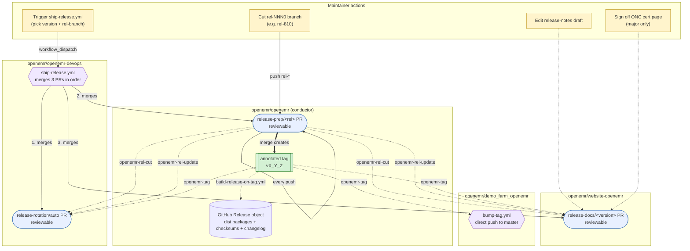

# OpenEMR Release Process

This document is the **complete release runbook** for tagged OpenEMR releases — every step from pre-release QA through post-release announcements, including the parts that are automated, the parts that aren't yet, and the parts that are irreducibly manual.

The automation core spans four repositories and is driven by `repository_dispatch` events emitted by this repo as the conductor. Three of them open reviewable PRs that cover code/version bumps, install/upgrade/release-notes pages, and CI/Docker pin rotation; the fourth (`demo_farm_openemr`) is updated by a direct automated push rather than a PR. Two steps are still done by hand today (merging the `website-openemr` docs PR, social/forum/email announcement fan-out); see [Automation gaps](#automation-gaps).

For background on why the flow is shaped this way, see [openemr/openemr-devops#664](https://github.com/openemr/openemr-devops/issues/664). For the per-slice plan documents, see the [Slice plans](#slice-plans) section below. For the end-to-end ordered checklist a release manager actually walks through, jump to [Release runbook](#release-runbook).

## Repositories involved

| Repository | Role |
| --- | --- |
| [`openemr/openemr`](https://github.com/openemr/openemr) | **Conductor.** Owns the release-prep PR. Merging it is the "we're shipping" decision; the merge commit gets the annotated release tag. Emits `repository_dispatch` to `openemr-devops`, `website-openemr`, and `demo_farm_openemr`. |
| [`openemr/website-openemr`](https://github.com/openemr/website-openemr) | **Docs consumer.** Subscribes to `rel-*` and tag events. Generates per-version Hugo pages (install, upgrade, OpenAPI, release notes draft, acknowledgements). On `openemr-tag` it also regenerates the EHI / ONC (b)(10) SchemaSpy schema documentation and publishes it under `/documentation/<version>/b10/` (tracked by git-lfs) in the same docs PR. DRAFT until the tag event flips it to FINAL. |
| [`openemr/openemr-devops`](https://github.com/openemr/openemr-devops) | **Infra consumer.** Subscribes to `rel-*` and tag events. Rotates the `current` / `next` / `dev` slot in CI matrices and package versions. Owns the canonical source for the cross-repo dispatch contract and tag verifier. Note: Docker pins now rotate in **this repo** via [`.github/release-targets.yml`](../.github/release-targets.yml) after the docker pipeline migration (see [`docker-migration-from-devops.md`](docker-migration-from-devops.md)); the openemr-devops rotation workflow's docker-pin slice is part of the deferred release-mechanism follow-up. |
| [`openemr/demo_farm_openemr`](https://github.com/openemr/demo_farm_openemr) | **Demo-farm consumer.** Subscribes to the `openemr-tag` event. `bump-tag.yml` rewrites matching production-demo rows in `ip_map_branch.txt` and pushes directly to `master` (no reviewable PR); the demo-farm host's nightly reset picks up the new tag. |

## Cross-repo flow



**Legend.** Yellow nodes are maintainer actions. Blue nodes are reviewable PRs that workflows open and force-update on every dispatch. The green node is the annotated tag the conductor creates on merge. Purple hexagons are workflows: `ship-release.yml` (in `openemr-devops`), which an operator triggers via `workflow_dispatch` to merge the three PRs in order (infra → conductor → docs) with mergeability gates; and `bump-tag.yml` (in `demo_farm_openemr`), which consumes `openemr-tag` and pushes the new tag to the demo-farm config directly. Solid arrows are git/PR actions and workflow triggers; dotted arrows are `repository_dispatch` events labeled with the event name.

## Cross-repo events

The conductor in `openemr/openemr` emits `repository_dispatch` on every push to `rel-*` and on tag creation, targeting `openemr/openemr-devops`, `openemr/website-openemr`, and `openemr/demo_farm_openemr`. Consumers subscribe via the matching `repository_dispatch` workflow trigger; `demo_farm_openemr` acts only on `openemr-tag`.

| Event | Emitter → target | When | `data` payload |
| --- | --- | --- | --- |
| `openemr-rel-cut` | `openemr/openemr` → devops, website-openemr | First push to a new `rel-*` branch | `{ branch, version, prev_release }` |
| `openemr-rel-update` | `openemr/openemr` → devops, website-openemr | Subsequent push to an existing `rel-*` branch | `{ branch, version, prev_release }` |
| `openemr-tag` | `openemr/openemr` → devops, website-openemr, demo_farm_openemr | Annotated tag created on `rel-*` HEAD | `{ tag, branch, version }` |

Common envelope on every event: `{ event, repo, sha, actor, dispatched_at, data }`.

**Schema location.** The canonical JSON Schema lives in `openemr-devops` at [`tools/release/contracts/dispatch.schema.json`](https://github.com/openemr/openemr-devops/blob/master/tools/release/contracts/dispatch.schema.json) and is vendored into each consumer (drift-checked in CI). The vendored copy in this repo is at [`tools/release/contracts/dispatch.schema.json`](../tools/release/contracts/dispatch.schema.json).

**Tag verifier.** The shared `TagVerifier` lives at [`tools/release/src/TagVerifier.php`](../tools/release/src/TagVerifier.php), vendored from `openemr-devops`'s [`tools/release/src/TagVerifier.php`](https://github.com/openemr/openemr-devops/blob/master/tools/release/src/TagVerifier.php). It confirms the tag is annotated (not a lightweight ref) and that the tag message contains a `MAJOR.MINOR.PATCH` version, an ISO date (`YYYY-MM-DD`), and the 40-hex merge-commit SHA — the fields the openemr-devops#664 spec requires CI to enforce.

## What each PR contains

### Conductor PR — `release-prep/<rel-branch>` in `openemr/openemr`

Long-lived draft PR against the `rel-*` branch, force-updated by [`.github/workflows/release-prep.yml`](../.github/workflows/release-prep.yml) on every push to a production release branch (matching `rel-[0-9]*0`, with `docs/**`-only pushes ignored). Test branches like `rel-test` go through `workflow_dispatch` instead. The mechanical edits applied by `bin/console openemr:release-prep` are documented in [`docs/release-automation-plan.md`](release-automation-plan.md) (the conductor slice plan).

In short, the conductor rewrites: `version.php`, `library/globals.inc.php` (debug toggle), `docker/production/docker-compose.yml` (image pin), `src/RestControllers/OpenApi/OpenApiDefinitions.php`, `swagger/openemr-api.yaml` (regenerated from the CLI), every `docker-version` file, and (on master) a fresh `sql/X_Y_Z-to-X_Y_Z+1_upgrade.sql` skeleton.

### Docs PR — `release-docs/<version>` in `openemr/website-openemr`

Long-lived PR per release. Generated content: install/upgrade Hugo pages, OpenAPI YAML, release-notes draft (grouped by `feat:` / `bug:` / `refactor:` / `chore:` prefix), acknowledgements (from `git shortlog vPREV..HEAD`), Hugo aliases for legacy URLs. Pages render with a `DRAFT — based on rel-* @ <sha>` shortcode until the `openemr-tag` event flips them to FINAL.

On the `openemr-tag` event, the same workflow also regenerates the EHI / ONC (b)(10) SchemaSpy schema documentation from the tagged release's schema and commits it under `static/documentation/<version>/b10/` (tracked by git-lfs) in this same docs PR. It is served at `/documentation/<version>/b10/`. The table set in scope is read from `Documentation/EHI_Export/b10-tables.yml` in the tagged openemr checkout, so it always matches that release's schema.

### Infra PR — `release-rotation/auto` in `openemr/openemr-devops`

Long-lived PR against `master`, force-updated on each dispatch. Rotates the three CI/version slots:

| Slot | Meaning |
| --- | --- |
| `current` | Most recent tagged release |
| `next` | Active `rel-*` branch (release candidate) |
| `dev` | Head of master (edge) |

Touches CI matrices, package version refs, raspberrypi pinned versions. Driven by `tools/release/versions.yml`. Note: Docker pinned versions used to be rotated by this workflow too; that slice now lives in **this repo**'s [`.github/release-targets.yml`](../.github/release-targets.yml) per the docker pipeline migration (see [`docker-migration-from-devops.md`](docker-migration-from-devops.md)). The openemr-devops rotation workflow's docker-pin handling is part of the deferred release-mechanism follow-up.

## Orientation: finding the current release state

This document describes the *process*. The *current* state lives in Git and the GitHub API — discover it before acting; do not assume a release is or isn't in flight.

- **Which release is in flight?** Active release branches and the open conductor PR:

  ```
  git ls-remote --heads https://github.com/openemr/openemr 'rel-*'
  gh pr list --repo openemr/openemr --state open --json number,headRefName \
    --jq '.[] | select(.headRefName | startswith("release-prep/"))'
  ```

- **The three sibling PRs** (given a version `X.Y.Z` and branch `rel-<MAJOR><MINOR>0`):

  ```
  gh pr list --repo openemr/openemr        --state open --json number,headRefName --jq '.[]|select(.headRefName|startswith("release-prep/"))'   # conductor
  gh pr list --repo openemr/openemr-devops --head release-rotation/auto --state open                                                          # infra
  gh pr list --repo openemr/website-openemr --head "release-docs/X.Y.Z" --state open                                                          # docs
  ```

- **Is the tag cut? Did the Release object land?**

  ```
  git ls-remote --tags https://github.com/openemr/openemr 'vX_Y_Z'
  gh release view vX_Y_Z --repo openemr/openemr   # 404 here after a tag = the historical v8.1.0 failure (step 10/11)
  ```

- **Shipping.** `ship-release.yml` inputs are `version` (e.g. `8.1.0`), `rel_branch` (e.g. `rel-810`), `dry_run` (bool). Validate before merging: `gh workflow run ship-release.yml --repo openemr/openemr-devops -f version=X.Y.Z -f rel_branch=rel-XY0 -f dry_run=true`.

- **When to escalate to a human / org owner.** An automated agent cannot: merge the conductor PR (cuts a public tag — a go/no-go decision), or set/rotate the release-App credentials (`vars.RELEASE_APP_CLIENT_ID` and `secrets.RELEASE_APP_PRIVATE_KEY`). If a consumer's auth fails, run that repo's `release-permissions-check.yml`; if it reports a missing credential or permission, stop and escalate — only an org owner can fix it.

## Release runbook

The complete ordered checklist for cutting a release. Each step is marked **[Automated]**, **[Manual]** (will be automated later — see [Automation gaps](#automation-gaps)), or **[Manual — judgment]** (irreducibly manual; requires human input).

### Phase 1 — Pre-release QA

1. **[Manual — judgment]** Confirm pre-release QA is complete. The QA process (test plan, regression coverage, sign-off) lives on the [QA and Release Process wiki page](https://www.open-emr.org/wiki/index.php/QA_and_Release_Process). QA runs in parallel with the release-prep PR being continuously regenerated; the sign-off is what authorizes the conductor PR merge in step 9 — not the branch cut or any prep-PR update. The maintainers authorized to merge the conductor PR are the QA team, so the merge button is itself the QA gate; no separate sign-off mechanism is required.

### Phase 2 — Branch cut and PR generation

2. **[Manual — judgment]** Cut the release branch: `rel-<MAJOR><MINOR>0` (e.g. `rel-810`) from `master`. This is the only step that creates new state from nothing. When this is a **new minor line** (no prior `rel-<MAJOR><MINOR>0` released), seed the [`demo_farm_openemr`](https://github.com/openemr/demo_farm_openemr) production-demo rows for that line (`branch_tag=tag` rows on the `<MAJOR>.<MINOR>` line) before the first tag — `bump-tag.yml` only advances rows whose existing tag shares the new tag's `MAJOR.MINOR`, so an unseeded minor would silently skip step 15.
3. **[Automated]** Conductor workflow (`release-prep.yml` in `openemr/openemr`) opens or updates the `release-prep/<rel-branch>` draft PR with all mechanical version bumps. Re-fires on every relevant push.
4. **[Automated]** Docs workflow (in `website-openemr`) opens or updates the `release-docs/<version>` draft PR with install/upgrade pages, OpenAPI YAML, release-notes draft, acknowledgements, Hugo aliases. Pages render with a `DRAFT — based on rel-* @ <sha>` banner.
5. **[Automated]** Infra workflow (`release-rotation.yml` in `openemr-devops`) opens or updates the `release-rotation/auto` draft PR rotating CI/version slots.

### Phase 3 — Manual editorial work (in the open PRs)

6. **[Manual — judgment]** In the `website-openemr` PR, edit the auto-generated release-notes draft for tone and what's noteworthy. The draft regenerates on every push; edits should be made on the PR branch (the workflow preserves manual edits in the rendered page).
7. **[Manual — judgment]** *(Major releases only)* In the `website-openemr` PR, sign off on the ONC Ambulatory EHR Certification Requirements page.
8. **[Manual — judgment]** *(Major releases only)* Write the marketing piece for the website.

### Phase 4 — Ship: merge the three PRs

The three PRs merge in strict order **infra → conductor → docs.** Infra readies CI for the new branch; the conductor merge creates the annotated tag (which flips the docs PR's banner from DRAFT to FINAL and triggers the infra rotation's `next` → `current` promotion); merging the docs PR ships the now-FINAL pages.

> **Today the `website-openemr` docs PR is merged by hand.** The ship automation does not yet merge it: after the conductor merge creates the tag, an operator manually merges the `release-docs/<version>` PR to ship its pages. Automating this merge on `openemr-tag` is a tracked gap — see [Automation gaps](#automation-gaps).

9. **[Automated]** Run the **ship-release workflow** in `openemr-devops` (`workflow_dispatch` on `.github/workflows/ship-release.yml`, or `task release:ship` locally for a dry-run). One operator action: pick the version + rel-branch and trigger. The workflow locates the three sibling PRs by branch convention, posts a `release/ship-approved` commit status on each, and merges in order with mergeability gates between steps. Already-merged PRs are detected and skipped (so the same trigger handles partial-merge recovery — see [Partial merges and recovery](#partial-merges-and-recovery)).

   **Manual fallback** (only if the workflow is unavailable): merge in order — infra PR, then conductor PR (creates the annotated tag), then docs PR (flips DRAFT → FINAL). Direct merges should be blocked by branch protection requiring the `release/ship-approved` status the workflow posts; admin-override the protection only if the workflow itself is broken.

### Phase 5 — Post-merge artifact and download verification

10. **[Automated]** Create the **GitHub Release object** on `openemr/openemr` for the new tag and attach the build artifacts. This is the canonical (and only) distribution target — SourceForge is no longer supported, and the website's `/downloads/` and `/releases/` pages link directly to assets on the Release object (see step 14). A tag alone is not enough: without a Release object the website's "Download" button 404s.

    The Release object must include:
    - **Distribution packages** (`openemr-<version>.tar.gz`, `openemr-<version>.zip`) — full, ready-to-run installs with production Composer dependencies and compiled front-end assets baked in and dev/test cruft pruned (per openemr/openemr's `.gitattributes export-ignore` and `build.xml`). These are *not* GitHub's auto-generated "Source code" archives; they are built and uploaded by the workflow below.
    - **Checksums** (`.md5`, `.sha256`, `.sha512`) for each distribution package.
    - **`changelog.md`** — the generated release notes.

    This runs automatically: [`build-release-on-tag.yml`](https://github.com/openemr/openemr-devops/blob/master/.github/workflows/build-release-on-tag.yml) in `openemr-devops` consumes the conductor's `openemr-tag` dispatch, derives the build inputs from the payload, looks up the previous release for the changelog `base_ref`, and calls the reusable [`build-release.yml`](https://github.com/openemr/openemr-devops/blob/master/.github/workflows/build-release.yml) with `dry_run=false`. That workflow builds the packages with `task release:package:assemble` (`git archive HEAD` → `composer install --no-dev` → `npm ci && npm run build` → prune via `build.xml` phing targets); then its "Create annotated tag and GitHub release" step is no-op-safe when the tag already exists and proceeds to `gh release create --verify-tag --notes-file changelog.md`, generates the checksum sidecars, and uploads the packages + checksums + changelog with `gh release upload --clobber`. `build-release.yml` remains available as a manual `workflow_dispatch` fallback (`dry_run=false`, the conductor-created tag in `release_tag`). Closing this gap was tracked in [openemr/openemr-devops#756](https://github.com/openemr/openemr-devops/issues/756).
11. **[Manual — judgment]** Verify the Release object on the [GitHub releases page](https://github.com/openemr/openemr/releases): distribution packages downloadable, all three checksum files present, changelog rendered.
12. **[Automated]** Docker images for the new release build via the workflows in **this repo** (`.github/workflows/docker-release-orchestrator.yml` fans out per-branch `docker-build-release.yml` dispatches; each rel branch's `docker-build-release.yml` also fires on its own `push: tags: ['v*']`). Triggered by the daily orchestrator cron + the new tag landing on a rel branch. See [`docs/docker-migration-from-devops.md`](docker-migration-from-devops.md) for why this lives here rather than in `openemr-devops`.
13. **[Automated]** The DockerHub readme (per-version description on [hub.docker.com/r/openemr/openemr](https://hub.docker.com/r/openemr/openemr)) is updated by `.github/workflows/docker-push-dockerhub-readme.yml` in **this repo**, which fires via `workflow_run` after each orchestrator run. Source template at [`docker/dockerhub/overview.md`](../docker/dockerhub/overview.md).
14. **[Automated]** The Downloads landing page and the historical release table on `website-openemr` (`/downloads/` and `/releases/`) re-render from `data/releases.json`, which the docs PR workflow updates on every dispatch. The `/downloads/` page's "Download" buttons link to the Release-object assets from step 10 — if step 10 is skipped, those buttons 404. The legacy [OpenEMR Downloads wiki page](https://www.open-emr.org/wiki/index.php/OpenEMR_Downloads) is no longer the source of truth and should be edited by hand to a one-line pointer to https://www.open-emr.org/downloads/.

Standalone patch releases (`v<MAJOR>_<MINOR>_<PATCH>_<N>` tags with a `<M>-<m>-<p>-Patch-<N>.zip` asset) are not part of the automated cadence: the [OpenEMR Patches wiki page](https://www.open-emr.org/wiki/index.php/OpenEMR_Patches) and its download list go away once automated tagged releases ship security and bug fixes on a regular interval. The wiki page should be edited by hand to point readers at the most recent regular release on the [Downloads](https://www.open-emr.org/downloads/) page.

### Phase 6 — Demo and promotion

15. **[Automated]** Point the demo farm (live demo servers at open-emr.org) to the new tag. The `bump-tag.yml` workflow in [`openemr/demo_farm_openemr`](https://github.com/openemr/demo_farm_openemr/blob/master/.github/workflows/bump-tag.yml) consumes the `openemr-tag` event, rewrites matching production-demo rows in `ip_map_branch.txt`, and pushes to master; the demo-farm host's nightly reset picks up the new tag automatically. The match condition is `branch_tag=tag` **and** the existing tag's `MAJOR.MINOR` equals the new tag's `MAJOR.MINOR`, so the first release on a new minor line is a no-op against the demo farm until production-demo rows for that line have been seeded (see Phase 2 step 2).
16. **[Manual]** Announce the release:
    - Forums
    - Chat
    - Twitter / X
    - Facebook
    - LinkedIn (group + company page)
    - Registered-users mailing list

    Per-channel drafts are auto-generated by [`release-announcements.yml`](https://github.com/openemr/openemr-devops/blob/master/.github/workflows/release-announcements.yml) in `openemr-devops` (consumes `openemr-tag`). The maintainer copy/pastes the rendered drafts onto the short-copy channels and runs [`oe-sender.js`](https://github.com/openemr/openemr-registration/blob/master/oe-sender.js) against the rendered `mail.html` + `mail.subject.txt` for the mailing list. Posting is still manual; the drafting half is automated.

## Automation gaps

This section tracks every post-automation gap, not just the manual runbook steps: currently-manual steps (marked **[Manual]** in the runbook above), missing guards, and recovery tooling. None of them are irreducibly manual; they're tracked for follow-on automation. The "Step" column references the runbook step a gap relates to, or "Recovery" for gaps in the partial-merge recovery path:

| Step | What | Tracking |
| --- | --- | --- |
| 2 / 15 | Seed `demo_farm_openemr` production-demo rows for a new minor line at branch cut, so the first tag on that line is not a no-op against the demo farm (today this is the manual step 2 prerequisite for step 15) | [openemr/demo_farm_openemr#110](https://github.com/openemr/demo_farm_openemr/issues/110) |
| 9 | Auto-merge the `website-openemr` docs PR on `openemr-tag`; the page banner already flips to FINAL via the manifest, but the PR stays a GitHub draft that an operator marks ready and merges by hand | [openemr/openemr-devops#761](https://github.com/openemr/openemr-devops/issues/761) |
| 10 | Verify the `openemr-tag` exists in `openemr/openemr` before the docs workflow flips pages DRAFT→FINAL — a guard so docs can never ship FINAL for a version that was never tagged | [openemr/website-openemr#132](https://github.com/openemr/website-openemr/issues/132) |
| 16 | Automated post-release announcement fan-out (forums, chat, social, mailing list) | [openemr/openemr-devops#711](https://github.com/openemr/openemr-devops/issues/711) |
| Recovery | Docs-first reconciliation workflow — re-render orphaned FINAL pages against the real tag after a docs-first partial merge (see [Docs-first recovery](#docs-first-recovery-manual-today)) | [openemr/website-openemr#133](https://github.com/openemr/website-openemr/issues/133) |

Recently closed: the Release-object creation for **runbook step 10** (automated GitHub Release object creation + checksum/changelog upload on `openemr-tag`) shipped via [openemr/openemr-devops#757](https://github.com/openemr/openemr-devops/pull/757), closing [#756](https://github.com/openemr/openemr-devops/issues/756). The v8.1.0 release surfaced the gap — tag landed, no Release object did; `build-release-on-tag.yml` now creates the Release object automatically when the conductor emits `openemr-tag`. The remaining open gap in the table's step-10 row, #132, is a different concern: the **docs DRAFT→FINAL tag-exists guard**, not the Release-object creation.

Umbrella issue tracking the full gap closure: [openemr/openemr-devops#706](https://github.com/openemr/openemr-devops/issues/706). Its open sub-issues are the five rows above: [openemr-devops#711](https://github.com/openemr/openemr-devops/issues/711), [openemr-devops#761](https://github.com/openemr/openemr-devops/issues/761), [website-openemr#132](https://github.com/openemr/website-openemr/issues/132), [website-openemr#133](https://github.com/openemr/website-openemr/issues/133), and [demo_farm_openemr#110](https://github.com/openemr/demo_farm_openemr/issues/110).

## Partial merges and recovery

The three PRs are coupled only by `repository_dispatch`. Branch protection should block direct merges and require the [ship-release workflow](https://github.com/openemr/openemr-devops/blob/master/.github/workflows/ship-release.yml) as the only merge path (via the `release/ship-approved` commit status the workflow posts), but admin-overrides and misconfigurations happen — this section documents the recovery path when they do.

**Re-running `ship-release.yml` is the normal recovery mechanism for partial *PR merges*, not a special bootstrap path.** Its idempotency is scoped to PR-merge state: it snapshots all three sibling PRs, skips any already merged, and merges the rest in order (infra → conductor → docs) after a readiness check. So re-triggering is safe when a subset of the PRs merged (by admin-override or a prior interrupted run) and the rest are still open and ready. Treat "re-run ship-release and let it reconcile" as the default response to a stuck *PR-merge* state.

What it does **not** do today is inspect the annotated tag or the GitHub Release object — it never reads `refs/tags` or the Release API. The tag is created as a side effect of merging the conductor PR (`release-prep.yml` runs `create-tag.php` on merge), and the Release object follows from the `openemr-tag` dispatch. This matters for one state re-running ship-release cannot fix: a tag that already exists with the conductor PR still open (see the out-of-band-tag row below). The partial-merge table enumerates the states re-running recovers from and the two it does not (docs-first and out-of-band-tag).

**Desired end state:** ship-release should be fully idempotent across the whole release, not just PR-merge state. It should read the tag and Release object up front, treat an already-existing correct tag as a completed step (rather than letting the conductor merge blindly re-attempt `create-tag.php` and fail), and fire the `openemr-tag` dispatch itself if it never ran. Reaching that retires the manual out-of-band-tag recovery below and makes "re-run ship-release and let it reconcile" the answer for *every* non-docs-first state. This is not yet built; until it is, the manual recovery applies.

### Partial-merge states

| Merged | Effect |
| --- | --- |
| Conductor only | Annotated tag exists; the Release object follows automatically once `build-release-on-tag.yml` in `openemr-devops` consumes the `openemr-tag` dispatch and finishes the build (step 10). No Release object is now a transient state, not a resting one. CI matrices and Docker pins still target the prior `current`; website still advertises the prior version. GitHub's auto-generated source archives exist as soon as the tag does; the full distribution packages (and the website's "Download" buttons that point at them) appear when that build completes. |
| Infra only | CI matrices roll forward to a `current` slot whose tag does not exist; builds for `current` fail until the conductor merges. Recoverable but noisy. |
| Docs only | Cannot reach FINAL — the DRAFT/FINAL banner is driven by the `openemr-tag` event, which the conductor never emitted. Merging publishes pages permanently stamped DRAFT for a version that was never tagged. **Worst case.** See "Docs-first recovery" below. |
| Conductor + infra (no docs) | Tag exists, CI green, but website still serves prior-version install/upgrade pages and no release notes. |
| Conductor + docs (no infra) | Tag exists, docs FINAL, but CI matrices still build the prior `current`/`next` slots — release-CI signal lags until the rotation PR merges. |
| Infra + docs (no conductor) | Both PRs reference a version whose tag does not exist. Docs stay DRAFT; CI builds for `current` fail. |
| None merged, but tag + Release object already exist | The annotated tag and its GitHub Release object exist, yet all three sibling PRs are still open — the tag was cut out-of-band rather than by a conductor-PR merge. CI matrices and Docker pins still target the prior `current`; the website still advertises the prior version; docs are still DRAFT. **Re-running ship-release does not fix this**, and is in fact unsafe here: ship-release inspects only PR state, so it will try to merge the still-open conductor PR, whose merge runs `create-tag.php` — and that fails (HTTP 422 on `POST /git/refs`) because the tag already exists, aborting the conductor step. Recovery is manual today (see [Out-of-band tag recovery](#out-of-band-tag-recovery-manual)); the [desired end state](#partial-merges-and-recovery) is for ship-release to recognize the existing tag/Release and reconcile this automatically. This state has happened in practice: v8.1.0's Release object published while its conductor, infra, and docs PRs remained open — `release-docs.yml` carries dedicated retroactive-8.1.0 fallback logic because that tag's SHA predates `b10-tables.yml`, which is what let the tag land ahead of its PRs. (As always, discover the actual current state from Git and the GitHub API before acting; the v8.1.0 case is an example, not a standing assertion about today.) |

### Recovery

For partial *PR-merge* states (some sibling PRs merged, the rest still open and ready) **except docs-first and out-of-band-tag**: re-trigger the ship-release workflow. Its idempotency is scoped to PR-merge state (see the section intro) — it re-reads the PRs, detects already-merged ones, skips them, and merges the rest in dependency order with the same preconditions check (mergeable + green + required approvals). The website may serve stale content and CI may be red against `current` until the workflow completes, but no manual intervention is needed.

Re-running ship-release does **not** cover the case where the tag (and Release object) already exist with the conductor PR still open — it inspects only PR state, so it would attempt the conductor merge and fail when `create-tag.php` hits the existing tag. See [Out-of-band tag recovery](#out-of-band-tag-recovery-manual) for that case.

### Docs-first recovery (manual, today)

This is the worst case and recovery is currently manual. The ship-release workflow detects docs-first up front and **refuses to do anything** — it will not even merge the remaining PRs, because doing so would create a tag for a version whose docs have already shipped FINAL with no tag link. A docs-side reconciliation workflow to automate the recovery is tracked in [openemr/website-openemr#133](https://github.com/openemr/website-openemr/issues/133); until it ships, follow the manual steps below.

The docs PR has already shipped FINAL pages for a version that has no tag yet. After the operator manually merges the conductor (creating the tag) and infra, the existing FINAL-flip mechanism doesn't help — it fires on docs-PR updates, but the docs PR is already merged and closed. The published pages are orphaned: they reference a version that now exists, but with stale DRAFT-era SHAs and no tag link.

Manual steps:

1. Manually merge the conductor and infra PRs (the ship-release workflow refuses to act once docs-first is detected; admin-override the branch protection or merge directly via the GitHub UI). This creates the tag and rotates CI.
2. In `openemr/website-openemr`, open a follow-up PR that re-renders the affected install/upgrade/release-notes pages against the now-real tag. Easiest path is to manually re-run the docs-PR generator script with the new tag SHA, commit the regenerated output, and merge.
3. Verify the live website pages now show the FINAL banner with the correct tag link, not DRAFT.
4. If anyone scraped or linked the DRAFT-stamped pages between merge and reconciliation, the URLs are stable — they now serve correct FINAL content.

Folding this reconciliation into a workflow is tracked in [openemr/website-openemr#133](https://github.com/openemr/website-openemr/issues/133). Scope it once docs-first has happened in practice (or the user-facing impact justifies preemptive automation).

### Out-of-band tag recovery (manual)

This is the "tag + Release object exist, all PRs still open" row above — the tag was created outside the conductor-merge path. (This has happened in practice: it was v8.1.0's state. As always, discover the real current state before acting rather than assuming this is today's.) Recovery is manual because **re-running ship-release does not work here**: ship-release inspects only PR state, sees the conductor PR open, and tries to merge it; the conductor's post-merge tag step then fails with HTTP 422 because `refs/tags/<tag>` already exists. The squash-merge lands but the tag/dispatch step errors, leaving a half-finished conductor merge.

The reason the conductor PR can't simply be merged: `release-prep.yml`'s `finalize` job runs `create-tag.php` on the merge of **any** PR whose head ref starts with `release-prep/` (or `release-prep-test/`) — there is no in-PR switch to skip it. So merging the existing conductor PR as-is always re-attempts the tag and fails on the existing ref.

First discover the real state from Git and the GitHub API — which PRs are open, what SHA the existing tag points at, whether the `openemr-tag` dispatch already fired (i.e. whether the Release object and downstream consumers are up to date). Then reconcile by hand:

1. **Conductor version bumps:** the conductor PR's two effects are the version-bump edits (still needed) and the tag (already done). Land the version-bump content via a branch **not** named `release-prep/*`, so the `finalize` tag job doesn't trigger: open a new PR from a plain branch (e.g. `release-reconcile/<version>`) carrying the same edits against the rel-branch, merge it, and close the original `release-prep/*` PR unmerged. Confirm the existing tag already points at the intended commit.
2. **Dispatch:** if the `openemr-tag` dispatch never fired for the existing tag (Release object or downstream consumers not up to date), fire it manually so `build-release-on-tag.yml` and the consumer repos pick it up.
3. **Infra:** once the tag and dispatch are settled and the `release-prep/*` PR is closed, merge the infra rotation PR — or re-run ship-release for the remaining PRs now that no `release-prep/*` PR is open to trip the tag step.
4. **Docs:** merge/flip docs to FINAL against the now-confirmed tag.
5. Verify CI matrices target the new `current`, the website advertises the new version, and docs show FINAL with the correct tag link.

This whole manual path exists only because ship-release is PR-state-only today. The [desired end state](#partial-merges-and-recovery) — ship-release reading the tag/Release object and treating an already-correct tag as done — would let the operator just re-run the workflow here instead of hand-reconciling. Until that lands, the steps above are the path.

## Naming and tag conventions

| Thing | Pattern | Example |
| --- | --- | --- |
| Release branch | `rel-<MAJOR><MINOR>0` | `rel-810` |
| Release tag | `v<MAJOR>_<MINOR>_<PATCH>` | `v8_1_0` |
| Hugo version param | `<MAJOR>.<MINOR>.<PATCH>` | `8.1.0` |
| Conductor PR branch | `release-prep/<rel-branch>` | `release-prep/rel-810` |
| Devops rotation PR branch | `release-rotation/auto` | — |
| Docs PR branch | `release-docs/<version>` | `release-docs/8.1.0` |

**Tags are always annotated** (Git object type `tag`, not `commit`). Lightweight tags lack author/date/message metadata and break `git describe`, downstream tooling, and consumers that introspect tag objects. The `TagVerifier` enforces this in CI on all three repos.

The tag message follows this template:

```
OpenEMR <version> released <YYYY-MM-DD>

Conductor PR: <url>
Merge commit: <sha>

Created by openemr-release-bot via automation
```

Tags are unsigned; the trailer line records that automation produced them. Revisit if maintainers later want signed tags.

## Bot identity and credentials

A GitHub App (the "release app") performs all automated git/PR actions. Every workflow mints a short-lived installation token via `actions/create-github-app-token`, authenticating with the App's client ID and private key — `client-id: ${{ vars.RELEASE_APP_CLIENT_ID }}` and `private-key: ${{ secrets.RELEASE_APP_PRIVATE_KEY }}`. `RELEASE_APP_CLIENT_ID` is an **organization variable** (the App's public client ID, not a secret) and `RELEASE_APP_PRIVATE_KEY` is an **organization secret**. Because they're set once at the org level, they're available to the release workflows in all four repos automatically — there's no need to duplicate them repo-by-repo. The App is installed on each repo.

Each repo carries a `release-permissions-check.yml` workflow (manual `workflow_dispatch`) that mints an App token and probes every permission the workflow needs — branch create/delete, PR open/close, tag create/delete, cross-repo `repository_dispatch`. Run it after installing the App or rotating the credentials; it fails loudly with the missing permission name.

This repo's check is at [`.github/workflows/release-permissions-check.yml`](../.github/workflows/release-permissions-check.yml).

## Slice plans

Each repo's slice has its own plan document with the per-slice mechanical detail (mutators, registry shape, consumer wiring, hypotheses, testing strategy):

- **Conductor:** [`docs/release-automation-plan.md`](release-automation-plan.md) in this repo.
- **Infra:** [`docs/release-automation-plan.md`](https://github.com/openemr/openemr-devops/blob/master/docs/release-automation-plan.md) in `openemr-devops`.
- **Docs:** the website-openemr slice was implemented in [openemr/website-openemr#82](https://github.com/openemr/website-openemr/pull/82); see the PR description for its design.

## Checklist templates

The conductor PR description embeds a maintainer-facing checklist of irreducibly-manual steps. The full and patch-release templates live in `openemr-devops`:

- [`tools/release/templates/full-checklist.md`](https://github.com/openemr/openemr-devops/blob/master/tools/release/templates/full-checklist.md)
- [`tools/release/templates/patch-checklist.md`](https://github.com/openemr/openemr-devops/blob/master/tools/release/templates/patch-checklist.md)

These templates are scoped to the devops slice; the conductor PR template (in this repo) collects the cross-repo checklist the release manager actually walks through.

## Wiki

The wiki pages [QA and Release Process](https://www.open-emr.org/wiki/index.php/QA_and_Release_Process) and [Steps for an official release](https://www.open-emr.org/wiki/index.php/Steps_for_an_official_release) historically described the manual flow that this automation replaces. Once the automated flow has cut its first release, those pages should be rewritten as short pointers to this document plus the manual checklist — keeping the URLs contributors already know without leaving stale step-by-step instructions in two places.
