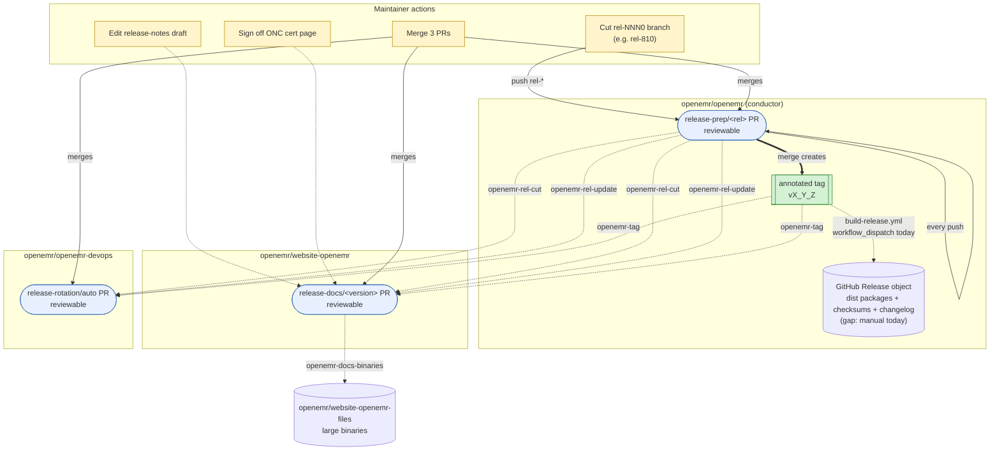

# OpenEMR Release Process

This document is the **complete release runbook** for tagged OpenEMR releases — every step from pre-release QA through post-release announcements, including the parts that are automated, the parts that aren't yet, and the parts that are irreducibly manual.

The automation core spans four repositories and is driven by `repository_dispatch` events (most emitted by this repo as the conductor; one — `openemr-docs-binaries` — emitted by `website-openemr` to `website-openemr-files`). It opens three reviewable PRs that cover code/version bumps, install/upgrade/release-notes pages, and CI/Docker pin rotation. Two post-merge steps (demo-farm tag bump, social/forum/email announcement fan-out) remain manual today; see [Automation gaps](#automation-gaps).

For background on why the flow is shaped this way, see [openemr/openemr-devops#664](https://github.com/openemr/openemr-devops/issues/664). For the per-slice plan documents, see the [Slice plans](#slice-plans) section below. For the end-to-end ordered checklist a release manager actually walks through, jump to [Release runbook](#release-runbook).

## Repositories involved

| Repository | Role |
| --- | --- |
| [`openemr/openemr`](https://github.com/openemr/openemr) | **Conductor.** Owns the release-prep PR. Merging it is the "we're shipping" decision; the merge commit gets the annotated release tag. Emits `repository_dispatch` to `openemr-devops` and `website-openemr`. (`website-openemr-files` is updated downstream by `website-openemr`, not directly by this repo.) |
| [`openemr/website-openemr`](https://github.com/openemr/website-openemr) | **Docs consumer.** Subscribes to `rel-*` events. Generates per-version Hugo pages (install, upgrade, OpenAPI, release notes draft, acknowledgements). DRAFT until the tag event flips it to FINAL. |
| [`openemr/website-openemr-files`](https://github.com/openemr/website-openemr-files) | **Binaries target.** Hosts large generated artifacts (EHI/B10 schemaspy HTML trees) referenced by the docs PR. Updated by the same workflow that updates `website-openemr`. |
| [`openemr/openemr-devops`](https://github.com/openemr/openemr-devops) | **Infra consumer.** Subscribes to `rel-*` and tag events. Rotates the `current` / `next` / `dev` slot in CI matrices, package versions, and Docker pins. Owns the canonical source for the cross-repo dispatch contract and tag verifier. |

## Cross-repo flow



**Legend.** Yellow nodes are maintainer actions. Blue nodes are reviewable PRs that workflows open and force-update on every dispatch. The green node is the annotated tag the conductor creates on merge. Solid arrows are git/PR actions; dotted arrows are `repository_dispatch` events labeled with the event name.

## Cross-repo events

The conductor in `openemr/openemr` emits `repository_dispatch` on every push to `rel-*` and on tag creation, targeting `openemr/openemr-devops` and `openemr/website-openemr`. Separately, `openemr/website-openemr` emits `openemr-docs-binaries` to `openemr/website-openemr-files` once large generated artifacts are ready to publish. Consumers subscribe via the matching `repository_dispatch` workflow trigger.

| Event | Emitter → target | When | `data` payload |
| --- | --- | --- | --- |
| `openemr-rel-cut` | `openemr/openemr` → devops, website-openemr | First push to a new `rel-*` branch | `{ branch, version, prev_release }` |
| `openemr-rel-update` | `openemr/openemr` → devops, website-openemr | Subsequent push to an existing `rel-*` branch | `{ branch, version, prev_release }` |
| `openemr-tag` | `openemr/openemr` → devops, website-openemr | Annotated tag created on `rel-*` HEAD | `{ tag, branch, version }` |
| `openemr-docs-binaries` | `openemr/website-openemr` → website-openemr-files | Large artifacts ready to publish to the binaries repo | `{ version, branch, files }` (`files` is a non-empty array) |

Common envelope on every event: `{ event, repo, sha, actor, dispatched_at, data }`.

**Schema location.** The canonical JSON Schema lives in `openemr-devops` at [`tools/release/contracts/dispatch.schema.json`](https://github.com/openemr/openemr-devops/blob/master/tools/release/contracts/dispatch.schema.json) and is vendored into each consumer (drift-checked in CI). The vendored copy in this repo is at [`tools/release/contracts/dispatch.schema.json`](../tools/release/contracts/dispatch.schema.json).

**Tag verifier.** The shared `TagVerifier` lives at [`tools/release/src/TagVerifier.php`](../tools/release/src/TagVerifier.php), vendored from `openemr-devops`'s [`tools/release/src/TagVerifier.php`](https://github.com/openemr/openemr-devops/blob/master/tools/release/src/TagVerifier.php). It confirms the tag is annotated (not a lightweight ref) and that the tag message contains a `MAJOR.MINOR.PATCH` version, an ISO date (`YYYY-MM-DD`), and the 40-hex merge-commit SHA — the fields the openemr-devops#664 spec requires CI to enforce.

## What each PR contains

### Conductor PR — `release-prep/<rel-branch>` in `openemr/openemr`

Long-lived draft PR against the `rel-*` branch, force-updated by [`.github/workflows/release-prep.yml`](../.github/workflows/release-prep.yml) on every push to a production release branch (matching `rel-[0-9]*0`, with `docs/**`-only pushes ignored). Test branches like `rel-test` go through `workflow_dispatch` instead. The mechanical edits applied by `bin/console openemr:release-prep` are documented in [`docs/release-automation-plan.md`](release-automation-plan.md) (the conductor slice plan).

In short, the conductor rewrites: `version.php`, `library/globals.inc.php` (debug toggle), `docker/production/docker-compose.yml` (image pin), `src/RestControllers/OpenApi/OpenApiDefinitions.php`, `swagger/openemr-api.yaml` (regenerated from the CLI), every `docker-version` file, and (on master) a fresh `sql/X_Y_Z-to-X_Y_Z+1_upgrade.sql` skeleton.

### Docs PR — `release-docs/<version>` in `openemr/website-openemr`

Long-lived PR per release. Generated content: install/upgrade Hugo pages, OpenAPI YAML, release-notes draft (grouped by `feat:` / `bug:` / `refactor:` / `chore:` prefix), acknowledgements (from `git shortlog vPREV..HEAD`), Hugo aliases for legacy URLs. Pages render with a `DRAFT — based on rel-* @ <sha>` shortcode until the `openemr-tag` event flips them to FINAL.

Large binaries (EHI/B10 schemaspy output) are pushed by the same workflow to `openemr/website-openemr-files` under `files/openemr-<version>-ehi/`.

### Infra PR — `release-rotation/auto` in `openemr/openemr-devops`

Long-lived PR against `master`, force-updated on each dispatch. Rotates the three CI/version slots:

| Slot | Meaning |
| --- | --- |
| `current` | Most recent tagged release |
| `next` | Active `rel-*` branch (release candidate) |
| `dev` | Head of master (edge) |

Touches CI matrices, package version refs, raspberrypi / Docker pinned versions. Driven by `tools/release/versions.yml`.

## Release runbook

The complete ordered checklist for cutting a release. Each step is marked **[Automated]**, **[Manual]** (will be automated later — see [Automation gaps](#automation-gaps)), or **[Manual — judgment]** (irreducibly manual; requires human input).

### Phase 1 — Pre-release QA

1. **[Manual — judgment]** Confirm pre-release QA is complete. The QA process (test plan, regression coverage, sign-off) lives on the [QA and Release Process wiki page](https://www.open-emr.org/wiki/index.php/QA_and_Release_Process). QA runs in parallel with the release-prep PR being continuously regenerated; the sign-off is what authorizes the conductor PR merge in step 9 — not the branch cut or any prep-PR update. The maintainers authorized to merge the conductor PR are the QA team, so the merge button is itself the QA gate; no separate sign-off mechanism is required.

### Phase 2 — Branch cut and PR generation

2. **[Manual — judgment]** Cut the release branch: `rel-<MAJOR><MINOR>0` (e.g. `rel-810`) from `master`. This is the only step that creates new state from nothing.
3. **[Automated]** Conductor workflow (`release-prep.yml` in `openemr/openemr`) opens or updates the `release-prep/<rel-branch>` draft PR with all mechanical version bumps. Re-fires on every relevant push.
4. **[Automated]** Docs workflow (in `website-openemr`) opens or updates the `release-docs/<version>` draft PR with install/upgrade pages, OpenAPI YAML, release-notes draft, acknowledgements, Hugo aliases. Pages render with a `DRAFT — based on rel-* @ <sha>` banner.
5. **[Automated]** Infra workflow (`release-rotation.yml` in `openemr-devops`) opens or updates the `release-rotation/auto` draft PR rotating CI/version slots.

### Phase 3 — Manual editorial work (in the open PRs)

6. **[Manual — judgment]** In the `website-openemr` PR, edit the auto-generated release-notes draft for tone and what's noteworthy. The draft regenerates on every push; edits should be made on the PR branch (the workflow preserves manual edits in the rendered page).
7. **[Manual — judgment]** In the `website-openemr` PR, sign off on the ONC Ambulatory EHR Certification Requirements page.
8. **[Manual — judgment]** *(Major releases only)* Write the marketing piece for the website.

### Phase 4 — Ship: merge the three PRs

The three PRs merge in strict order **infra → conductor → docs.** Infra readies CI for the new branch; the conductor merge creates the annotated tag (which flips the docs PR's banner from DRAFT to FINAL and triggers the infra rotation's `next` → `current` promotion); merging the docs PR ships the now-FINAL pages.

9. **[Automated]** Run the **ship-release workflow** in `openemr-devops` (`workflow_dispatch` on `.github/workflows/ship-release.yml`, or `task release:ship` locally for a dry-run). One operator action: pick the version + rel-branch and trigger. The workflow locates the three sibling PRs by branch convention, posts a `release/ship-approved` commit status on each, and merges in order with mergeability gates between steps. Already-merged PRs are detected and skipped (so the same trigger handles partial-merge recovery — see [Partial merges and recovery](#partial-merges-and-recovery)).

   **Manual fallback** (only if the workflow is unavailable): merge in order — infra PR, then conductor PR (creates the annotated tag), then docs PR (flips DRAFT → FINAL). Direct merges should be blocked by branch protection requiring the `release/ship-approved` status the workflow posts; admin-override the protection only if the workflow itself is broken.

### Phase 5 — Post-merge artifact and download verification

10. **[Manual today — gap]** Create the **GitHub Release object** on `openemr/openemr` for the new tag and attach the build artifacts. This is the canonical (and only) distribution target — SourceForge is no longer supported, and the website's `/downloads/` and `/releases/` pages link directly to assets on the Release object (see step 14). A tag alone is not enough: without a Release object the website's "Download" button 404s.

    The Release object must include:
    - **Distribution packages** (`openemr-<version>.tar.gz`, `openemr-<version>.zip`) — full, ready-to-run installs with production Composer dependencies and compiled front-end assets baked in and dev/test cruft pruned (per openemr/openemr's `.gitattributes export-ignore` and `build.xml`). These are *not* GitHub's auto-generated "Source code" archives; they are built and uploaded by the workflow below.
    - **Checksums** (`.md5`, `.sha256`, `.sha512`) for each distribution package.
    - **`changelog.md`** — the generated release notes.

    Today this is done by manually running [`build-release.yml`](https://github.com/openemr/openemr-devops/actions/workflows/build-release.yml) in `openemr-devops` (`workflow_dispatch` with `dry_run=false`, the conductor-created tag in `release_tag`). It builds the packages with `task release:package:assemble` (`git archive HEAD` → `composer install --no-dev` → `npm ci && npm run build` → prune via `build.xml` phing targets); then its "Create annotated tag and GitHub release" step is no-op-safe when the tag already exists and proceeds to `gh release create --verify-tag --notes-file changelog.md`, generates the checksum sidecars, and uploads the packages + checksums + changelog with `gh release upload --clobber`. **The conductor's `openemr-tag` dispatch does not currently invoke this workflow** — that is the [automation gap](#automation-gaps) and is why a freshly-merged conductor PR produces a tag with no Release object.
11. **[Manual — judgment]** Verify the Release object on the [GitHub releases page](https://github.com/openemr/openemr/releases): distribution packages downloadable, all three checksum files present, changelog rendered.
12. **[Automated]** Docker images for the new release build via the workflows in `openemr-devops` (triggered by the rotation PR's merge and the new tag).
13. **[Automated]** The DockerHub readme (per-version description on [hub.docker.com/r/openemr/openemr](https://hub.docker.com/r/openemr/openemr)) is updated by the workflow that consumes the `openemr-tag` event in `openemr-devops`.
14. **[Automated]** The Downloads landing page and the historical release table on `website-openemr` (`/downloads/` and `/releases/`) re-render from `data/releases.json`, which the docs PR workflow updates on every dispatch. The `/downloads/` page's "Download" buttons link to the Release-object assets from step 10 — if step 10 is skipped, those buttons 404. The legacy [OpenEMR Downloads wiki page](https://www.open-emr.org/wiki/index.php/OpenEMR_Downloads) is no longer the source of truth and should be edited by hand to a one-line pointer to https://www.open-emr.org/downloads/.

Standalone patch releases (`v<MAJOR>_<MINOR>_<PATCH>_<N>` tags with a `<M>-<m>-<p>-Patch-<N>.zip` asset) are not part of the automated cadence: the [OpenEMR Patches wiki page](https://www.open-emr.org/wiki/index.php/OpenEMR_Patches) and its download list go away once automated tagged releases ship security and bug fixes on a regular interval. The wiki page should be edited by hand to point readers at the most recent regular release on the [Downloads](https://www.open-emr.org/downloads/) page.

### Phase 6 — Demo and promotion

15. **[Automated]** Point the demo farm (live demo servers at open-emr.org) to the new tag. The `bump-tag.yml` workflow in [`openemr/demo_farm_openemr`](https://github.com/openemr/demo_farm_openemr/blob/master/.github/workflows/bump-tag.yml) consumes the `openemr-tag` event, rewrites matching production-demo rows in `ip_map_branch.txt`, and pushes to master; the demo-farm host's nightly reset picks up the new tag automatically.
16. **[Manual]** Announce the release:
    - Forums
    - Chat
    - Twitter / X
    - Facebook
    - LinkedIn (group + company page)
    - Registered-users mailing list

    Per-channel drafts are auto-generated by [`release-announcements.yml`](https://github.com/openemr/openemr-devops/blob/master/.github/workflows/release-announcements.yml) in `openemr-devops` (consumes `openemr-tag`). The maintainer copy/pastes the rendered drafts onto the short-copy channels and runs [`oe-sender.js`](https://github.com/openemr/openemr-registration/blob/master/oe-sender.js) against the rendered `mail.html` + `mail.subject.txt` for the mailing list. Posting is still manual; the drafting half is automated.

## Automation gaps

The runbook above marks each currently-manual post-automation step **[Manual]**. None of them are irreducibly manual; they're tracked for follow-on automation:

| Step | What | Tracking |
| --- | --- | --- |
| 10 | Automated GitHub Release object creation + checksum/changelog upload on `openemr-tag`. Today `openemr-devops`'s [`build-release.yml`](https://github.com/openemr/openemr-devops/blob/master/.github/workflows/build-release.yml) does this work but is `workflow_dispatch` only; the conductor's `openemr-tag` dispatch needs to either invoke it (or a tag-event-driven equivalent), or the conductor's finalize job needs to absorb the release-creation steps. The v8.1.0 release surfaced this gap — tag landed, no Release object did. | (not yet filed) |
| 16 | Automated post-release announcement fan-out (forums, chat, social, mailing list) | [openemr/openemr-devops#711](https://github.com/openemr/openemr-devops/issues/711) |

Umbrella issue tracking the full gap closure: [openemr/openemr-devops#706](https://github.com/openemr/openemr-devops/issues/706).

## Partial merges and recovery

The three PRs are coupled only by `repository_dispatch`. Branch protection should block direct merges and require the [ship-release workflow](https://github.com/openemr/openemr-devops/blob/master/.github/workflows/ship-release.yml) as the only merge path (via the `release/ship-approved` commit status the workflow posts), but admin-overrides and misconfigurations happen — this section documents the recovery path when they do.

### Partial-merge states

| Merged | Effect |
| --- | --- |
| Conductor only | Annotated tag exists, but no Release object (step 10 is still manual today — see [Automation gaps](#automation-gaps)). CI matrices and Docker pins still target the prior `current`; website still advertises the prior version. GitHub's auto-generated source archives exist once the tag does, but the full distribution packages (and the website's "Download" buttons that point at them) don't until step 10 runs. |
| Infra only | CI matrices roll forward to a `current` slot whose tag does not exist; builds for `current` fail until the conductor merges. Recoverable but noisy. |
| Docs only | Cannot reach FINAL — the DRAFT/FINAL banner is driven by the `openemr-tag` event, which the conductor never emitted. Merging publishes pages permanently stamped DRAFT for a version that was never tagged. **Worst case.** See "Docs-first recovery" below. |
| Conductor + infra (no docs) | Tag exists, CI green, but website still serves prior-version install/upgrade pages and no release notes. |
| Conductor + docs (no infra) | Tag exists, docs FINAL, but CI matrices still build the prior `current`/`next` slots — release-CI signal lags until the rotation PR merges. |
| Infra + docs (no conductor) | Both PRs reference a version whose tag does not exist. Docs stay DRAFT; CI builds for `current` fail. |

### Recovery

For every case **except docs-first**: re-trigger the ship-release workflow. It detects already-merged PRs, skips them, and merges the rest in dependency order with the same preconditions check (mergeable + green + required approvals). The website may serve stale content and CI may be red against `current` until the workflow completes, but no manual intervention is needed.

### Docs-first recovery (manual, today)

This is the worst case and recovery is currently manual. The ship-release workflow detects docs-first up front and **refuses to do anything** — it will not even merge the remaining PRs, because doing so would create a tag for a version whose docs have already shipped FINAL with no tag link. A future docs-side reconciliation workflow could automate the recovery; see the trailing note.

The docs PR has already shipped FINAL pages for a version that has no tag yet. After the operator manually merges the conductor (creating the tag) and infra, the existing FINAL-flip mechanism doesn't help — it fires on docs-PR updates, but the docs PR is already merged and closed. The published pages are orphaned: they reference a version that now exists, but with stale DRAFT-era SHAs and no tag link.

Manual steps:

1. Manually merge the conductor and infra PRs (the ship-release workflow refuses to act once docs-first is detected; admin-override the branch protection or merge directly via the GitHub UI). This creates the tag and rotates CI.
2. In `openemr/website-openemr`, open a follow-up PR that re-renders the affected install/upgrade/release-notes pages against the now-real tag. Easiest path is to manually re-run the docs-PR generator script with the new tag SHA, commit the regenerated output, and merge.
3. Verify the live website pages now show the FINAL banner with the correct tag link, not DRAFT.
4. If anyone scraped or linked the DRAFT-stamped pages between merge and reconciliation, the URLs are stable — they now serve correct FINAL content.

Folding this reconciliation into a workflow is a future follow-on; not yet filed. Scope it once docs-first has happened in practice (or the user-facing impact justifies preemptive automation).

## Naming and tag conventions

| Thing | Pattern | Example |
| --- | --- | --- |
| Release branch | `rel-<MAJOR><MINOR>0` | `rel-810` |
| Release tag | `v<MAJOR>_<MINOR>_<PATCH>` | `v8_1_0` |
| Hugo version param | `<MAJOR>.<MINOR>.<PATCH>` | `8.1.0` |
| Conductor PR branch | `release-prep/<rel-branch>` | `release-prep/rel-810` |
| Devops rotation PR branch | `release-rotation/auto` | — |
| Docs PR branch | `release-docs/<version>` | `release-docs/8.1.0` |

**Tags are always annotated** (Git object type `tag`, not `commit`). Lightweight tags lack author/date/message metadata and break `git describe`, downstream tooling, and consumers that introspect tag objects. The `TagVerifier` enforces this in CI on all three repos.

The tag message follows this template:

```
OpenEMR <version> released <YYYY-MM-DD>

Conductor PR: <url>
Merge commit: <sha>

Created by openemr-release-bot via automation
```

Tags are unsigned; the trailer line records that automation produced them. Revisit if maintainers later want signed tags.

## Bot identity and credentials

A GitHub App (the "release app") performs all automated git/PR actions. Its credentials live as repo secrets `RELEASE_APP_ID` and `RELEASE_APP_PRIVATE_KEY` on each of the four repos, and the App is installed on each.

Each repo carries a `release-permissions-check.yml` workflow (manual `workflow_dispatch`) that mints an App token and probes every permission the workflow needs — branch create/delete, PR open/close, tag create/delete, cross-repo `repository_dispatch`. Run it after installing the App or rotating the secrets; it fails loudly with the missing permission name.

This repo's check is at [`.github/workflows/release-permissions-check.yml`](../.github/workflows/release-permissions-check.yml).

## Slice plans

Each repo's slice has its own plan document with the per-slice mechanical detail (mutators, registry shape, consumer wiring, hypotheses, testing strategy):

- **Conductor:** [`docs/release-automation-plan.md`](release-automation-plan.md) in this repo.
- **Infra:** [`docs/release-automation-plan.md`](https://github.com/openemr/openemr-devops/blob/master/docs/release-automation-plan.md) in `openemr-devops`.
- **Docs:** the website-openemr slice was implemented in [openemr/website-openemr#82](https://github.com/openemr/website-openemr/pull/82); see the PR description for its design.

## Checklist templates

The conductor PR description embeds a maintainer-facing checklist of irreducibly-manual steps. The full and patch-release templates live in `openemr-devops`:

- [`tools/release/templates/full-checklist.md`](https://github.com/openemr/openemr-devops/blob/master/tools/release/templates/full-checklist.md)
- [`tools/release/templates/patch-checklist.md`](https://github.com/openemr/openemr-devops/blob/master/tools/release/templates/patch-checklist.md)

These templates are scoped to the devops slice; the conductor PR template (in this repo) collects the cross-repo checklist the release manager actually walks through.

## Wiki

The wiki pages [QA and Release Process](https://www.open-emr.org/wiki/index.php/QA_and_Release_Process) and [Steps for an official release](https://www.open-emr.org/wiki/index.php/Steps_for_an_official_release) historically described the manual flow that this automation replaces. Once the automated flow has cut its first release, those pages should be rewritten as short pointers to this document plus the manual checklist — keeping the URLs contributors already know without leaving stale step-by-step instructions in two places.
