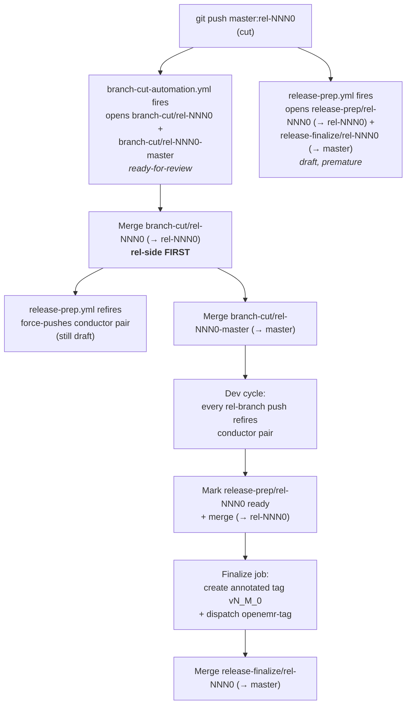
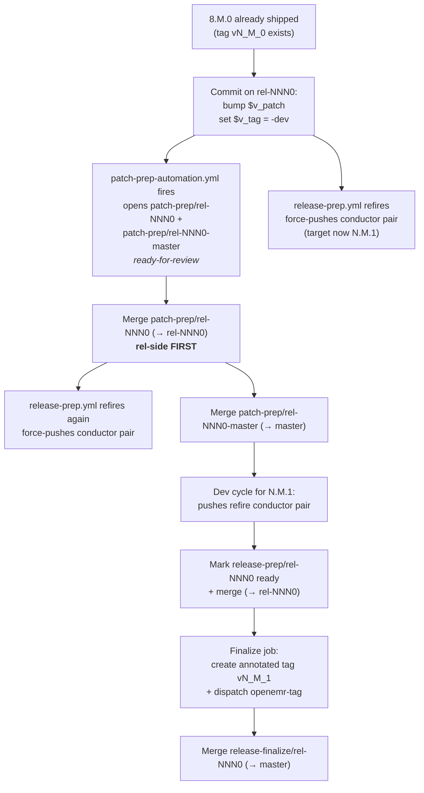

# Release automation — `openemr/openemr` slice (the conductor + siblings)

Tracks: openemr/openemr-devops#664 (refines #662, overlaps with #638).

This repo owns the four coordinated **release-automation workflows** that
drive the OpenEMR release lifecycle from cut through ship: **branch-cut**,
**patch-prep**, **release-prep** (the conductor), and **release-finalize**
(paired with release-prep). Merging a release-prep PR is still the "we're
shipping" decision — the merge commit gets the annotated release tag, which
drives the downstream PR in `website-openemr` plus the `openemr-tag`
cascade into `openemr-devops` (Release object + announcement drafts). The
three other workflows own the mechanical bootstrap around that decision so
that no lifecycle event on a `rel-*` branch requires a maintainer to hand-edit
the same version stamps, docker scaffolding, or `release-targets.yml` rows
twice.

All four workflows share one mutator framework (see
[Mutator framework](#mutator-framework)) so a lifecycle transition is
defined by *the list of mutators it runs against which side of the cut*
rather than by bespoke automation code.

## Role in the flow

```text
                                       openemr/openemr                             consumers
                                       ─────────────────────                       ────────────────────
create rel-NNN0                 branch-cut/<rel-branch>            ───┐
   │                            branch-cut/<rel-branch>-master     ───┤
   ├──► branch-cut-automation.yml                                     │
   │                                                                  │
push $v_patch bump on rel-*     patch-prep/<rel-branch>            ───┤
   │                            patch-prep/<rel-branch>-master     ───┤
   ├──► patch-prep-automation.yml                                     │
   │                                                                  │
push to rel-*                   release-prep/<rel-branch>          ───┤
   │                            release-finalize/<rel-branch>      ───┤
   ├──► release-prep.yml                                               ├─► openemr-rel-cut / openemr-rel-update
   │                                                                  │
   ▼                                                                  │
merge release-prep/<rel-branch>                                       │
   │                                                                  │
   ├──► release-prep.yml (finalize job)                                │
   │       │                                                          │
   │       ▼                                                          │
   │    annotated tag v{M}_{m}_{p}                                    │
   │                                                                  ├─► openemr-tag  →  openemr-devops
   │                                                                                        (build-release.yml)
   │                                                                                    →  website-openemr
   │                                                                                        (release-docs PR)
   │
merge release-finalize/<rel-branch> on master   (pins rel branch row, shuffles docker slots)
```

Each of the four workflows opens a **coordinated pair** of PRs — one on
the rel branch, one on master — so the "we're doing X for release Y"
change lives as a single reviewable unit spanning both places release
state is kept.

## Pattern

Borrowed from release-please: long-lived PRs per lifecycle event, one
per rel branch, auto-updated on every trigger of the same event. The
release-prep PR is force-pushed (history is generated, not authored);
the branch-cut / patch-prep / release-finalize PRs are opened
ready-for-review because they land fast, once, and shouldn't sit as
drafts.

All commits are authored as `openemr-release-bot`. All four workflows
mint an installation token from `RELEASE_APP_CLIENT_ID` (org var) +
`RELEASE_APP_PRIVATE_KEY` (org secret) scoped narrowly to the target
repos.

---

## Branch-cut automation

Workflow: [`.github/workflows/branch-cut-automation.yml`](../.github/workflows/branch-cut-automation.yml)
· Command: `bin/console openemr:branch-cut` ([`BranchCutCommand`](../src/Common/Command/BranchCutCommand.php))
· Landed: #12696 (workstream 2, 2026-07-01).

**Trigger.** GitHub `create` event on a `rel-NNN0` branch (the shape
`rel-<one digit major><one-or-more digit minor>0`). No path filter — the
whole point is to react to the branch coming into existence. Manual
`workflow_dispatch` accepts `rel-branch` + optional `prev-rel-branch`
override (needed for first-minor cuts where `prev = rel-{major}00` can't
be auto-derived by decrementing minor below 1).

**Rel-side PR** (`branch-cut/<rel-branch>`, base `<rel-branch>`,
ready-for-review):

- `DockerUpgradeScaffoldMutator` — new `fsupgrade-N.sh` skeleton +
  Dockerfile manifest updates (both `COPY` and `chmod` blocks). Same
  scaffolding the docker-upgrade-actions memo enumerates as mandatory
  per release.
- `DockerfileOpenemrVersionMutator` — pins the `OPENEMR_VERSION` ARG
  in the branch's Dockerfile to the new rel line.
- `TranslationFileCopyFromPriorRelMutator` — fetches the translation
  blob from the prior rel branch (`prevRelBranch`) so the freshly-cut
  branch inherits the last shipped translation state.
- `GlobalsIncMutator` — flip `allow_debug_language` default to `0` (rel
  branches don't ship with dev-only globals on).

**Master-side PR** (`branch-cut/<rel-branch>-master`, base `master`,
ready-for-review):

- `DockerUpgradeScaffoldMutator` — the same scaffold applied on master
  so it stays in sync across branches.
- `SqlUpgradeSkeletonMutator` — creates the `sql/X_Y_0-to-X_(Y+1)_0_upgrade.sql`
  skeleton for the next-minor dev cycle. **Must run before**
  `VersionPhpMasterMutator` — it reads the current `version.php` to
  derive the "from" version in the filename; if version.php has already
  been bumped, the skeleton no-ops. `BranchCutCommand` enforces order.
- `VersionPhpMasterMutator` — advances master's `version.php` from
  `X.Y.0-dev` to `X.(Y+1).0-dev`.
- `OpenApiVersionMutator` — bumps `#[OA\Info(version: ...)]` in
  `src/RestControllers/OpenApi/OpenApiDefinitions.php`.
- `SwaggerRegenMutator` — regenerates `swagger/openemr-api.yaml` by
  subprocessing `bin/console openemr:create-api-documentation --skip-globals`.
- `BranchCutReleaseTargetsMutator` — inserts a row for the new rel
  branch in `.github/release-targets.yml`, shuffles docker slot
  assignments (`latest`/`next`/`dev`), keeps the master row's
  `openemr_version_ref` on master.

Master-side mutators that advance to next-dev context (VersionPhpMaster,
OpenApiVersion, SwaggerRegen, SqlUpgradeSkeleton) receive a
`MutatorContext` synthesised with `minor + 1`; the release-targets
mutator uses the original target context because it needs to write the
new rel branch's row.

## Patch-prep automation

Workflow: [`.github/workflows/patch-prep-automation.yml`](../.github/workflows/patch-prep-automation.yml)
· Command: `bin/console openemr:patch-prep` ([`PatchPrepCommand`](../src/Common/Command/PatchPrepCommand.php))
· Landed: #12697 (workstream 6, 2026-07-01).

**Trigger.** `push` to `rel-*` when `version.php` changes. The workflow's
resolver then gates on *exactly*:

- `$v_patch` incremented by exactly one (a larger jump would produce
  the wrong "from" version for the SQL bridge rename).
- Both before-state and after-state `$v_tag == '-dev'` (a non-dev →
  dev transition immediately after a ship push would signal something
  unusual — let a human look).
- Same `$v_major`/`$v_minor` — a change across minor boundaries is a
  different lifecycle event.
- Push isn't the branch's creation event (`before == all-zeros`) —
  branch-cut owns that.

Fails cleanly (with `should-run=false` steps skipped) on anything that
doesn't fit the shape, rather than crashing.

Manual `workflow_dispatch` accepts `rel-branch` + `target-version` +
`prev-version` and re-verifies the same invariants, plus verifies the
rel branch's HEAD version.php actually reads `<target>-dev` before running.

**Rel-side PR** (`patch-prep/<rel-branch>`, base `<rel-branch>`,
ready-for-review):

- `DockerUpgradeScaffoldMutator` — same as branch-cut, plus a new
  `fsupgrade-N.sh` for the new patch line.
- `SqlUpgradeSkeletonMutator` — creates
  `sql/X_Y_(P-1)-to-X_Y_P_upgrade.sql`. On this side version.php has
  *already* been bumped past the anchor value the skeleton filename
  needs, so the command passes `fromVersion=<prev-version>` explicitly
  via `MutatorContext::$fromVersion` rather than letting the mutator
  read from version.php.

**Master-side PR** (`patch-prep/<rel-branch>-master`, base `master`,
ready-for-review):

- `DockerUpgradeScaffoldMutator` — cross-branch sync.
- `SqlUpgradeSkeletonMutator` — mirror `sql/X_Y_(P-1)-to-X_Y_P_upgrade.sql`
  on master (uses the same `fromVersion` override).
- `MasterSqlPatchBridgeMutator` — renames the existing bridge file
  `sql/X_Y_(P-1)-to-X_(Y+1)_0_upgrade.sql` → `sql/X_Y_P-to-X_(Y+1)_0_upgrade.sql`
  so the bridge from the rel line to next-dev tracks the new patch.
- `PatchPrepReleaseTargetsMutator` — inserts an unreleased placeholder
  row in `.github/release-targets.yml` for the new patch.

The rel side and master side share the same `fromVersion` semantic
contract: `MutatorContext` validates that `fromVersion` is
`{target.major}.{target.minor}.{target.patch - 1}` — a mistyped manual
recovery can't scaffold files for the wrong patch.

## Release-prep conductor (the original, extended)

Workflow: [`.github/workflows/release-prep.yml`](../.github/workflows/release-prep.yml)
· Command: `bin/console openemr:release-prep` ([`ReleasePrepCommand`](../src/Common/Command/ReleasePrepCommand.php))
· Extended: #12662 (workstream 3 Phase A, 2026-07-01) — now emits a
partner PR on master alongside the rel-side PR (see
[release-finalize](#release-finalize-partner-pr)).

**Trigger.** `push` to `rel-<digits ending 0>` (production shape). Also
`pull_request: closed` on `rel-*` (drives the tag-and-dispatch finalize
job on merge), and `workflow_dispatch` with `target-version` + `branch` +
optional `test` (opens `release-prep-test/<branch>` for end-to-end test
runs) and `force-dispatch`. No `paths-ignore` — every push, including
doc-only pushes, fires the conductor. Force-pushes with no diff are no-ops
via peter-evans's `pull-request-operation=none` signal, and the downstream
consumer dispatch is gated on that same signal, so idle refires produce
no external churn.

The `push` filter matches the branch-creation push too, so this
workflow fires *at cut time* alongside `branch-cut-automation.yml` —
opening a premature draft `release-prep/<rel-branch>` (paired with a
`release-finalize/<rel-branch>` targeting master) before the branch is
anywhere near ready to ship. Accepted as a tradeoff: the PRs sit inert as drafts,
re-render on each push through the dev cycle, and become real when the
branch is actually ready. See [Lifecycle: rel-NNN0 cut event](#lifecycle-rel-nnn0-cut-event)
for the full picture.

**Rel-side prep PR** (`release-prep/<rel-branch>`, base `<rel-branch>`,
draft, force-pushed on each run):

- `VersionPhpMutator` — strip `-dev` suffix from `$v_tag`.
- `GlobalsIncMutator` — reused from branch-cut (idempotent, so re-running
  is safe if the branch-cut PR wasn't merged before dev started).
- `DockerComposeProductionMutator` — pin `openemr/openemr:latest@sha256:…`
  to `openemr/openemr:<version>@sha256:…`. Image digest is supplied via
  `--image-digest` from the workflow after the release image is published;
  if absent, the existing digest is preserved and only the tag is swapped.
- `OpenApiVersionMutator` — bump `#[OA\Info(title: 'OpenEMR API', version: 'X.Y.Z')]`.
  (The wiki + earlier drafts of this plan said `_rest_routes.inc.php` but
  the version constant actually lives in `src/RestControllers/OpenApi/OpenApiDefinitions.php`.)
- `SwaggerRegenMutator` — regenerate `swagger/openemr-api.yaml`.

The `docker-version` files and `sql/*_upgrade.sql` skeleton the earlier
draft of this plan enumerated for the release-prep PR moved to
**branch-cut / patch-prep** (they're now scaffolded at the lifecycle
event that creates a new dev cycle, not at ship time). The
`fsupgrade-N.sh` scaffolding likewise moved to branch-cut / patch-prep.

**Finalize job.** Fires on the `pull_request: closed` event when the
PR head ref starts with `release-prep/` or `release-prep-test/` and
`merged == true`. Creates an annotated tag on the merge commit via
`tools/release/bin/create-tag.php` (never lightweight), verifies via
`tools/release/bin/verify-tag.php`, and dispatches `openemr-tag`.

## Release-finalize partner PR

Introduced: #12662 (workstream 3 Phase A, 2026-07-01).

The `release-prep` workflow now runs a second block of steps after the
rel-side PR is created:

1. Fresh checkout of master into `master-checkout/`.
2. `composer install` inside `master-checkout/` (the setup-php-composer
   composite installs into the workflow default dir only).
3. `bin/console openemr:release-prep --scope=master --target-version=... --rel-branch=...`.
4. `peter-evans/create-pull-request` on branch
   `release-finalize/<rel-branch>` (base `master`, draft).

The `--scope=master` list runs one mutator:

- `PostReleaseTargetsMutator` — three coordinated edits to
  `.github/release-targets.yml`, all idempotent: (1) pin the rel
  branch's `openemr_version_ref` to the new tag (e.g. `rel-810` → `v8_1_1`),
  (2) slot-shuffle `latest`/`next`/`dev` across rows — promote `next`
  to `latest` on the just-shipped rel branch, drop `latest` from the
  prior holder, move `next` to the next upcoming-stable owner, (3) drop
  the unreleased placeholder row for the same rel branch if present
  (the multi-row mechanism from openemr/openemr#12656). Implemented as
  surgical line-based edits so the human-authored comments in the file
  are preserved; Symfony YAML's parser is used at the end as a
  structural-validity sanity check.

Test-mode conductor runs (`release-prep-test/<branch>`) intentionally
skip this partner PR — the finalize edits only make sense for a real
ship, and a master-side draft on every test exercise would be noise.

The release-finalize PR sits alongside the release-prep PR until ship
day and lands **after** the tag is created. It's not gated on the tag
creation (a maintainer can review and land it before merging release-prep);
the semantic invariant is only that the tag it references exists by
the time master's `release-targets.yml` is consulted downstream.

## Lifecycle: rel-NNN0 cut event

The most complex per-workflow interaction happens when a new `rel-NNN0`
branch is cut. A single `git push origin master:rel-NNN0` fires two
workflows simultaneously — `branch-cut-automation.yml` on the `create`
event, and `release-prep.yml` on the `push` event (the create is also
a push of master's tip to the new ref). Between them they open **four
PRs** in the first minute or two:

| PR (head → base) | Opened by | State | Lifetime |
| --- | --- | --- | --- |
| `branch-cut/<rel-branch>` → `<rel-branch>` | branch-cut | ready-for-review | until merged (or re-opened via `workflow_dispatch` recovery) |
| `branch-cut/<rel-branch>-master` → `master` | branch-cut | ready-for-review | until merged |
| `release-prep/<rel-branch>` → `<rel-branch>` | release-prep conductor | draft, force-pushed on every rel-branch push | until ship day |
| `release-finalize/<rel-branch>` → `master` | release-prep conductor (Phase A partner) | draft, force-pushed on every rel-branch push | until ship day |

**Lockstep on the conductor pair.** The last two are produced by a
single `release-prep.yml` run, using two checkouts and one Symfony
console invocation per side. Every subsequent push to `<rel-branch>` —
whether it's the branch-cut PR merging, a dev commit, or a
release-cycle-bot preparation PR — re-fires the conductor and
force-pushes both sides. Reviewers should treat them as one review
target that happens to span two PRs; the diff on one implies specific
content on the other.

**File overlap between the two pairs.** The branch-cut and conductor
PRs against the same base branch touch some of the same files:

- Rel-side both PRs touch `library/globals.inc.php` (branch-cut flips
  `allow_debug_language` → `'0'`; release-prep's `GlobalsIncMutator` is
  reused and idempotent, so a re-render sees the flag already flipped
  and no-ops).
- Rel-side both touch the `docker-version` triple (branch-cut bumps by
  one for the new minor's dev cycle; release-prep leaves them alone at
  ship time).
- Master-side both touch `.github/release-targets.yml`, but different
  operations: branch-cut inserts the new rel row + bumps master's
  docker_tags; release-finalize does the eventual `latest`/`next` slot
  shuffle when the branch actually ships.

No merge conflicts at open time — force-pushed regeneration keeps the
conductor pair current against the rel branch's tip. Recommended merge
order:

1. **`branch-cut/<rel-branch>` (rel-side) first.** This is the critical
   ordering: the master-side PR inserts a row in `.github/release-targets.yml`
   (with `openemr_version_ref: <rel-branch>`), and the docker release
   orchestrator now fires on pushes to that file
   (openemr/openemr#12720). So merging master-side kicks off an image
   build against the rel branch's tip. If master-side lands *before*
   rel-side, that build bakes an image labeled `<version>,next` from a
   rel branch that's still bit-identical to master. No fatal error —
   the Dockerfile is byte-identical across branches — but the image
   won't carry the rel-branch identity mutations (Dockerfile `ARG
   OPENEMR_VERSION` pin, docker-version bump, translation blob copy,
   `allow_debug_language` flip) until rel-side lands and the next
   orchestrator run picks it up.
2. **`branch-cut/<rel-branch>-master` (master-side) second.**
3. **Conductor pair (release-prep + release-finalize) stays draft** until
   the branch is actually ready to ship (dev cycle complete, all
   pre-ship checklists satisfied). The pair re-renders on every push
   through the dev cycle, so it stays fresh.

**Known gap: master-side release-finalize doesn't auto-refresh on
master pushes.** The conductor fires on `push` to `<rel-branch>`, not
on `push` to master. So the sequence "merge `branch-cut/<rel-branch>-master`
→ master advances → `release-finalize/<rel-branch>` (which targets
master) still points at the pre-branch-cut master" persists until the
next push to `<rel-branch>` refreshes it. Not a practical problem — release-finalize is draft, no
one merges it until ship day, and dev commits to the rel branch fire
throughout the cycle — but worth knowing when inspecting the diff
between the two events.

**Skip-line cut (`unreleased: true` on outgoing rel branch's rows).**
When a rel line is being skipped entirely (e.g., the 8.1.x skip that
preceded rel-820 — see openemr/openemr#12712), the pre-cut posture
flags the outgoing branch's rows as `unreleased: true` and moves the
`next` docker tag to master interim. At the create event, the
branch-cut `BranchCutReleaseTargetsMutator` drops all unreleased rows
uniformly (leaving no rows for the skipped rel), and inserts the new
rel row picking up `next`. Meanwhile the conductor still fires its
premature draft against the new rel — same story as any cut, just with
zero surviving rows for the outgoing rel branch.

### Flow: cut → 8.M.0 release



### Flow: cut → patch bump → 8.M.P release

Same start as above (cut → 8.M.0 ships). Later, a `$v_patch` bump on
the rel branch fires patch-prep alongside the conductor:



Subsequent patch bumps (`N.M.1 → N.M.2 → …`) follow the same shape;
the diagram scales by inspection.

## Mutator framework

All four workflows drive their console commands
(`openemr:release-prep`, `openemr:branch-cut`, `openemr:patch-prep`)
against a shared framework at [`src/Common/Command/ReleasePrep/`](../src/Common/Command/ReleasePrep/):

- **`MutatorInterface`** — `name(): string` + `apply(MutatorContext): MutatorResult`.
- **`MutatorContext`** — `readonly` value object carrying `projectDir`,
  parsed `major`/`minor`/`patch`, and the optional context fields the
  various mutators need: `imageDigest` (release-prep only, when
  `--image-digest` is passed), `relBranch` (release-finalize, branch-cut,
  patch-prep), `prevRelBranch` (branch-cut rel-side translation copy),
  `fromVersion` (patch-prep SQL skeleton override — validated to be
  same major/minor as target with patch == target - 1). Constructor
  validates every optional field's format at construction time so
  malformed CLI inputs surface as `InvalidArgumentException` rather
  than downstream mutator errors.
- **`MutatorResult`** — `changedFiles: list<string>` + `messages: list<string>`;
  `changed(): bool` derived from `changedFiles`.
- **`AstSourceEditor`** — shared helper for surgical PHP-source edits
  (used by version.php + openapi mutators).

Each command builds its default mutator list internally on demand and
accepts optional constructor injection for tests. Every mutator is
idempotent: the workflow re-runs on every event, and non-idempotent
mutators would produce churn PRs.

| Mutator | Used by | Purpose |
|---------|---------|---------|
| `VersionPhpMutator` | release-prep (rel) | Strip `-dev` from `$v_tag`. |
| `VersionPhpMasterMutator` | branch-cut (master) | Advance to next-minor `-dev`. |
| `GlobalsIncMutator` | branch-cut (rel), release-prep (rel) | `allow_debug_language = 0`. |
| `DockerComposeProductionMutator` | release-prep (rel) | Pin `openemr/openemr` tag + digest. |
| `DockerfileOpenemrVersionMutator` | branch-cut (rel) | Pin Dockerfile `OPENEMR_VERSION` ARG. |
| `DockerUpgradeScaffoldMutator` | branch-cut (rel + master), patch-prep (rel + master) | New `fsupgrade-N.sh` + Dockerfile manifest wiring. |
| `TranslationFileCopyFromPriorRelMutator` | branch-cut (rel) | Fetch translation blob from prior rel branch. |
| `OpenApiVersionMutator` | branch-cut (master), release-prep (rel) | Bump `#[OA\Info(version: ...)]`. |
| `SwaggerRegenMutator` | branch-cut (master), release-prep (rel) | Regenerate `swagger/openemr-api.yaml`. |
| `SqlUpgradeSkeletonMutator` | branch-cut (master), patch-prep (rel + master) | Scaffold `sql/X_Y_Z-to-X_Y_Z+N_upgrade.sql`. |
| `MasterSqlPatchBridgeMutator` | patch-prep (master) | Rename bridge file to track new patch. |
| `BranchCutReleaseTargetsMutator` | branch-cut (master) | Insert row for new rel branch. |
| `PatchPrepReleaseTargetsMutator` | patch-prep (master) | Insert unreleased placeholder row for new patch. |
| `PostReleaseTargetsMutator` | release-prep (master, release-finalize) | Pin rel row + slot shuffle + drop placeholder. |

Adding a new lifecycle event (or a new mutation to an existing one) is
a matter of writing one class implementing `MutatorInterface`, adding
it to the appropriate command's default list, and covering it with an
isolated test at `tests/Tests/Isolated/Common/Command/ReleasePrep/Mutator/`.

## Tag handling

On merge of the release-prep PR, the workflow creates an **annotated**
tag on the merge commit via the GitHub API (`create-tag.php`) — never
a lightweight ref. Lightweight tags lack author/date/message metadata
and break `git describe`, downstream tooling, and consumers that
introspect tag objects. `verify-tag.php` (a step in the finalize job)
re-fetches and asserts the annotated-tag shape.

The conductor stops at the tag — it does **not** create the GitHub
Release object directly. That step (full distribution packages +
checksums + `changelog.md` attached to a Release on `openemr/openemr`)
is what the website's `/downloads/` page links to, and is driven
automatically by
[`build-release-on-tag.yml`](https://github.com/openemr/openemr-devops/blob/master/.github/workflows/build-release-on-tag.yml)
in `openemr-devops`, which consumes the conductor's `openemr-tag`
dispatch and calls the reusable
[`build-release.yml`](https://github.com/openemr/openemr-devops/blob/master/.github/workflows/build-release.yml)
with `dry_run=false` to build the packages, create the Release object,
and upload assets + checksums + changelog. This closed the gap that
broke v8.1.0 on 2026-05-28 (tag landed, no Release object did); shipped
via [openemr/openemr-devops#757](https://github.com/openemr/openemr-devops/pull/757),
closing [#756](https://github.com/openemr/openemr-devops/issues/756).
See also [`RELEASE_PROCESS.md` § Phase 5 step 10](RELEASE_PROCESS.md#phase-5--post-merge-artifact-and-download-verification)
and [§ Automation gaps](RELEASE_PROCESS.md#automation-gaps).

## Dispatch events emitted

The workflows emit `repository_dispatch` to consumer repos. The full
envelope (`event`, `repo`, `sha`, `actor`, `dispatched_at`, `data`) is
defined in [`tools/release/contracts/dispatch.schema.json`](../tools/release/contracts/dispatch.schema.json);
the table below lists only the per-event `data` payload.

| Event                     | Source workflow           | When                                                     | `data` payload                          |
| ------------------------- | ------------------------- | -------------------------------------------------------- | --------------------------------------- |
| `openemr-rel-cut`         | release-prep              | first push to a new `rel-*` (peter-evans reports `created`) | `{ branch, version, prev_release }` |
| `openemr-rel-update`      | release-prep              | subsequent push to `rel-*` (peter-evans reports `updated`, or `--force-dispatch`) | `{ branch, version, prev_release }` |
| `openemr-tag`             | release-prep (finalize)   | annotated tag created after release-prep merge          | `{ tag, branch, version }`              |
| `release-targets-changed` | (master push, out-of-conductor) | `.github/release-targets.yml` changes on master   | `{}` (envelope's `sha`/`actor`/`dispatched_at` fully identify the change) |
| `openemr-docs-binaries`   | website-openemr           | docs binaries dispatched to website-openemr-files       | `{ version, branch, files }`            |

Targets: `openemr/website-openemr`, `openemr/openemr-devops`.
`demo_farm_openemr` no longer receives `openemr-tag` — its `bump-tag.yml`
was retired in `demo_farm_openemr#141` in favor of an auto-derive bot
that subscribes to `release-targets-changed` instead.

Branch-cut and patch-prep intentionally do **not** dispatch to consumers.
The rel-cut dispatch fires on the first release-prep push against the
new rel branch (which happens naturally once the branch-cut PRs land);
patch-prep is followed by a normal dev cycle whose first push against
the newly-bumped rel branch fires rel-update.

## Components (all shipped)

Status ledger for the components originally scoped as "to build":

1. **`bin/console openemr:release-prep`** — landed in the initial
   conductor PR; extended for `--scope=master` in #12662.
2. **`.github/workflows/release-prep.yml`** — landed in the initial
   conductor PR; extended for the release-finalize partner PR in #12662.
3. **App credential** — provisioned via `RELEASE_APP_CLIENT_ID` (org var)
   + `RELEASE_APP_PRIVATE_KEY` (org secret). Token minted per workflow
   run, scoped to the exact repo list each workflow needs. See
   [Permissions self-check](#permissions-self-check).
4. **PR template / body rendering** — templates live at
   `.github/PULL_REQUEST_TEMPLATE/{branch-cut-rel,branch-cut-master,patch-prep-rel,patch-prep-master,release-prep,release-finalize}.md`
   and are substituted by `tools/release/bin/render-pr-body.php`. The
   maintainer checklist of irreducibly-manual steps stays canonical in
   [`RELEASE_PROCESS.md` § Release runbook](RELEASE_PROCESS.md#release-runbook)
   — the PR bodies link out rather than duplicating it.
5. **`bin/console openemr:branch-cut`** + **`branch-cut-automation.yml`** —
   landed in #12696 (workstream 2).
6. **`bin/console openemr:patch-prep`** + **`patch-prep-automation.yml`** —
   landed in #12697 (workstream 6).
7. **`PostReleaseTargetsMutator` + `MutatorInterface` / `MutatorContext` /
   `MutatorResult` framework** — landed in #12662; extended for the
   `fromVersion` optional field in #12697.

## Permissions self-check

[`.github/workflows/release-permissions-check.yml`](../.github/workflows/release-permissions-check.yml)
(manual `workflow_dispatch`). Mints an App token from the org variable
`RELEASE_APP_CLIENT_ID` plus the org secret `RELEASE_APP_PRIVATE_KEY`
and probes everything the conductor workflow performs:

- `GET /installation/repositories` — confirm this repo is in the install list.
- Create + delete a throwaway branch `release-permissions-check/<run-id>` —
  confirm `contents:write`.
- Open + close a draft PR from that branch — confirm `pull-requests:write`.
- Create + delete a throwaway annotated tag `release-permissions-check-<run-id>`
  — confirm tag-creation works (catches issues an unsigned-vs-signed flip
  would cause).
- Send a no-op `repository_dispatch` (event type `release-permissions-probe`)
  to **openemr/openemr-devops** and **openemr/website-openemr** — confirm
  cross-repo `actions:write` on both consumer repos.

Fails loudly with the missing permission name. Run after installing the App
on this repo and the consumer repos; re-run if secrets are rotated.

## Not in these workflows' scope

- **Docs publishing** — `website-openemr`'s `release-docs/<version>` PR,
  driven by consumption of `openemr-tag`.
- **Wiki content migration** — handled in `website-openemr`.
- **`InstallerAuto.php`** — verified to contain no version references
  in the current openemr/openemr code; nothing to bump.
- **`acknowledge_license_cert.html`** — currently a wiki-rendered
  contributors page. Acknowledgments move to the docs PR (`website-openemr`)
  where they are generated from `git shortlog vPREV..HEAD`. None of the
  four workflows here touch this file.
- **GitHub Release object + distribution packages** — driven by
  `openemr-devops`'s `build-release-on-tag.yml` (see
  [Tag handling](#tag-handling)).

The docker upgrade scaffolding (`fsupgrade-N.sh`, `Dockerfile` manifest
edits, `docker-version` files) is **no longer** out-of-scope — branch-cut
and patch-prep automate it (workstream 2 + 6). The test-matrix / package-pin
rotation used to live in an `openemr-devops` infra PR but was retired when
the docker-pipeline migration removed all of its live targets; there is
no longer a separate rotation slice.

## Testing

Each mutator + command has coverage under
[`tests/Tests/Isolated/Common/Command/`](../tests/Tests/Isolated/Common/Command/):

- `ReleasePrep/MutatorTest.php` + `MutatorContextTest.php` — framework
  contract + optional-field validation.
- `ReleasePrep/ReleasePrepCommandTest.php`, `BranchCutCommandTest.php`,
  `PatchPrepCommandTest.php` — command wiring, side/scope switching,
  option-parsing invariants.
- `ReleasePrep/Mutator/*Test.php` — one file per mutator (fixture-based
  where the mutator edits real project files); assert exact diff + assert
  **idempotence** (run twice → no diff on the second run).
- `ReleasePrep/fixtures/` — canonical inputs the mutator tests operate
  against.

All are isolated (no DB, no HTTP), run in the standard
`openemr-cmd phpunit-isolated` / `composer phpunit-isolated` path.

## Open questions

- **Acknowledgements list** — generate from `git shortlog vX..HEAD` in
  the conductor, or defer to the docs PR? Currently leaning: generate
  the raw list here, render in the docs PR. Not yet implemented in
  either place.

The previous open question about master-side release-prep runs was
answered by #12662: yes, master needs a paired PR — the
release-finalize partner PR pattern.

## Hypotheses (claims this slice rose or falls on)

1. **Release-prep is truly mechanical.** *Validated* — every pre-tag
   edit has proven derivable from `target version + repo state` on every
   push across 8.1.1 prep and now the extended lifecycle events.
2. **`bin/console openemr:create-api-documentation` runs in CI without
   a full database/install.** *Validated* — `SwaggerRegenMutator` runs
   with `--skip-globals` cleanly in the workflow runner.
3. **Annotated tags created by an app/bot identity are acceptable** to
   maintainers and downstream consumers. *Validated* through 8.1.0 /
   8.1.1 cycles; no signing objections.
4. **The `feat:` / `bug:` / `refactor:` / `chore:` prefix convention is
   applied consistently enough** to drive a release-notes draft. *Still
   soft* — the change-log generator hasn't been re-wired into the
   conductor PR body yet; spot-check before relying.
5. **Force-pushing the long-lived release-prep PR is acceptable to
   reviewers** even though it can drop inline comments. *Validated* —
   no reviewer complaints across the 8.1.0 and 8.1.1 cycles; the
   discipline of "review the current head, not the history" holds.
6. **`git shortlog` is an acceptable acknowledgements source** — no
   contributor opt-outs, no affiliation tracking needed. *Not yet
   validated* — pending the acknowledgements-list decision above.

Kept as historical record; validated notes added where the shipped
lifecycle events confirmed them.

## Assumptions

- An app (`RELEASE_APP_CLIENT_ID` / `RELEASE_APP_PRIVATE_KEY`) with
  `contents:write`, `pull-requests:write`, and cross-repo dispatch is
  provisioned. Validated by [`release-permissions-check.yml`](../.github/workflows/release-permissions-check.yml).
- `rel-<digits>` is the only release-branch naming pattern the
  workflows recognise. Modern `rel-NNN0` shape is what branch-cut
  auto-derives against; legacy `rel-NMP` shapes must be handled manually.
- The release manager's manual surface is the irreducibly-manual steps
  in [`RELEASE_PROCESS.md` § Release runbook](RELEASE_PROCESS.md#release-runbook).
- Consumers vendor `dispatch.schema.json` and drift-check against the
  canonical copy in this repo. Enforced by
  [`tools/release/bin/check-vendored.php`](../tools/release/bin/check-vendored.php)
  (`openemr/openemr#12619`).

## Status

**Live.** All four workflows shipped 2026-07-01 (#12662, #12696, #12697)
on top of the conductor that shipped earlier this cycle. The 8.1.1 ship
in 2026-06 was the first real production exercise of release-prep +
release-finalize; the next rel-820 cut will be the first production
exercise of branch-cut; the next patch dev-cycle entry (e.g. 8.1.2-dev
on rel-810) will be the first production exercise of patch-prep.

Companion docs — start here for the wider context:

- [`docs/release-mechanism-migration-from-devops.md`](release-mechanism-migration-from-devops.md)
  — architectural rationale + phased migration plan out of `openemr-devops`.
- [`docs/release-mechanism-gaps.md`](release-mechanism-gaps.md) —
  living gap tracker (G4, G5, G11 above map to workstreams 2 and 3A).
- [`docs/docker-migration-from-devops.md`](docker-migration-from-devops.md)
  — the load-bearing prerequisite migration that made this one tractable.
- [`docs/RELEASE_PROCESS.md`](RELEASE_PROCESS.md) — the maintainer runbook.
