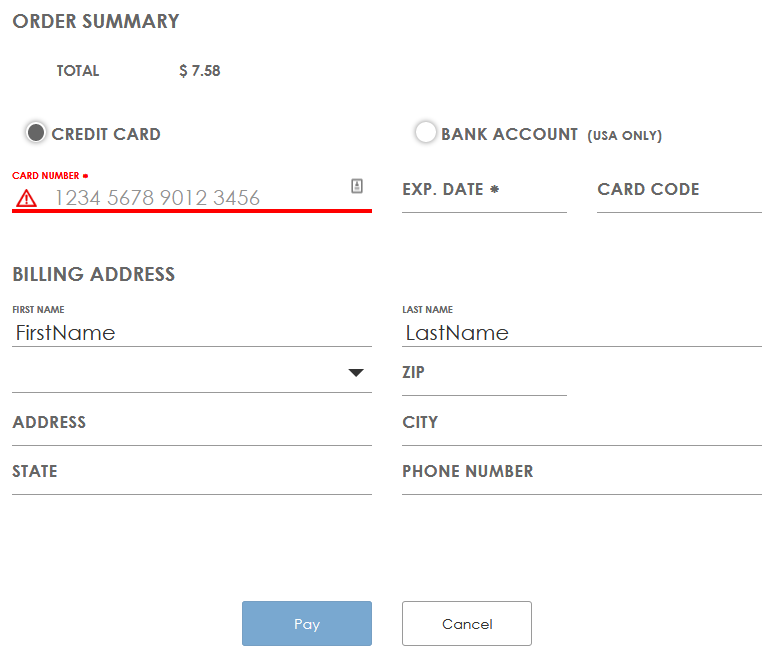

[](https://travis-ci.org/academe/omnipay-authorizenetapi)
[](https://packagist.org/packages/academe/omnipay-authorizenetapi)
[](https://packagist.org/packages/academe/omnipay-authorizenetapi)
[](https://packagist.org/packages/academe/omnipay-authorizenetapi)
[](https://packagist.org/packages/academe/omnipay-authorizenetapi)

Table of Contents
=================

   * [Table of Contents](#table-of-contents)
   * [Omnipay-AuthorizeNetApi](#omnipay-authorizenetapi)
   * [Installation](#installation)
   * [Authorize.Net API](#authorizenet-api)
      * [API Authorize/Purchase (Credit Card)](#api-authorizepurchase-credit-card)
      * [API Capture](#api-capture)
      * [API Authorize/Purchase (Opaque Data)](#api-authorizepurchase-opaque-data)
      * [API Void](#api-void)
      * [API Refund](#api-refund)
      * [API Fetch Transaction](#api-fetch-transaction)
   * [Hosted Payment Page](#hosted-payment-page)
      * [Hosted Payment Page Authorize/Purchase](#hosted-payment-page-authorizepurchase)
   * [Webhook Notifications](#webhook-notifications)

# Omnipay-AuthorizeNetApi

Omnipay 3.x implementation of Authorize.Net API

# Installation

    composer require "academe/omnipay-authorizenetapi: ~3.0"

# Authorize.Net API

The *Authorize.Net API* driver handles server-to-server requests.
It is used both for direct card payment (though check PCI requirements)
and for creating transactions using a card token.

## API Authorize/Purchase (Credit Card)

The following example is a simple authorize with supplied card details.
You would normally avoid allowing card details near your merchant site
back end for PCI compliance reasons,
supplying a tokenised card reference instead (see later section for this).

```php
<?php

include 'vendor/autoload.php';

$gateway = Omnipay\Omnipay::create('AuthorizeNetApi_Api');

$gateway->setAuthName('XXXXXxxxxxx');
$gateway->setTransactionKey('XXXXX99999xxxxx');
$gateway->setTestMode(true);

$creditCard = new Omnipay\Common\CreditCard([
    // Swiped tracks can be provided instead, if the card is present.
    'number' => '4000123412341234',
    'expiryMonth' => '12',
    'expiryYear' => '2020',
    'cvv' => '123',
    // Billing and shipping details can be added here.
]);

// Generate a unique merchant site transaction ID.
$transactionId = rand(100000000, 999999999);

$response = $gateway->authorize([
    'amount' => '7.99',
    'currency' => 'USD',
    'transactionId' => $transactionId,
    'card' => $creditCard,
    // Additional optional attributes:
    'customerId' => '123456',
    'customerType' => \Academe\AuthorizeNet\Request\Model\Customer::CUSTOMER_TYPE_INDIVIDUAL,
    'customerDriversLicense' => [
        'number' => '123456',
        'state' => 'NY',
        'dateOfBirth' => '1967-01-01',
    ],
    'customerTaxId' => 'TAX456',
])->send();

// Or use $gateway->purchase() to immediately capture.

var_dump($response->isSuccessful());
// bool(true)

var_dump($response->getCode());
// string(1) "1"

var_dump($response->getMessage());
// string(35) "This transaction has been approved."

var_dump($response->getTransactionReference());
// string(11) "60103474871"
```

## API Capture

Once authorized, the amount can be captured:

```php
// Captured from the authorization response.
$transactionReference = $response->getTransactionReference();

$response = $gateway->capture([
    'amount' => '7.99',
    'currency' => 'USD',
    'transactionReference' => $transactionReference,
])->send();
```

## API Authorize/Purchase (Opaque Data)

The "Opaque Data" here is a tokenised credit or debit card.
Authorize.Net can tokenise cards in a number of ways, once of which
is through the `accept.js` package on the front end. It works like this:

You build a payment form in your page.
As well as hard-coding it as shown below, the gateway provides a method
to generate it dynamically too.

```html
<form id="paymentForm"
    method="POST"
    action="https://example.com/authorize">
    <input type="text" id="cardNumber" placeholder="cardNumber"/>
    <input type="text" id="expMonth" placeholder="expMonth"/>
    <input type="text" id="expYear" placeholder="expYear"/>
    <input type="text" id="cardCode" placeholder="cardCode"/>
    <input type="hidden" name="opaqueDataValue" id="opaqueDataValue" />
    <input type="hidden" name="opaqueDataDescriptor" id="opaqueDataDescriptor" />
    <button>Pay Now</button>
</form>
```

Note the card detail elements do not have names, so will not be submitted
to your site.
Two hidden fields are defined to carry the opaquer data to your site.
You can include any many other fields as you like in the same form,
which may include names and an address.

After the payment form, you will need the `accept.js` JavaScript:

```javascript
    <script type="text/javascript"
        src="https://jstest.authorize.net/v1/Accept.js"
        charset="utf-8">\
    </script>
```

Or use `https://js.authorize.net/v1/Accept.js` for production.

You need to catch the "Pay Now" submission and send it to a function to
process the card details. Either an `onclick` attribute or a jQuery event
will work. For example:

    <button type="button" onclick="sendPaymentDataToAnet()">Pay</button>

The `sendPaymentDataToAnet` function handles the tokenisation.

```javascript
<script type="text/javascript">
function sendPaymentDataToAnet() {
    // Set up authorisation to access the gateway.
    var authData = {};
        authData.clientKey = "YOUR PUBLIC CLIENT KEY";
        authData.apiLoginID = "YOUR API LOGIN ID";

    // Capture the card details from the payment form.
    // The cardCode is the CVV.
    // You can include fullName and zip fields too, for added security.
    // You can pick up bank account fields in a similar way, if using
    // that payment method.
    var cardData = {};
        cardData.cardNumber = document.getElementById("cardNumber").value;
        cardData.month = document.getElementById("expMonth").value;
        cardData.year = document.getElementById("expYear").value;
        cardData.cardCode = document.getElementById("cardCode").value;

    // Now send the card data to the gateway for tokenisation.
    // The responseHandler function will handle the response.
    var secureData = {};
        secureData.authData = authData;
        secureData.cardData = cardData;
        Accept.dispatchData(secureData, responseHandler);
}
</script>
```

The response handler is able to provide errors that may have been
generated while trying to tokenise the card.
But if all is well, it updates the payment form with the opaque data
(another function `paymentFormUpdate`):

```javascript
function responseHandler(response) {
    if (response.messages.resultCode === "Error") {
        var i = 0;
        while (i < response.messages.message.length) {
            console.log(
                response.messages.message[i].code + ": " +
                response.messages.message[i].text
            );
            i = i + 1;
        }
    } else {
        paymentFormUpdate(response.opaqueData);
    }
}
```

Populate the opaque data hidden form items, then submit the form again:

```javascript
function paymentFormUpdate(opaqueData) {
    document.getElementById("opaqueDataDescriptor").value = opaqueData.dataDescriptor;
    document.getElementById("opaqueDataValue").value = opaqueData.dataValue;
    document.getElementById("paymentForm").submit();
}
```

Back at the server, you will have two opaque data fields to capture:

* opaqueDataDescriptor
* opaqueDataValue

Initiate an `authorize()` or `purchase()` at the backend, as described in
the previous section. In the `creditCard` object, leave the card details
blank, not set. Instead, send the opaque data:

```php
$request = $gateway->authorize([
    ...
    'opaqueDataDescriptor' => $opaqueDataDescriptor,
    'opaqueDataValue' => $opaqueDataValue,
]);
```

or

```php
$request->setOpaqueData($opaqueDataDescriptor, $opaqueDataValue);
```

or join with a colon (:) to handle as a card token:

```php
$request->setToken($opaqueDataDescriptor . ':' . $opaqueDataValue);
```

The authorize or purchase should then go ahead as though the card
details were provided directly. In the result, the last four digits
of the card will be made available in case a refund needs to be performed.

Further details can be 
[fouund in the officual documentation](https://developer.authorize.net/api/reference/features/acceptjs.html).

Note also that the opaque data is used for other payment sources, such as
bank accounts and PayPal.

## API Void

An authorized transaction can be voided:

```php
// Captured from the authorization response.
$transactionReference = $response->getTransactionReference();

$response = $gateway->void([
    'transactionReference' => $transactionReference,
])->send();
```

## API Refund

A cleared credit card payment can be refunded, given the original
transaction reference, the original amount, and the last four digits
of the credit card:

```php
$response = $gateway->refund([
    'amount' => '7.99',
    'currency' => 'USD',
    'transactionReference' => $transactionReference,
    'numberLastFour' => '1234',
])->send();
```

## API Fetch Transaction

An existing transaction can be fetched from the gateway given
its `transactionReference`:

```php
$response = $gateway->fetchTransaction([
    'transactionReference' => $transactionReference,
])->send();
```

The Hosted Payment Page will host the payment form on the gateway.
The form can be presented to the user as a full page redirect or in an iframe.

# Hosted Payment Page

The Hosted Payment Page is a different gateway:

```php
$gateway = Omnipay\Omnipay::create('AuthorizeNetApi_HostedPage');
```

The gateway is configured the same way as the direct API gateway,
and the authorize/purchase
requests are created in the same way, except for the addition of
`return` and `cancel` URLs:

## Hosted Payment Page Authorize/Purchase

```php
$request = $gateway->authorize([
    'amount' => $amount,
    // etc.
    'returnUrl' => 'return URL after the transaction is approved or rejected',
    'cancelUrl' => 'URL to use if the user cancels the transaction',
]);
```

The response will be a redirect, with the following details used to
construct the redirect in the merchant site:

```php
$response = $request->send();

$response->getRedirectMethod();
// Usually "POST"

$response->getRedirectUrl();
// The redirect URL or POST form action.

$response->getRedirectData()
// Array of name/value elements used to construct hidden fields
// in the POST form.
```

A naive POST "pay now" button may look like the following form.

```php
$method = $response->getRedirectMethod();
$action = $response->getRedirectUrl();

echo "<form method='$method' action='$action'>";
foreach ($response->getRedirectData() as $name => $value) {
    $dataName = htmlspecialchars($name);
    $dataValue = htmlspecialchars($value);

    echo "<input type='hidden' name='$dataName' value='$dataValue' />";
}
echo "<button type='submit'>Pay Now</button>";
echo "</form>";
```

This will take the user to the gateway payment page, looking something
like this by default:

------

------

The billing details will be prefilled with the card details supplied
in the `$gateway->authorize()`.
What the user can change and/or see, can be changed using options or
confiration in the account.

Taking the `hostedPaymentPaymentOptions` as an example,
this is how the options are set:

The [documentation](https://developer.authorize.net/api/reference/features/accept_hosted.html)
lists `hostedPaymentPaymentOptions` as supporting these options:
`{"cardCodeRequired": false, "showCreditCard": true, "showBankAccount": true}`

To set any of the options, drop the `hostedPayment` prefix from the options
name, then append with the specific option you want to set, and use the
result as the parameter, keeping the name in *camelCase*.
So the above set of options are supported by the following parameters:

* paymentOptionsCardCodeRequired
* paymentOptionsShowCreditCard
* paymentOptionsShowBankAccount

You can set these in the `authorize()` stage:

```php
$request = $gateway->authorize([
    ...
    // Hide the bank account form but show the credit card form.
    'paymentOptionsShowCreditCard' => true,
    'paymentOptionsShowBankAccount' => false,
    // Change the "Pay" buton text.
    'buttonOptionsText' => 'Pay now',
]);
```

or use the `set*()` form to do the same thing:

    $request->setPaymentOptionsShowBankAccount(false);

# Webhook Notifications

The Authorize.Net gateway provides a rich set of webhooks to notify the
merchant site (and/or other backend systems) about events related to
customers or payments.
The [current documentation can be found here](https://developer.authorize.net/api/reference/features/webhooks.html).

For some API methods, such as the Hosted Payment Page, the webhooks
are necessary for operation. For other API methods they provide additional
information.

The webhooks can be configured in the Authorize.Net account settings page.
They can also be fully managed through a REST API, so that a merchant
site can register for all the webhooks that it needs.
*Note that the webhook management RESTful API has not yet been implemented here.*

Your notification handler is set up like this at your webhook endpoint:

```php
$gateway = Omnipay::create('AuthorizeNetApi_Api');

$gateway->setAuthName($authName);
$gateway->setTransactionKey($authKey);
$gateway->setSignatureKey($signatureKey); // HMAC-256
$gateway->setTestMode(true); // for false

$notification = $gateway->acceptNotification();
```

This will read and parse the webhook `POST` data.
The raw nested array data can be found at:

    $notification->getData();

The parsed `Notification` value object can be found at:

    $notification->getParsedData();

Some details that describe the nature of the notification are:

```php
// The main target: payment or customer
$notification->getEventTarget();

// The event subtarget. e.g. capture, fraud, void, subscription
$notification->getEventSubtarget();

// The event action. e.g. created, updated, deleted, held, approved, declined
$notification->getEventMethod();
```

See here for a full list of the target, subtarget and actions:
https://github.com/academe/authorizenet-objects/blob/master/src/ServerRequest/Notification.php#L24

For those notifications that contain the `transactionReference`, this can be
obtained:

    $notification->getTransactionReference();

For any notifications that do not involve a transaction, this will be `null`.
Note that the webhook does not include the merchant `transactionId`,
so there is nothing to tie the payment webhook back to a Hosted Page request.
In this case, you can supply the `transactionId` as a query parameter
on the `notifyUrl` when creating the Hosted Payment Page data.
However, do be aware this ID will be visible to end users monitoring
browser traffic, and the ID (being in the URL) will not be included
in the notification signing, so could be faked. It is unlikely, but just
be aware that it is a potential attack vector, so maybe self-sign the URL
too.

Notifications can be signed by the gateway using a `signatureKey`.
By default, this notification handler will verify the `signature`
and throw an exception if it failes to validate against the key
you provide when fetching the result of the transaction.

A manual check of the `signature` can be made using:

    $notification->isSignatureValid()

This will return `true` if the signature is valid,  or `false` if any
part of the verification process fails.

Validation of the `signature` can be disabled if needed:

    $gateway->setDisableWebhookSignature(true);

For consistency with other Omipay Drivers, this driver *may* make an
opinionated decision on how the `transactionId` is passed into the
notification handler, but only after researchign how other people are
handling it.
There is a front-end way to do it through an iframe, but it seems
vulnerable to user manipulation to me.

