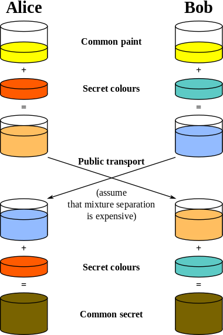

# Public key cryptography

Public-key cryptography refers to a cryptographic system requiring two separate
keys, one of which is secret and one of which is public. Although different, the
two parts of the key pair are mathematically linked. One key locks or encrypts
the plaintext, and the other unlocks or decrypts the cyphertext. Neither key can
perform both functions. One of these keys is published or public, while the
other is kept private.

In zend-crypt, we implement two public key algorithms:

- [Diffie-Hellman](http://en.wikipedia.org/wiki/Diffie%E2%80%93Hellman_key_exchange)
  key exchange, and
- [RSA](http://en.wikipedia.org/wiki/RSA_%28algorithm%29).

## Diffie-Hellman

The Diffie-Hellman algorithm is a specific method of exchanging cryptographic
keys. It is one of the earliest practical examples of key exchange implemented
within the field of cryptography. The Diffie–Hellman key exchange method allows
two parties that have no prior knowledge of each other to jointly establish a
shared secret key over an insecure communications channel. This key can then be
used to encrypt subsequent communications using a symmetric key cipher.

The diagram of operation of the Diffie-Hellman algorithm can be defined by the
following picture (taken from the [Diffie-Hellman](http://en.wikipedia.org/wiki/Diffie%E2%80%93Hellman_key_exchange)
Wikipedia page):



The schema's colors represent the parameters of the algorithm.

Below is an example demonstrating usage of `Zend\Crypt\PublicKey\DiffieHellman`:

```php
use Zend\Crypt\PublicKey\DiffieHellman;

$aliceOptions = [
    'prime' => '155172898181473697471232257763715539915724801966915404479707795314057629378541917580651227'
        . '423698188993727816152646631438561595825688188889951272158842675419950341258706556549803580'
        . '104870537681476726513255747040765857479291291572334510643245094715007229621094194349783925'
        . '984760375594985848253359305585439638443',
    'generator'=> '2',
    'private'  => '992093140665725952364085695919679885571412495614942674862518080355353963322786201435363176'
        . '813127128916726230726309951803243888416814918577455156967890911274095150092503589658166661'
        . '463420498381785213791321533481399080168191962194483101070726325157493390557981225386151351'
        . '04828702523796951800575031871051678091',
];

$bobOptions   = [
    'prime'    => $aliceOptions['prime'],
    'generator'=> '2',
    'private'  => '334117357926395586257336357178925636125481806504021611510774783148414637079488997861035889'
        . '123256347304105519467727528801778689728169635518217403867000760342134081539246925625431179'
        . '634647331566005454845108330724270034742070646507148310833044977371603820970833568760781462'
        . '31616972608703322302585471319261275664',
);

$alice = new DiffieHellman(
    $aliceOptions['prime'],
    $aliceOptions['generator'],
    $aliceOptions['private']
);
$bob = new DiffieHellman(
    $bobOptions['prime'],
    $bobOptions['generator'],
    $bobOptions['private']
);

$alice->generateKeys();
$bob->generateKeys();

$aliceSecretKey = $alice->computeSecretKey(
    $bob->getPublicKey(DiffieHellman::FORMAT_BINARY),
    DiffieHellman::FORMAT_BINARY,
    DiffieHellman::FORMAT_BINARY
);

$bobSecretKey = $bob->computeSecretKey(
    $alice->getPublicKey(DiffieHellman::FORMAT_BINARY),
    DiffieHellman::FORMAT_BINARY,
    DiffieHellman::FORMAT_BINARY
);

if ($aliceSecretKey !== $bobSecretKey) {
    echo "ERROR!\n";
} else {
    printf("The secret key is: %s\n", base64_encode($aliceSecretKey));
}
```

The parameters of the Diffie-Hellman class are:

- a prime number (p),
- a generator (g) that is a primitive root mod p, and
- a private integer number.

The security of the Diffie-Hellman exchange algorithm is related to the choice
of these parameters. To know how to choose secure numbers you can read the
[RFC 3526](http://tools.ietf.org/html/rfc3526) document.

> ### Openssl
>
> The `Zend\Crypt\PublicKey\DiffieHellman` class by default uses the
> [OpenSSL](http://php.net/manual/en/book.openssl.php) extension to generate the
> parameters. If you don't want to use the OpenSSL library, call
> `DiffieHelmman::useOpensslExtension(false)`.

## RSA

RSA is an algorithm for public-key cryptography that is based on the presumed
difficulty of factoring large integers, known as the [factoring
problem](http://en.wikipedia.org/wiki/Factoring_problem). A user of RSA creates
and then publishes the product of two large prime numbers, along with an
auxiliary value, as their public key. The prime factors must be kept secret.
Anyone can use the public key to encrypt a message, but with currently published
methods, if the public key is large enough, only someone with knowledge of the
prime factors can feasibly decode the message. Whether breaking RSA encryption
is as hard as factoring is an open question.

The RSA algorithm can be used to encrypt/decrypt messages, and also to provide
authenticity and integrity by generating a digital signature of a message.

Suppose that Alice wants to send an encrypted message to Bob. Alice must use the
public key of Bob to encrypt the message. Bob can decrypt the message using his
private key. Because Bob is the only one that can access his private key,
he is the only one that can decrypt the message. If Alice wants to provide
authenticity and integrity of a message to Bob she can use her private key to
sign the message. Bob can check the correctness of the digital signature using
the public key of Alice. Alice can provide encryption, authenticity, and
integrity of a message to Bob using the previous schemas in sequence, applying
the encryption first and the digital signature after.

Below are examples of usage of the `Zend\Crypt\PublicKey\Rsa` class in order to:

- generate a public key and a private key;
- encrypt/decrypt a string;
- generate a digital signature of a file.

### Generate a public key and a private key

In order to generate a public and private key, use the following code:

```php
use Zend\Crypt\PublicKey\RsaOptions;

$rsaOptions = new RsaOptions([
    'pass_phrase' => 'test'
[);

$rsaOptions->generateKeys([
    'private_key_bits' => 2048,
]);

file_put_contents('private_key.pem', $rsaOptions->getPrivateKey());
file_put_contents('public_key.pub', $rsaOptions->getPublicKey());
```

This example generates a 2048-bit public and private key, storing the keys in two separate files,
`private_key.pem` for the private key and `public_key.pub` for the public key. You can also
generate the public and private key using OpenSSL from the command line (Unix style syntax):

```bash
$ ssh-keygen -t rsa
```

### Encrypt and decrypt a string

Below is an example demonstrating encryption and decryption of a string using
the RSA algorithm. You can encrypt only small strings. The maximum size of
encryption is given by the length of the public/private key - 88 bits. For
instance, if we use a size of 2048 bit you can encrypt a string with a maximum
size of 1960 bit (245 characters). This limitation is related to the OpenSSL
implementation for a security reason related to the nature of the RSA algorithm.

The normal application of public key encryption algorithm is to store a key or a
hash of the data you want to encrypt or sign. A hash is typically 128-256 bits
(the PHP `sha1()` function returns a 160 bit hash). An AES encryption key is 128
to 256 bits. Either will comfortably fit inside a single RSA encryption.

```php
use Zend\Crypt\PublicKey\Rsa;

$rsa = Rsa::factory([
    'public_key'    => 'public_key.pub',
    'private_key'   => 'private_key.pem',
    'pass_phrase'   => 'test',
    'binary_output' => false,
]);

$text = 'This is the message to encrypt';

$encrypt = $rsa->encrypt($text);
printf("Encrypted message:\n%s\n", $encrypt);

$decrypt = $rsa->decrypt($encrypt);

if ($text !== $decrypt) {
    echo "ERROR\n";
} else {
    echo "Encryption and decryption performed successfully!\n";
}
```

### Generate a digital signature of a file

Below is an example demonstrating generation of a digital file signature.

```php
use Zend\Crypt\PublicKey\Rsa;

$rsa = Rsa::factory([
    'private_key'   => 'path/to/private_key',
    'pass_phrase'   => 'passphrase of the private key',
    'binary_output' => false,
]);

$file = file_get_contents('path/file/to/sign');

$signature = $rsa->sign($file, $rsa->getOptions()->getPrivateKey());
$verify    = $rsa->verify($file, $signature, $rsa->getOptions()->getPublicKey());

if ($verify) {
    echo "The signature is OK\n";
    file_put_contents($filename . '.sig', $signature);
    echo "Signature save in $filename.sig\n";
} else {
     echo "The signature is not valid!\n";
}
```

In this example, we used the Base64 format to encode the digital signature of the file
(`binary_output` is false).

> ## Openssl
>
> The implementation of the `Zend\Crypt\PublicKey\Rsa` algorithm uses PHP's OpenSSL extension.
